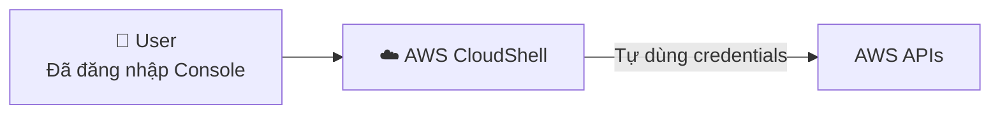

# 23. AWS CloudShell

## 🎯 Giới thiệu

**AWS CloudShell** là một terminal trực tiếp trên cloud của AWS — miễn phí, không cần cấu hình credentials, và có thể truy cập ngay từ AWS Console.

---

## 1. 🌐 CloudShell là gì?

- Terminal **trong trình duyệt**, được AWS cung cấp miễn phí.
- **AWS CLI đã được cài sẵn** (version 2).
- **Không cần** `aws configure` — tự động dùng credentials của tài khoản đang đăng nhập.
- Region mặc định = **region đang login trên Console**.



---

## 2. ⚠️ Giới hạn vùng (Regional Availability)

- CloudShell **không khả dụng ở tất cả regions**.
- Biểu tượng CloudShell xuất hiện ở góc trên phải — nếu **không thấy** = region đó không hỗ trợ.
- Nên chọn một **region được hỗ trợ** nếu muốn dùng CloudShell.
- Kiểm tra danh sách region hỗ trợ tại: CloudShell FAQ.

---

## 3. 💻 Các tính năng CloudShell

### Thực thi lệnh AWS CLI:
```bash
aws --version          # Kiểm tra version (hiển thị v2)
aws iam list-users     # Gọi API với credentials của account hiện tại
aws --region us-east-1 iam list-users  # Chỉ định region cụ thể
```

### 📁 File persistence:
- Files tạo trong CloudShell **được giữ lại** sau khi restart session.
```bash
echo "test" > demo.txt   # Tạo file
# Restart CloudShell → demo.txt vẫn còn
```

### 📤 Upload / Download files:
- **Upload:** Actions → Upload file → chọn file từ máy tính.
- **Download:** Actions → Download file → nhập đường dẫn file.

### ⚙️ Tùy chỉnh giao diện:
- Font size: Smallest / Medium / Large
- Theme: Light / Dark
- Safe paste: On / Off

### 🪟 Multiple tabs / Split terminal:
- Mở tab mới (New Tab)
- Split terminal thành nhiều cột (Split into columns)
- → Chạy nhiều lệnh song song

---

## 4. 🔄 CloudShell vs CLI Local

| | CloudShell | CLI Local |
|-|-----------|-----------|
| **Cài đặt** | Không cần | Phải cài |
| **Credentials** | Tự động từ Console | Phải `aws configure` |
| **Truy cập** | Từ browser | Terminal máy tính |
| **Availability** | Một số regions | Mọi nơi |
| **File storage** | Persistent trong session | Trên máy tính |

---

## 💡 Mẹo ghi nhớ cho kỳ thi AWS

- 📌 **CloudShell = terminal miễn phí trên AWS**, không cần cài đặt.
- 📌 Tự dùng **credentials của account đang đăng nhập** — không cần Access Keys.
- 📌 **Files được lưu lại** sau khi restart CloudShell.
- 📌 **Không khả dụng ở mọi region** — phải kiểm tra.

---

## ✅ Kết luận

CloudShell là giải pháp thay thế tiện lợi cho AWS CLI trên máy tính. Ưu điểm lớn nhất: không cần cấu hình credentials và tích hợp sẵn vào AWS Console. Tuy nhiên chỉ available ở một số regions nhất định. Files trong CloudShell được lưu bền vững giữa các sessions.
