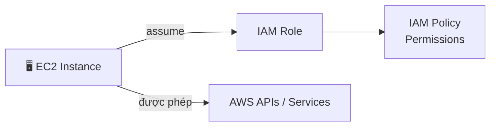

# 24. IAM Roles for AWS Services

## 🎯 Giới thiệu

**IAM Roles** là thành phần cuối cùng quan trọng của IAM. Roles được thiết kế để cấp quyền cho **AWS services** (không phải người dùng thực tế) thực hiện các hành động trong AWS.

---

## 1. 🤔 Tại sao cần IAM Roles?

- Một số AWS services cần **thực hiện hành động** trên tài khoản AWS của bạn.
- Giống như users cần permissions, **services cũng cần permissions**.
- Thay vì tạo user, ta tạo **IAM Role** và gán cho service đó.

---

## 2. 🔄 Cách IAM Role hoạt động

- **EC2 Instance** muốn gọi AWS API → nó sử dụng **IAM Role** được gắn vào.
- Nếu IAM Role có đủ quyền → API call thành công.
- EC2 Instance + IAM Role = **một thực thể thống nhất** với quyền xác định.

---

## 3. 📋 Các loại IAM Role phổ biến

| Role Type | Dùng cho |
|-----------|---------|
| **EC2 Instance Role** | EC2 instances cần truy cập AWS services |
| **Lambda Function Role** | Lambda functions thực thi code |
| **CloudFormation Role** | CloudFormation tạo/quản lý resources |

---

## 4. 🆚 User vs Role

| | IAM User | IAM Role |
|-|----------|----------|
| **Dùng cho** | Người thực | AWS Services |
| **Credentials** | Username + Password / Access Keys | Temporary credentials (tự động) |
| **Gắn vào** | Người dùng cụ thể | AWS service/entity |

---

## 💡 Mẹo ghi nhớ cho kỳ thi AWS

- 📌 **IAM Role** = permissions dành cho **AWS services**, không phải người dùng.
- 📌 **EC2 Instance Role** là loại role phổ biến nhất trong kỳ thi.
- 📌 Khi EC2 cần gọi S3, DynamoDB, v.v. → **gắn IAM Role** vào EC2, không dùng Access Keys.
- 📌 Role sử dụng **temporary credentials** (tự động xoay vòng) — an toàn hơn Access Keys.

---

## ✅ Kết luận

IAM Role cho phép AWS services (như EC2, Lambda, CloudFormation) thực hiện các hành động trên AWS thay mặt bạn — một cách an toàn và có kiểm soát. Đây là **best practice** khi muốn cấp quyền cho EC2 instances thay vì nhúng Access Keys vào server.
