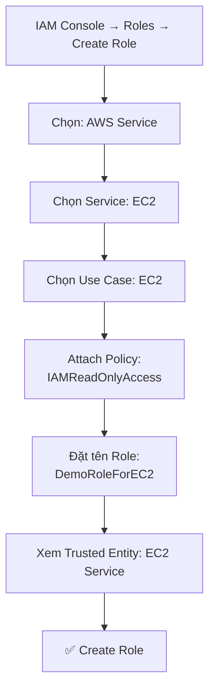
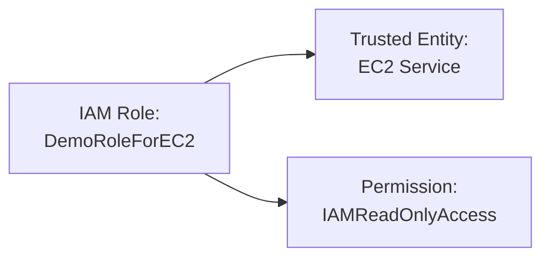

# 25. IAM Roles Hands On

## 🎯 Giới thiệu

Bài thực hành hướng dẫn tạo một **IAM Role** cho **EC2 Instance** và gán IAM policy vào role đó — chuẩn bị cho phần EC2 sắp tới.

---

## 1. 🛠️ Các bước tạo IAM Role

---

## 2. 📋 Chi tiết từng bước

### Bước 1: Chọn loại entity
- Vào **IAM → Roles → Create Role**
- Chọn **"AWS Service"** (quan trọng nhất cho thi CCP)
- Có thể tạo 5 loại role khác nhau, nhưng **AWS Service** là loại cần biết cho kỳ thi.

### Bước 2: Chọn Service
- Chọn **EC2** từ danh sách "Commonly used services"
- Use case: **EC2** (mặc định)

### Bước 3: Gắn Policy
- Tìm và chọn: **IAMReadOnlyAccess**
- → EC2 Instance sẽ có quyền đọc thông tin IAM

### Bước 4: Đặt tên và review
- Role name: `DemoRoleForEC2`
- **Trusted entities:** `ec2.amazonaws.com` → xác nhận role này dành cho EC2 service

---

## 3. 🔍 Cấu trúc Role sau khi tạo

---

## 4. 📌 Lưu ý thực hành

- Role đã được tạo, nhưng **chưa thể sử dụng ngay** vì cần gắn vào EC2 instance.
- Sẽ được dùng thực tế trong **phần học về EC2** tiếp theo.

---

## 📊 Bảng tóm tắt

| Thông tin | Giá trị |
|-----------|--------|
| **Tên Role** | DemoRoleForEC2 |
| **Trusted Entity** | Amazon EC2 (ec2.amazonaws.com) |
| **Permission gắn vào** | IAMReadOnlyAccess |
| **Mục đích** | EC2 instance có thể đọc thông tin IAM |

---

## 💡 Mẹo ghi nhớ cho kỳ thi AWS

- 📌 **Trusted Entity** xác định ai có thể "assume" role đó — quan trọng trong thi cử.
- 📌 Loại entity **"AWS Service"** là loại thường gặp nhất trong đề thi.
- 📌 Role **không có password hay Access Keys** — dùng temporary credentials tự động.

---

## ✅ Kết luận

Tạo IAM Role gồm 3 bước chính: chọn trusted entity (AWS Service → EC2), gắn policy (IAMReadOnlyAccess), và đặt tên. Role này sẽ được gắn vào EC2 instance trong phần tiếp theo để instance có thể tương tác với AWS services một cách an toàn.
