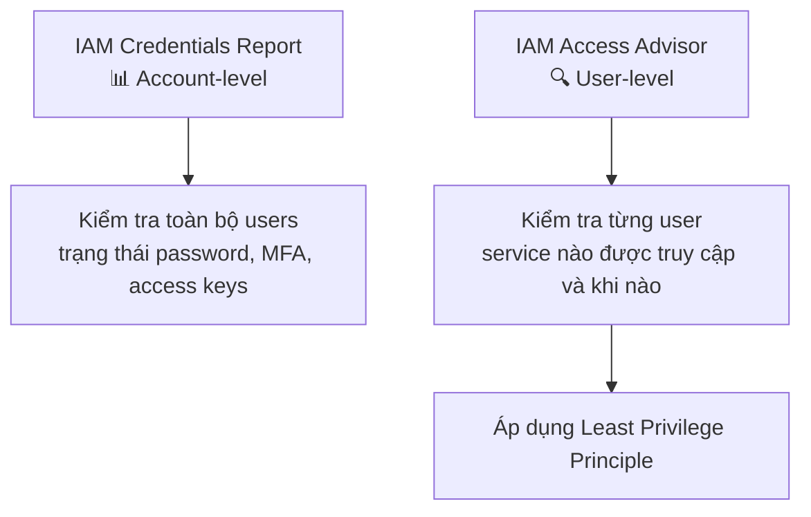

# 26. IAM Security Tools

## 🎯 Giới thiệu

AWS cung cấp hai công cụ bảo mật quan trọng trong IAM để giúp kiểm tra và tối ưu hóa quyền truy cập: **IAM Credentials Report** và **IAM Access Advisor**.

---

## 1. 📊 IAM Credentials Report

- **Cấp độ:** Account-level (toàn bộ tài khoản AWS)
- **Nội dung:** Báo cáo tất cả users trong account và **trạng thái credentials** của họ.
- **Định dạng:** File CSV (có thể tải về)

### Thông tin trong báo cáo:
| Thông tin | Mô tả |
|-----------|-------|
| Tên user | Username trong IAM |
| Password enabled | Có bật password chưa |
| Password last used | Lần cuối dùng password |
| Password last changed | Lần cuối đổi password |
| Password next rotation | Khi nào cần đổi tiếp |
| MFA active | Có bật MFA chưa |
| Access key 1/2 | Có tạo access key chưa |
| Access key last rotated | Lần cuối xoay access key |
| Access key last used | Lần cuối dùng access key |

### 💡 Ứng dụng:
- Phát hiện users **không đổi password lâu**.
- Phát hiện users **không dùng account**.
- Kiểm tra ai **chưa bật MFA**.

---

## 2. 🔍 IAM Access Advisor

- **Cấp độ:** User-level (từng user cụ thể)
- **Nội dung:** Hiển thị **services mà user được phép truy cập** và **thời điểm truy cập gần nhất**.

### 💡 Ứng dụng:
- Xác định permissions nào **không được dùng** → có thể thu hồi.
- Áp dụng **Least Privilege Principle**: chỉ giữ lại quyền thực sự cần thiết.
- Ví dụ: User có AdministratorAccess nhưng thực tế chỉ dùng EC2, S3, IAM → có thể giới hạn quyền lại.

---

## 3. 🔄 So sánh hai công cụ

| | IAM Credentials Report | IAM Access Advisor |
|-|------------------------|-------------------|
| **Phạm vi** | Toàn bộ account | Từng user |
| **Mục đích** | Audit credentials | Tối ưu hóa permissions |
| **Định dạng** | CSV file | Giao diện web |
| **Giúp với** | Password, MFA, Access Keys | Service permissions |

---

## 💡 Mẹo ghi nhớ cho kỳ thi AWS

- 📌 **Credentials Report** = account-level, CSV, kiểm tra password/MFA/access keys.
- 📌 **Access Advisor** = user-level, xem service nào được dùng → thu hồi quyền thừa.
- 📌 Cả hai đều hỗ trợ **Least Privilege Principle**.

---

## ✅ Kết luận

IAM cung cấp hai security tools hữu ích: **Credentials Report** để audit toàn bộ account (password, MFA, keys), và **Access Advisor** để phân tích quyền truy cập của từng user nhằm áp dụng **Least Privilege Principle** hiệu quả.
