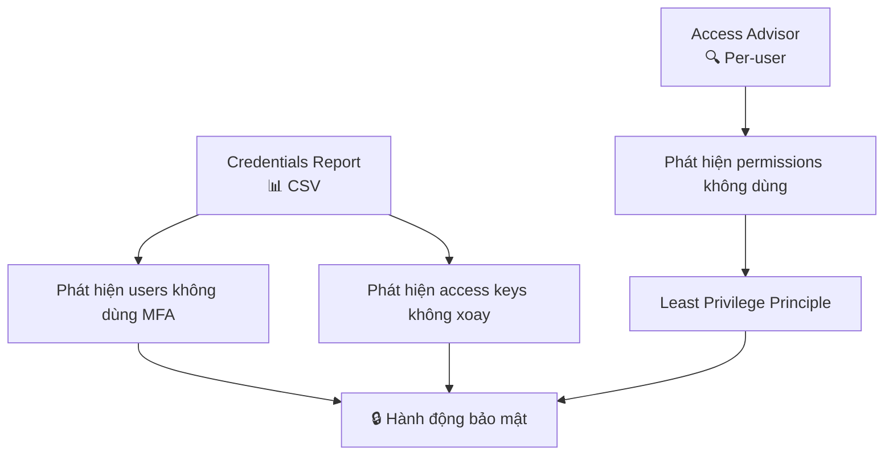

# 27. IAM Security Tools Hands On

## 🎯 Giới thiệu

Bài thực hành minh họa cách sử dụng hai công cụ bảo mật IAM: **IAM Credentials Report** và **IAM Access Advisor** trực tiếp trên AWS Console.

---

## 1. 📊 Thực hành: IAM Credentials Report

**Đường dẫn:** IAM Console → Credential Report → Download Credential Report

### Nội dung CSV trả về (ví dụ với 2 users):

| Thông tin | root account | stephane |
|-----------|-------------|---------|
| User created | ... | ... |
| Password enabled | ✅ | ✅ |
| Password last used | ... | ... |
| MFA active | ✅ | ❌ |
| Access key created | ❌ | ✅ |
| Access key last rotated | N/A | ... |

### 💡 Nhận xét từ báo cáo:
- Root account: **MFA đang bật** ✅, chưa tạo access keys.
- User `stephane`: **MFA chưa bật** ❌, đã tạo access keys.
- → Cần bật MFA cho `stephane` để tăng bảo mật.

---

## 2. 🔍 Thực hành: IAM Access Advisor

**Đường dẫn:** IAM Console → Users → stephane → Access Advisor tab

### Kết quả ví dụ:

| Service đã truy cập | Khi nào | Qua policy nào |
|---------------------|---------|----------------|
| IAM | Gần đây | AdministratorAccess |
| EC2 | Gần đây | AdministratorAccess |
| Health | Gần đây | AdministratorAccess |
| Organizations | Gần đây | AdministratorAccess |
| Resource Explorer | Gần đây | AdministratorAccess |
| Alexa for Business | **Chưa bao giờ** | — |
| App2Container | **Chưa bao giờ** | — |
| ... (37 trang) | ... | ... |

### 💡 Ứng dụng:
- User `stephane` có **AdministratorAccess** nhưng thực tế chỉ dùng vài services.
- → Có thể **giới hạn quyền** chỉ còn những services thực sự dùng (Least Privilege).
- Có thể drill down: click vào EC2 → xem chi tiết policy nào cấp quyền.

---

## 3. 🔄 Luồng sử dụng Security Tools

---

## 📊 Bảng tóm tắt

| Công cụ | Đường dẫn | Output | Dùng để |
|---------|-----------|--------|---------|
| Credentials Report | IAM → Credential Report | CSV file | Audit password, MFA, access keys |
| Access Advisor | IAM → Users → [user] → Access Advisor | Web UI | Tối ưu permissions |

---

## 💡 Mẹo ghi nhớ cho kỳ thi AWS

- 📌 **Credentials Report** tải về file **CSV**.
- 📌 **Access Advisor** xem trực tiếp trên **web console**, ở tab của từng user.
- 📌 Cả hai công cụ giúp thực hiện **Least Privilege Principle**.
- 📌 Nếu câu hỏi thi hỏi "làm sao biết service nào user chưa dùng?" → **Access Advisor**.

---

## ✅ Kết luận

Hai security tools trong IAM giúp audit và tối ưu bảo mật: **Credentials Report** cho cái nhìn tổng quan về toàn bộ account (MFA, password, access keys), còn **Access Advisor** giúp phân tích từng user để thu hồi quyền không cần thiết, thực thi **Least Privilege Principle** trong thực tế.
