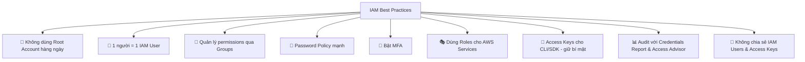

# 28. IAM Best Practices

## 🎯 Giới thiệu

Tổng hợp các **best practices** quan trọng khi sử dụng IAM trên AWS — áp dụng cho cả thực tế và kỳ thi AWS.

---

## 1. 🔑 Danh sách IAM Best Practices

### 🚫 Không dùng Root Account hàng ngày
- **Root account** chỉ dùng khi **setup AWS account** lần đầu.
- Sau đó: **không dùng**, **không chia sẻ**.

### 👤 Một người = Một AWS User
- Mỗi người trong tổ chức cần một **IAM user riêng**.
- ⚠️ Không chia sẻ credentials với người khác.
- Nếu bạn bè muốn dùng AWS → **tạo user mới** cho họ, không share tài khoản của bạn.

### 👥 Quản lý permissions qua Groups
- Gán users vào **groups**.
- Gán **permissions vào groups** (không phải từng user).
- → Quản lý tập trung, dễ thay đổi.

### 🔐 Tạo Password Policy mạnh
- Yêu cầu độ dài, ký tự đặc biệt, hết hạn định kỳ.

### 📱 Bật và bắt buộc MFA
- MFA cho **root account**: bắt buộc.
- MFA cho **tất cả IAM users**: nên bắt buộc.

### 🎭 Dùng IAM Roles cho AWS Services
- Khi **EC2 instances** hoặc **AWS services** cần quyền → **tạo và gắn IAM Role**.
- Không nhúng Access Keys vào server/code.

### 🔑 Dùng Access Keys cho CLI/SDK
- Khi cần truy cập AWS programmatically.
- **Giữ bí mật** như password.
- **Không share** với bất kỳ ai.

### 📊 Audit định kỳ bằng Security Tools
- Dùng **IAM Credentials Report** để kiểm tra toàn bộ account.
- Dùng **IAM Access Advisor** để tối ưu quyền từng user.

### 🔒 Không bao giờ chia sẻ IAM Users và Access Keys
- Đây là nguyên tắc **tuyệt đối** — không có ngoại lệ.

---

## 2. 📋 Bảng Best Practices tổng hợp

---

## 📊 Bảng tóm tắt

| Best Practice | Lý do |
|---------------|-------|
| Không dùng Root Account | Root có toàn quyền, rủi ro rất cao |
| 1 người = 1 user | Truy vết hành động, accountability |
| Permissions qua Groups | Quản lý tập trung, nhất quán |
| Password Policy mạnh | Chống brute force |
| Bật MFA | Bảo vệ khi mật khẩu bị lộ |
| Roles cho Services | An toàn hơn Access Keys trên server |
| Audit định kỳ | Phát hiện rủi ro bảo mật sớm |
| Không share credentials | Mỗi người chịu trách nhiệm cá nhân |

---

## 💡 Mẹo ghi nhớ cho kỳ thi AWS

- 📌 **Least Privilege Principle** là nền tảng của tất cả best practices IAM.
- 📌 **EC2 + IAM Role** > EC2 + Access Keys trong code.
- 📌 **Root Account** = chỉ dùng 1 lần khi setup → sau đó cất đi.
- 📌 Câu hỏi về "ai chịu trách nhiệm tạo/quản lý users?" → **bạn** (không phải AWS).

---

## ✅ Kết luận

IAM Best Practices xoay quanh hai nguyên tắc lớn: **bảo mật tối đa** (MFA, password policy, không dùng root) và **quyền hạn tối thiểu** (Least Privilege, Roles cho services, audit định kỳ). Không chia sẻ credentials là quy tắc tuyệt đối trong AWS.
