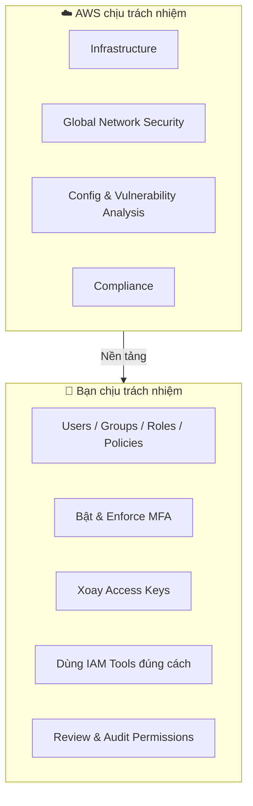

# 29. Shared Responsibility Model for IAM

## 🎯 Giới thiệu

**Shared Responsibility Model** (Mô hình trách nhiệm chia sẻ) là một chủ đề quan trọng trong kỳ thi AWS CCP. Bài học làm rõ: **AWS chịu trách nhiệm cho điều gì** và **bạn (khách hàng) chịu trách nhiệm cho điều gì** liên quan đến IAM.

---

## 1. 🏗️ AWS chịu trách nhiệm (Infrastructure)

AWS chịu toàn bộ trách nhiệm về **hạ tầng** phía dưới:

- ✅ **Infrastructure** (cơ sở hạ tầng vật lý)
- ✅ **Global network security** (bảo mật mạng toàn cầu)
- ✅ **Configuration và vulnerability analysis** của các services AWS cung cấp
- ✅ **Compliance** (tuân thủ các tiêu chuẩn mà AWS cam kết)

---

## 2. 👤 Bạn (Khách hàng) chịu trách nhiệm (Usage)

Mọi thứ liên quan đến **cách bạn sử dụng IAM** là trách nhiệm của bạn:

| Trách nhiệm | Mô tả |
|-------------|-------|
| Tạo và quản lý Users | AWS không tạo users cho bạn |
| Tạo và quản lý Groups | Phân nhóm users theo vai trò |
| Tạo và quản lý Roles | Cho AWS services |
| Tạo và quản lý Policies | Định nghĩa quyền hạn |
| Bật MFA | AWS không tự bật MFA cho bạn |
| Xoay vòng Access Keys | Định kỳ rotate keys |
| Dùng IAM tools đúng cách | Credentials Report, Access Advisor |
| Phân tích access patterns | Review permissions định kỳ |
| Review permissions | Đảm bảo Least Privilege |

---

## 3. 📊 Mô hình trực quan

---

## 4. 💡 Tóm gọn nguyên tắc

> **AWS = Security OF the cloud** (bảo mật của hạ tầng cloud)
>
> **Bạn = Security IN the cloud** (bảo mật bên trong, cách bạn dùng cloud)

---

## 📊 Bảng tóm tắt nhanh

| | AWS | Khách hàng |
|-|-----|-----------|
| Hạ tầng vật lý | ✅ | ❌ |
| Bảo mật mạng toàn cầu | ✅ | ❌ |
| Tạo IAM Users/Groups | ❌ | ✅ |
| Bật MFA | ❌ | ✅ |
| Rotate Access Keys | ❌ | ✅ |
| Định nghĩa Policies | ❌ | ✅ |
| Audit permissions | ❌ | ✅ |

---

## 💡 Mẹo ghi nhớ cho kỳ thi AWS

- 📌 **AWS = "Security OF the cloud"** → hạ tầng, mạng, compliance.
- 📌 **Khách hàng = "Security IN the cloud"** → users, policies, MFA, keys.
- 📌 Đề thi thường hỏi: "Ai chịu trách nhiệm cho X?" → phân biệt rõ hai phía.
- 📌 **AWS không bao giờ** tự tạo users, bật MFA, hay rotate keys cho bạn.

---

## ✅ Kết luận

Shared Responsibility Model trong IAM rất rõ ràng: **AWS lo hạ tầng**, **bạn lo cách sử dụng**. Mọi tác vụ IAM như tạo users, nhóm, policies, bật MFA, xoay keys, và audit đều là **trách nhiệm của khách hàng**. Đây là concept xuất hiện xuyên suốt trong kỳ thi AWS CCP.
