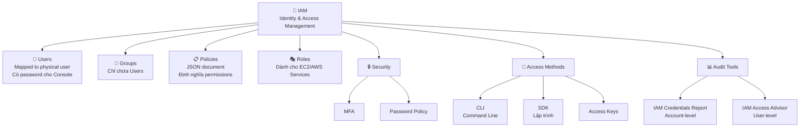

# 30. IAM Summary

## 🎯 Giới thiệu

Bài tổng kết toàn bộ kiến thức về **IAM** (Identity and Access Management) — ôn tập nhanh trước kỳ thi AWS.

---

## 1. 📋 Tổng hợp toàn bộ IAM

---

## 2. 🔑 Các thành phần cốt lõi

### 👤 IAM Users
- Map 1-1 với người thực trong tổ chức.
- Có **password** để đăng nhập AWS Console.

### 👥 IAM Groups
- Nhóm các users lại.
- **Chỉ chứa users**, không chứa groups khác.

### 📋 IAM Policies
- JSON document định nghĩa quyền hạn.
- Gắn vào **users** hoặc **groups**.

### 🎭 IAM Roles
- **Identities** dành cho **EC2 instances** và **AWS services** (không phải người).
- Thay thế cho Access Keys trên server.

### 🔒 Security
- **MFA** (Multi-Factor Authentication): bảo vệ tài khoản.
- **Password Policy**: kiểm soát độ mạnh mật khẩu.

### 🔑 Access Methods
- **CLI**: quản lý services qua command line.
- **SDK**: quản lý AWS qua ngôn ngữ lập trình.
- **Access Keys**: credentials dùng cho CLI và SDK.

### 📊 Audit Tools
- **IAM Credentials Report**: audit credentials toàn account.
- **IAM Access Advisor**: phân tích service permissions từng user.

---

## 📊 Bảng tóm tắt nhanh

| Thành phần | Dùng cho | Ghi nhớ |
|------------|---------|---------|
| **Users** | Người thực | 1 người = 1 user |
| **Groups** | Nhóm users | Chỉ chứa users |
| **Policies** | Định nghĩa quyền | JSON document |
| **Roles** | AWS services | Không phải người |
| **MFA** | Bảo mật 2 lớp | Bắt buộc cho root |
| **Password Policy** | Kiểm soát mật khẩu | Chống brute force |
| **CLI** | Terminal | Dùng Access Keys |
| **SDK** | Code ứng dụng | Dùng Access Keys |
| **Access Keys** | CLI + SDK auth | Bí mật như password |
| **Credentials Report** | Audit account | CSV, account-level |
| **Access Advisor** | Tối ưu quyền | User-level |

---

## 💡 Mẹo ghi nhớ cho kỳ thi AWS

- 📌 **IAM = Global Service** — không thuộc region nào.
- 📌 **Root Account** → chỉ setup ban đầu, sau đó không dùng.
- 📌 **Least Privilege Principle** → chỉ cấp đúng quyền cần thiết.
- 📌 **Roles** → giải pháp an toàn khi EC2/services cần truy cập AWS.
- 📌 **Shared Responsibility**: AWS lo hạ tầng, bạn lo cách dùng IAM.
- 📌 **Access Keys** = bí mật, không chia sẻ, không commit lên code.
- 📌 **MFA** → bảo vệ ngay cả khi mật khẩu bị lộ.

---

## ✅ Kết luận

IAM là nền tảng bảo mật của toàn bộ AWS. Nắm vững 8 thành phần (Users, Groups, Policies, Roles, MFA, Password Policy, Access Keys, Audit Tools) và nguyên tắc **Least Privilege** là đủ để trả lời mọi câu hỏi IAM trong kỳ thi AWS Certified Cloud Practitioner.
