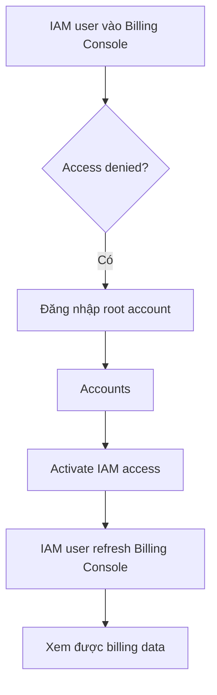
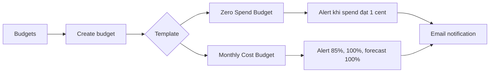

# 31. AWS Budget Setup

## 🎯 Giới thiệu

Bài học hướng dẫn cách thiết lập **Budget** và **Alarm** trong AWS để tránh phát sinh chi phí ngoài ý muốn trong quá trình học. Nội dung tập trung vào việc truy cập **Billing and Cost Management**, bật quyền truy cập billing cho **IAM user**, xem chi tiết hóa đơn, theo dõi **Free Tier**, và tạo các loại budget cơ bản.

## 1. 🔐 Truy cập Billing bằng IAM user

Khi đăng nhập bằng **IAM user** có quyền administrative access, người dùng vẫn có thể gặp lỗi **access denied** khi vào billing data.

Nguyên nhân:

- Billing data không tự động được phép truy cập bởi **IAM user**.
- Cần dùng **root account** để bật quyền truy cập billing cho IAM.

Các bước chính:

- Đăng nhập bằng **root account**.
- Vào **Accounts**.
- Tìm phần **IAM user and role access to billing information**.
- Kích hoạt **IAM access**.
- Quay lại **Billing Console** bằng IAM user và refresh.

📌 Lưu ý: Sau khi bật quyền, có thể cần refresh vài lần hoặc chờ một chút để dữ liệu hiển thị.

## 2. 💰 Xem Billing Dashboard và Bills

Trong **Billing Console**, bạn có thể xem các thông tin chi phí như:

- **Month-to-date cost**.
- **Forecasted cost** cho tháng hiện tại.
- **Last month's total cost**.
- Cost breakdown theo tháng.

Trong phần **Bills**, bạn có thể:

- Chọn tháng cần xem.
- Cuộn xuống phần **Charges by service**.
- Xem số lượng active services.
- Xem chi phí theo từng service, ví dụ:
  - **Elastic Compute Cloud / EC2**.
  - **NatGateway**.
  - **EBS**.
  - **Elastic IP**.

📌 Đây là nơi quan trọng để debug billing issue vì có thể biết service nào đang tạo chi phí.

## 3. 🆓 Theo dõi Free Tier

AWS có trang **Free Tier** trong billing console để theo dõi:

- Current usage.
- Forecasted usage.
- Giới hạn Free Tier.
- Dự báo có vượt Free Tier hay không.

⚠️ Nếu forecast chuyển sang màu đỏ, nghĩa là bạn có thể bị tính phí. Khi đó cần tắt hoặc xóa những resource đang chạy và có khả năng phát sinh tiền.

## 4. 🚨 Tạo Budget cảnh báo chi phí

Trong phần **Budgets**, bạn có thể tạo budget để nhận email khi chi phí đạt ngưỡng.

### Zero Spend Budget

**Zero Spend Budget** dùng để cảnh báo ngay khi tài khoản phát sinh chi phí nhỏ nhất.

- Template: **zero spend budget**.
- Alert khi chi phí đạt **1 cent**.
- Nhập email nhận cảnh báo.
- Tạo budget.

📌 Use Case: Rất hữu ích cho tài khoản học AWS, vì chỉ cần phát sinh 1 cent là nhận email ngay.

### Monthly Cost Budget

**Monthly Cost Budget** dùng để đặt giới hạn chi phí theo tháng, ví dụ **$10/month**.

Budget này có thể gửi nhiều cảnh báo:

- Khi **actual spend** đạt **85%**.
- Khi **actual spend** đạt **100%**.
- Khi **forecasted spend** dự kiến đạt **100%**.

## 5. 📌 Kỹ năng cần nhớ khi học AWS

Bài học nhấn mạnh rằng trong quá trình học AWS, nếu cẩn thận thì không nên phát sinh chi phí. Tuy nhiên, việc thiết lập budget vẫn rất cần thiết vì người học có thể mắc lỗi.

Các công cụ quan trọng để kiểm soát chi phí:

- **Budgets**: cảnh báo khi đạt ngưỡng chi phí.
- **Free Tier Dashboard**: theo dõi mức dùng Free Tier.
- **Bills**: kiểm tra chi tiết service nào đang bị tính phí.

## 📊 Bảng tóm tắt

| Tiêu chí | Mô tả |
|----------|------|
| Billing access cho IAM user | Cần root account bật **IAM access** trong phần billing information |
| Bills | Xem chi tiết chi phí theo service và theo tháng |
| Free Tier | Theo dõi current usage và forecasted usage |
| Zero Spend Budget | Gửi alert khi chi phí đạt 1 cent |
| Monthly Cost Budget | Gửi alert theo ngưỡng chi phí tháng, ví dụ $10 |
| Email alert | Nhận thông báo khi actual hoặc forecasted spend đạt threshold |

## 💡 Mẹo ghi nhớ cho kỳ thi AWS

- 👤 **IAM user có admin access chưa chắc xem được Billing** nếu root account chưa bật IAM billing access.
- 🚨 Luôn tạo **Budget** để tránh bất ngờ về chi phí.
- 📊 Muốn điều tra bill: vào **Bills → Charges by service**.
- 🆓 Muốn biết có vượt Free Tier không: kiểm tra **Free Tier** dashboard.

## ✅ Kết luận

Bài học giúp bạn biết cách kiểm soát chi phí trong AWS bằng cách bật billing access cho IAM user, xem hóa đơn chi tiết, theo dõi Free Tier và tạo budget cảnh báo. Đây là kỹ năng nền tảng khi sử dụng AWS, đặc biệt trong quá trình học và thực hành để tránh phát sinh chi phí không mong muốn.
