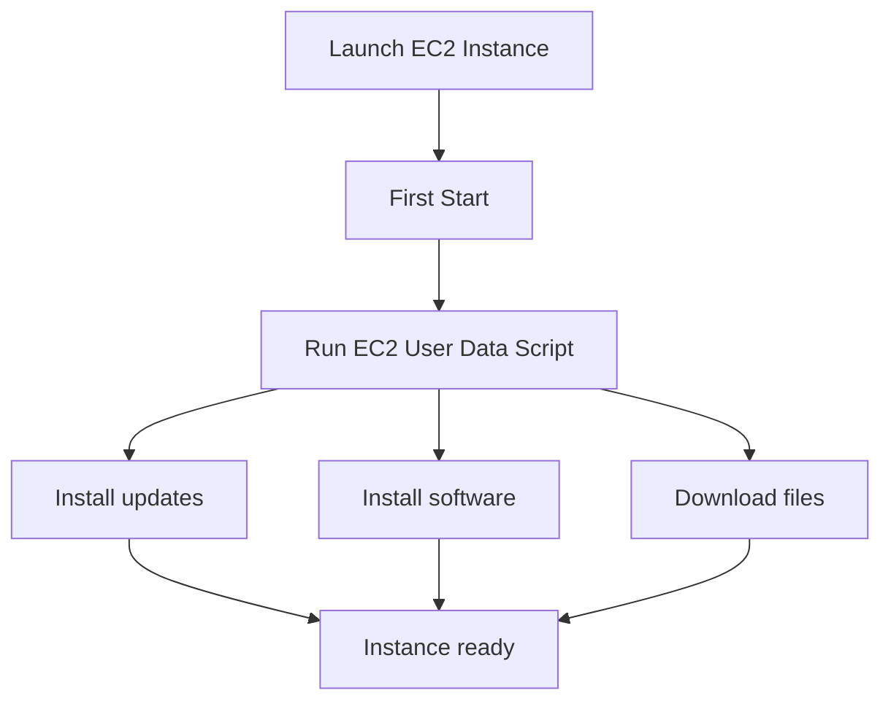

# 32. EC2 Basics

## 🎯 Giới thiệu

Bài học giới thiệu **Amazon EC2**, một trong những dịch vụ phổ biến nhất của AWS. **EC2** là viết tắt của **Elastic Compute Cloud** và là cách triển khai **Infrastructure as a Service** trên AWS. Đây là nền tảng quan trọng để hiểu cách cloud cho phép thuê compute theo nhu cầu.

## 1. 🚀 Amazon EC2 là gì?

**Amazon EC2** cho phép bạn thuê virtual machine từ AWS. Các virtual machine này được gọi là **EC2 instances**.

Ở mức high-level, EC2 không chỉ là một service đơn lẻ mà gồm nhiều thành phần:

- **EC2 instances**: virtual machines có thể thuê từ AWS.
- **EBS volumes**: virtual drives dùng để lưu trữ dữ liệu.
- **Elastic Load Balancer**: phân phối tải giữa nhiều machine.
- **Auto Scaling Group / ASG**: scale services tự động.

📌 EC2 rất quan trọng vì cloud cho phép thuê compute **on demand**, đúng lúc cần và không cần sở hữu server vật lý.

## 2. ⚙️ Các lựa chọn khi tạo EC2 Instance

Khi tạo một **EC2 instance**, bạn có thể lựa chọn nhiều thành phần của virtual server.

### Operating System

Có thể chọn:

- **Linux**: phổ biến nhất.
- **Windows**.
- **macOS**.

### Compute và Memory

Bạn cần chọn:

- Số lượng **CPU / cores**.
- Dung lượng **RAM**.

### Storage

Có thể chọn kiểu storage:

- Storage gắn qua network:
  - **EBS**.
  - **EFS**.
- Storage gắn trực tiếp phần cứng:
  - **EC2 Instance Store**.

### Network

Bạn có thể chọn:

- Loại network card.
- Public IP.
- Network performance.

### Firewall Rules

Firewall rules của EC2 instance được quản lý bằng:

- **Security Group**.

### Bootstrap Script

Bạn có thể truyền script cấu hình lúc instance chạy lần đầu bằng:

- **EC2 User Data**.

## 3. 📜 EC2 User Data và Bootstrapping

**Bootstrapping** nghĩa là chạy commands khi machine start.

Trong EC2, bootstrapping được thực hiện bằng **EC2 User Data script**.

Đặc điểm quan trọng:

- Script chỉ chạy **một lần** khi instance start lần đầu.
- Script dùng để tự động hóa boot tasks.
- **EC2 User Data Scripts** chạy với **root user**.
- Commands trong script có **sudo rights**.

Các task thường được tự động hóa bằng User Data:

- Install updates.
- Install software.
- Download common files from the internet.
- Thực hiện bất kỳ command nào cần chạy khi boot.

⚠️ Càng thêm nhiều việc vào **User Data Script**, instance càng mất nhiều thời gian khi boot.

## 4. 📌 Ý nghĩa của EC2 trong Cloud

EC2 thể hiện sức mạnh chính của cloud:

- Có thể thuê virtual machine rất nhanh.
- Có thể chọn cấu hình gần như theo nhu cầu.
- Không cần sở hữu server vật lý.
- Có thể dùng compute on demand.

📌 Điều cần nhớ: EC2 là nền tảng để hiểu cloud vì nó minh họa rõ khái niệm thuê compute khi cần.

## 📊 Bảng tóm tắt

| Tiêu chí | Mô tả |
|----------|------|
| EC2 | **Elastic Compute Cloud**, cách làm **Infrastructure as a Service** trên AWS |
| EC2 Instance | Virtual machine thuê từ AWS |
| EBS Volume | Virtual drive để lưu trữ dữ liệu |
| Elastic Load Balancer | Phân phối tải giữa nhiều machines |
| Auto Scaling Group / ASG | Scale services tự động |
| Security Group | Firewall rules cho EC2 instance |
| EC2 User Data | Script bootstrap chạy khi instance start lần đầu |
| Root user | User Data script chạy với quyền root |

## 💡 Mẹo ghi nhớ cho kỳ thi AWS

- 🚀 **EC2 = Elastic Compute Cloud = thuê virtual machine on demand**.
- 💾 **EBS** là virtual drive gắn với EC2.
- 🔒 **Security Group** là firewall rules cho EC2.
- 📜 **EC2 User Data** chỉ chạy **một lần** ở lần start đầu tiên.
- 👑 **User Data** chạy với quyền **root user**.

## ✅ Kết luận

Amazon EC2 là dịch vụ nền tảng của AWS, cho phép thuê virtual machines theo nhu cầu. Khi tạo EC2 instance, bạn có thể chọn operating system, CPU, RAM, storage, network, security group và bootstrap script bằng EC2 User Data. Đây là kiến thức cốt lõi để tiếp tục học các chủ đề EC2 thực hành trong các bài tiếp theo.
