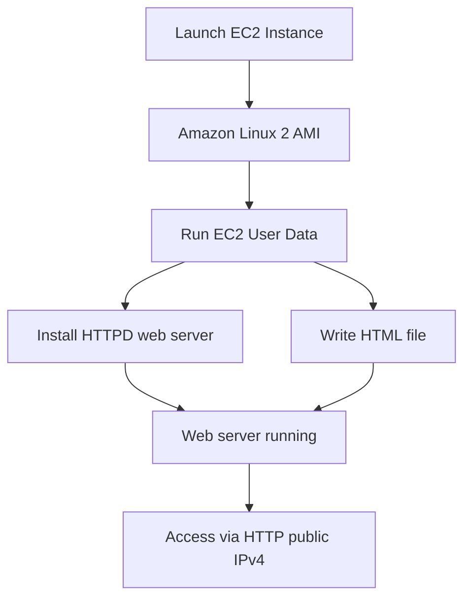
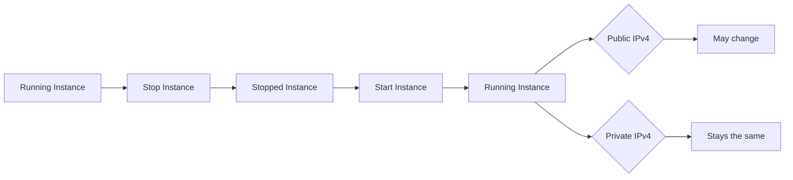

# 33. Create an EC2 Instance with EC2 User Data to have a Website Hands On

## 🎯 Giới thiệu

Bài học thực hành tạo **EC2 instance** đầu tiên chạy **Amazon Linux 2**, cấu hình các tham số quan trọng khi launch instance, dùng **EC2 User Data** để chạy một web server, sau đó học cách **start**, **stop** và **terminate** instance.

## 1. 🚀 Launch EC2 Instance đầu tiên

Trong **EC2 Console**:

- Vào **Instances**.
- Chọn **Launch Instances**.
- Đặt tên instance: **My First Instance**.
- Name được tạo dưới dạng tag.

### Chọn AMI

Instance cần một base image, chính là operating system.

Trong bài học dùng:

- **Amazon Linux** từ Quick Start.
- **Amazon Linux 2 AMI**.
- Architecture: **64-bit x86**.
- AMI này **Free Tier eligible**.

### Chọn Instance Type

Bài học dùng:

- **t2.micro**.
- **Free Tier eligible**.

Instance type khác nhau theo:

- Số lượng CPU.
- Dung lượng memory.
- Chi phí.

📌 Trong Free Tier, **t2.micro** có thể chạy miễn phí trong phạm vi điều kiện bài học nêu.

## 2. 🔑 Key Pair để SSH

Để dùng **SSH utility** truy cập instance, cần tạo **Key Pair**.

Trong bài học:

- Key pair name: **EC2 Tutorial**.
- Key pair type: **RSA**.
- Key pair format:
  - **.pem** cho Mac, Linux hoặc Windows 10.
  - **.ppk** cho Windows 7 hoặc Windows 8 dùng **PuTTY**.

⚠️ Nếu muốn SSH trong course thì không nên proceed without key pair.

## 3. 🔒 Network Settings và Security Group

Instance được cấu hình để có public IP.

Một **Security Group** được tạo tự động tên:

- **launch-wizard-1**.

Inbound rules được bật:

- **SSH** từ anywhere.
- **HTTP** từ internet.

Không bật **HTTPS** vì bài học chưa dùng HTTPS.

📌 Rule HTTP port 80 cần thiết để truy cập web server trên EC2 instance.

## 4. 💾 Storage và Delete on Termination

Storage mặc định:

- **8 GB gp2 root volume**.
- Trong transcript, Free Tier cho phép tới **30 GB EBS general purpose SSD storage**.

Trong phần advanced storage có tùy chọn:

- **Delete on termination**: mặc định là **Yes**.

Ý nghĩa:

- Khi terminate EC2 instance, volume cũng bị xóa.

## 5. 📜 EC2 User Data để tạo Web Server

Trong **Advanced details**, phần **User Data** được dùng để truyền script cho EC2 instance.

Đặc điểm:

- Script chạy khi instance start lần đầu.
- Script chỉ chạy **một lần** trong lifecycle của instance.
- Script trong bài học thực hiện:
  - Update một số thứ.
  - Install **HTTPD web server**.
  - Tạo file **HTML** để hiển thị web page.

## 6. 🌐 Truy cập Website trên EC2

Sau khi instance chuyển sang trạng thái **running**, bạn có thể xem thông tin:

- Instance name.
- Instance ID.
- Public IPv4 address.
- Private IPv4 address.
- Instance type: **t2.micro**.
- AMI: **Amazon Linux 2**.
- Key pair: **EC2 Tutorial**.
- Security Group inbound rules:
  - Port 22 từ anywhere.
  - Port 80 từ anywhere.

Để truy cập web server:

- Copy **Public IPv4 address**.
- Dùng protocol **HTTP**.
- URL phải là `http://<public-ip>`.

⚠️ Nếu dùng **HTTPS**, trang có thể loading vô hạn vì bài học chưa cấu hình HTTPS.

Website hiển thị:

- **Hello World**.
- Private IPv4 address của instance.

📌 Dùng public IP để truy cập từ internet, nhưng page hiển thị private IP do nội dung HTML được lập trình như vậy.

## 7. ⏯️ Start, Stop và Terminate Instance

### Stop Instance

Khi stop instance:

- Instance ngừng chạy.
- Không còn web server phục vụ request.
- AWS không bill compute cho instance đang stopped theo nội dung bài học.
- State của instance vẫn được giữ nhờ volume attached.

### Start Instance lại

Khi start lại instance:

- Instance chuyển qua pending rồi running.
- **Public IPv4 address có thể thay đổi**.
- **Private IPv4 address giữ nguyên**.

⚠️ Nếu website không truy cập được sau khi start lại, hãy copy public IPv4 mới và dùng `http://`.

### Terminate Instance

Terminate dùng để xóa instance. Bài học chỉ demo vị trí thao tác, nhưng không thực hiện terminate vì muốn giữ instance.

## 📊 Bảng tóm tắt

| Tiêu chí | Mô tả |
|----------|------|
| AMI | **Amazon Linux 2 AMI** |
| Architecture | **64-bit x86** |
| Instance type | **t2.micro** |
| Key pair | **EC2 Tutorial** |
| Key format | **.pem** cho Mac/Linux/Windows 10, **.ppk** cho Windows 7/8 |
| Security Group | **launch-wizard-1** |
| SSH rule | Port 22 từ anywhere |
| HTTP rule | Port 80 từ anywhere |
| Storage | 8 GB **gp2 root volume** |
| Delete on termination | Default **Yes** |
| User Data | Chạy script một lần ở first launch |
| Web access | Dùng `http://<public-ip>` |
| Stop/Start | Public IPv4 có thể thay đổi, Private IPv4 giữ nguyên |

## 💡 Mẹo ghi nhớ cho kỳ thi AWS

- 📜 **EC2 User Data** chỉ chạy **một lần** khi instance first launch.
- 🌐 Muốn web server HTTP hoạt động phải mở **port 80** trong **Security Group**.
- 🔑 Muốn SSH cần **Key Pair** và mở **port 22**.
- ⚠️ Stop rồi start lại instance: **Public IPv4 may change**, **Private IPv4 stays the same**.
- 💾 **Delete on termination = Yes** nghĩa là volume bị xóa khi terminate instance.

## ✅ Kết luận

Bài thực hành cho thấy cách launch một EC2 instance Amazon Linux 2, cấu hình key pair, security group, storage, User Data và truy cập web server bằng public IPv4 qua HTTP. Bài cũng nhấn mạnh sự khác nhau giữa public IPv4 và private IPv4 khi stop/start instance, cùng các thao tác quản lý vòng đời instance như stop, start và terminate.
