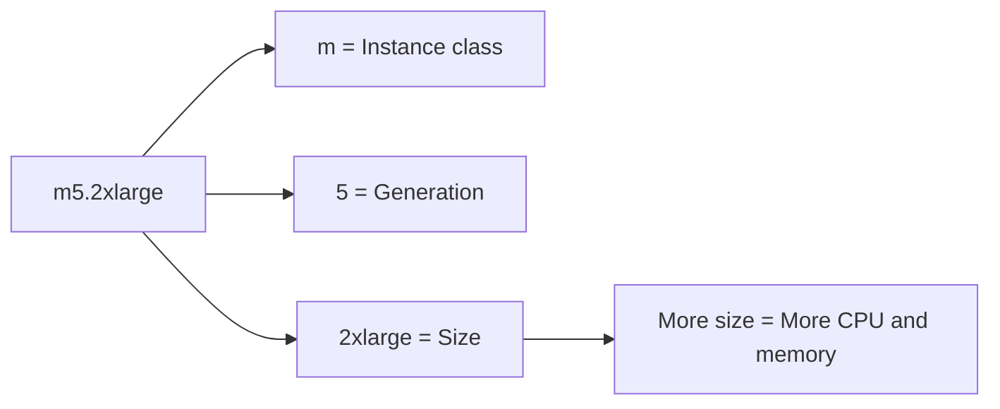

# 34. EC2 Instance Types Basics

## 🎯 Giới thiệu

Bài học giới thiệu các loại **EC2 instance types**, cách đặt tên instance type, các nhóm instance tối ưu cho những workload khác nhau, và cách so sánh instance dựa trên CPU, memory, network performance và EBS bandwidth.

## 1. 🧩 Naming Convention của EC2 Instance Type

Ví dụ instance type:

- **m5.2xlarge**

Ý nghĩa:

- **m**: instance class.
  - Trong ví dụ này là loại **general purpose**.
- **5**: generation của instance.
  - AWS cải thiện hardware theo thời gian và phát hành generation mới.
- **2xlarge**: size trong instance class.
  - Size càng lớn thì memory và CPU càng nhiều.

📌 Cần hiểu cấu trúc tên để đoán nhanh loại instance trong đề thi.

## 2. ⚖️ General Purpose Instances

**General purpose** phù hợp với nhiều workload khác nhau.

Use cases:

- Web servers.
- Code repositories.
- Workload cần cân bằng compute, memory và networking.

Đặc điểm:

- Cân bằng giữa:
  - Compute.
  - Memory.
  - Networking.

Trong course sẽ dùng:

- **t2.micro**.
- Đây là **Free Tier general purpose instance type**.

## 3. 🧮 Compute Optimized Instances

**Compute optimized** phù hợp với workload cần nhiều processor.

Use cases:

- Batch processing.
- Media transcoding.
- High performance web servers.
- **High Performance Computing / HPC**.
- Machine learning.
- Dedicated gaming server.

Tên instance thường thuộc nhóm:

- **C** series, ví dụ **C5**, **C6**.

📌 Ghi nhớ: C liên quan đến compute-intensive tasks.

## 4. 🧠 Memory Optimized Instances

**Memory optimized** dành cho workload xử lý large data sets trong memory.

Memory ở đây là **RAM**.

Use cases:

- High performance relational databases.
- High performance non-relational databases.
- Distributed web scale cache store, ví dụ **ElastiCache**.
- In-memory databases cho **Business Intelligence / BI**.
- Realtime processing của big unstructured data.

Tên instance có thể thuộc:

- **R series** vì R stands for RAM.
- **X1**.
- **High Memory**.
- **Z1**.

## 5. 💾 Storage Optimized Instances

**Storage optimized** phù hợp khi cần truy cập rất nhiều data sets trên local storage.

Use cases:

- High frequency **Online Transaction Processing / OLTP** systems.
- Relational databases.
- NoSQL databases.
- Cache for in-memory databases, ví dụ **Redis**.
- Data warehousing applications.
- Distributed file systems.

Tên instance có thể bắt đầu bằng:

- **I**.
- **D**.
- **H1**.

## 6. 📊 So sánh ví dụ Instance Types

Bài học đưa ví dụ để thấy sự khác nhau giữa các instance:

- **t2.micro**:
  - 1 vCPU.
  - 1 GB memory.
- **r5.16xlarge**:
  - 16 vCPU.
  - 512 GB memory.
  - Nhấn mạnh memory.
- **c5d.4xlarge**:
  - 16 vCPU.
  - 32 GB memory.
  - Ít memory hơn, nhấn mạnh compute hơn.

Các instance còn khác nhau ở:

- Network performance.
- EBS bandwidth.
- Cost.

## 7. 🔎 Công cụ tham khảo Instance Types

Transcript nhắc đến hai nơi để tham khảo:

- AWS website về EC2 instance types.
- **ec2instances.info** để so sánh instance.

Thông tin có thể xem:

- Linux On Demand cost.
- Linux Reserved cost.
- Memory.
- Number of vCPU.
- Search và sort theo instance name.

## 📊 Bảng tóm tắt

| Instance Category | Tối ưu cho | Use Cases | Tên ví dụ trong transcript |
|------------------|------------|-----------|-----------------------------|
| General Purpose | Cân bằng compute, memory, networking | Web servers, code repositories | **t2.micro**, **M** class |
| Compute Optimized | CPU / processor cao | Batch processing, media transcoding, HPC, machine learning | **C5**, **C6** |
| Memory Optimized | Large data sets trong RAM | Databases, ElastiCache, BI, realtime big data | **R**, **X1**, **High Memory**, **Z1** |
| Storage Optimized | Local storage access cao | OLTP, NoSQL, Redis cache, data warehousing, distributed file systems | **I**, **D**, **H1** |

## 💡 Mẹo ghi nhớ cho kỳ thi AWS

- 🧩 **m5.2xlarge** = class + generation + size.
- ⚖️ **General Purpose** = cân bằng compute, memory, networking.
- 🧮 **C series** = compute optimized.
- 🧠 **R series** = RAM / memory optimized.
- 💾 **Storage optimized** = workload truy cập nhiều data trên local storage.
- 📌 Trong course dùng **t2.micro** vì là Free Tier general purpose instance.

## ✅ Kết luận

EC2 instance types được thiết kế cho nhiều workload khác nhau. Điều quan trọng khi ôn thi là hiểu naming convention và biết chọn category phù hợp: general purpose cho workload cân bằng, compute optimized cho tác vụ CPU cao, memory optimized cho xử lý dữ liệu lớn trong RAM, và storage optimized cho workload cần local storage performance cao.
