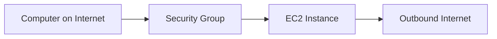
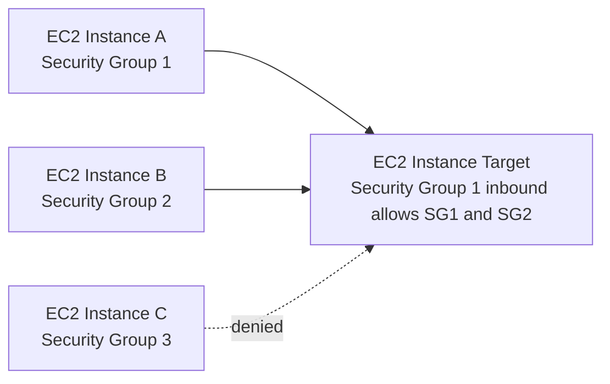

# 35. Security Groups & Classic Ports Overview

## 🎯 Giới thiệu

Bài học giải thích **Security Groups**, thành phần nền tảng cho network security trong AWS cloud. Security Groups kiểm soát traffic được phép đi vào và đi ra khỏi **EC2 instances**, hoạt động như firewall bên ngoài instance.

## 1. 🔒 Security Groups là gì?

**Security Groups** kiểm soát traffic:

- **Inbound traffic**: từ bên ngoài vào EC2 instance.
- **Outbound traffic**: từ EC2 instance ra bên ngoài.

Đặc điểm quan trọng:

- Chỉ chứa **allow rules**.
- Rules có thể reference:
  - IP addresses.
  - Other security groups.
- Security Group hoạt động như firewall quanh EC2 instance.

📌 Nếu traffic bị block bởi Security Group, EC2 instance sẽ không thấy request đó.

## 2. 📥 Inbound Rules và 📤 Outbound Rules

Một Security Group có thể có:

- **Inbound rules**: kiểm soát traffic đi vào instance.
- **Outbound rules**: kiểm soát traffic đi ra từ instance.

Rule thường gồm:

- Type.
- Protocol, ví dụ **TCP**.
- Port.
- Source, ví dụ IP range.

Ví dụ source:

- `0.0.0.0/0` nghĩa là mọi IPv4 address.
- Một IP cụ thể nghĩa là chỉ cho phép IP đó.

Mặc định:

- Tất cả inbound traffic bị blocked.
- Tất cả outbound traffic được authorized.

## 3. ⚠️ Timeout và Connection Refused

Bài học nhấn mạnh cách phân biệt lỗi kết nối:

### Timeout

Nếu application không accessible và request cứ chờ mãi:

- Đây thường là **Security Group issue**.
- Traffic bị chặn trước khi tới EC2 instance.

### Connection refused

Nếu nhận lỗi **connection refused**:

- Security Group đã cho traffic đi qua.
- Vấn đề nằm ở application:
  - Application bị lỗi.
  - Application chưa chạy.
  - Service không listening.

📌 Đây là mẹo troubleshooting rất quan trọng.

## 4. 🧱 Security Group và EC2 Instance Relationship

Security Groups có các tính chất:

- Một Security Group có thể attached vào nhiều EC2 instances.
- Một EC2 instance có thể có nhiều Security Groups.
- Rules từ nhiều Security Groups sẽ được áp dụng cùng nhau.
- Security Groups bị giới hạn theo **Region / VPC combination**.
- Nếu đổi region hoặc đổi VPC, cần tạo Security Group mới.

💡 Best Practice trong transcript:

- Nên duy trì một Security Group riêng chỉ cho **SSH access**.
- Vì SSH access thường là phần dễ gặp lỗi nhất.

## 5. 👥 Referencing Security Groups

Security Group rules có thể reference other Security Groups thay vì IP.

Ý nghĩa:

- Instance có Security Group được reference sẽ được phép kết nối.
- Không cần quản lý IP của từng EC2 instance.
- Rất hữu ích khi làm việc với Load Balancers.

📌 Nếu inbound rule cho phép **Security Group 1** và **Security Group 2**, các instance gắn hai group này có thể kết nối tới target instance. Instance với **Security Group 3** sẽ bị denied.

## 6. 🔢 Classic Ports cần nhớ

Các port quan trọng trong bài học:

| Port | Protocol / Service | Mục đích |
|------|--------------------|----------|
| 22 | **SSH / Secure Shell** | Log into Linux EC2 instance |
| 21 | **FTP / File Transfer Protocol** | Upload files into file share |
| 22 | **SFTP / Secure File Transfer Protocol** | Upload files using SSH |
| 80 | **HTTP** | Access unsecured websites |
| 443 | **HTTPS** | Access secured websites |
| 3389 | **RDP / Remote Desktop Protocol** | Log into Windows instance |

📌 22 dùng cho SSH vào Linux, còn 3389 dùng cho RDP vào Windows.

## 📊 Bảng tóm tắt

| Tiêu chí | Mô tả |
|----------|------|
| Security Group | Firewall cho EC2 instance |
| Rule type | Chỉ có **allow rules** |
| Inbound traffic | Từ ngoài vào instance |
| Outbound traffic | Từ instance ra ngoài |
| Default inbound | Blocked |
| Default outbound | Authorized |
| Timeout | Thường là Security Group issue |
| Connection refused | Traffic đã qua, application có vấn đề |
| Region/VPC | Security Group locked to Region/VPC combination |
| Reference rule | Có thể reference IP hoặc Security Group khác |

## 💡 Mẹo ghi nhớ cho kỳ thi AWS

- 🔒 **Security Group = firewall around EC2 instance**.
- ✅ Security Groups chỉ có **allow rules**.
- ⚠️ **Timeout = Security Group issue**.
- ⚠️ **Connection refused = application issue**, không phải SG block.
- 📌 Default: inbound blocked, outbound allowed.
- 🔢 Nhớ port: **22 SSH**, **80 HTTP**, **443 HTTPS**, **3389 RDP**.

## ✅ Kết luận

Security Groups là thành phần cốt lõi trong network security của EC2. Chúng kiểm soát inbound và outbound traffic, hoạt động ngoài EC2 instance, chỉ dùng allow rules và có thể reference IP hoặc Security Group khác. Khi ôn thi AWS, cần nhớ default rules, cách troubleshoot timeout/connection refused và các classic ports quan trọng.
