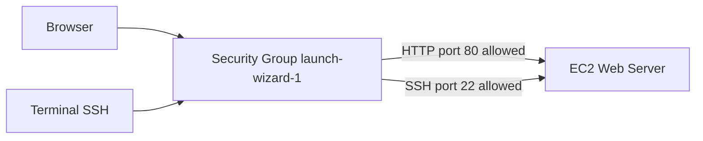
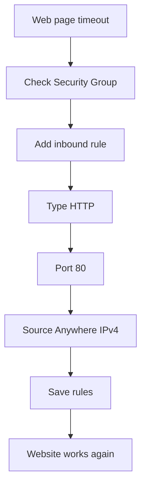

# 36. Security Groups Hands On

## 🎯 Giới thiệu

Bài học thực hành kiểm tra và chỉnh sửa **Security Groups** của một **EC2 instance** đã launch. Nội dung cho thấy cách inbound rules ảnh hưởng trực tiếp đến việc truy cập web server qua **HTTP** và cách nhận biết lỗi **timeout** do Security Group.

## 1. 🔍 Xem Security Groups của EC2 Instance

Có hai cách xem Security Groups:

- Trong EC2 instance, chọn tab **Security** để xem overview.
- Vào menu bên trái: **Networking and Security → Security Groups** để xem trang đầy đủ hơn.

Trong console có hai Security Groups:

- **default security group**.
- **launch-wizard-1**: được tạo khi tạo EC2 instance đầu tiên.

Mỗi Security Group có:

- Security Group ID.
- Inbound rules.
- Outbound rules.

## 2. 📥 Inbound Rules

**Inbound rules** là rules cho phép connectivity từ bên ngoài vào EC2 instance.

Trong bài học, **launch-wizard-1** có hai inbound rules:

- **SSH**:
  - Port: **22**.
  - Source: anywhere, `0.0.0.0/0`.
- **HTTP**:
  - Port: **80**.
  - Source: anywhere.

📌 Rule **HTTP port 80** chính là rule cho phép truy cập web server trên EC2.

## 3. ⚠️ Xóa HTTP Rule và Timeout

Bài học thử xóa inbound rule **HTTP port 80**.

Kết quả:

- Web page refresh bị loading liên tục.
- Không truy cập được EC2 web server.
- Đây được gọi là **timeout**.

Mẹo quan trọng:

- Nếu gặp **timeout** khi kết nối tới EC2 instance, nguyên nhân là **EC2 Security Group**.
- Điều này áp dụng cho:
  - SSH timeout.
  - HTTP query timeout.
  - Bất kỳ kết nối nào bị timeout vào EC2 instance.

⚠️ Transcript nhấn mạnh: timeout khi cố gắng establish connection vào EC2 instance là do Security Group rules không đúng.

## 4. ✅ Thêm lại HTTP Rule

Để sửa lỗi, thêm lại rule:

- Type: **HTTP**.
- Port: **80**.
- Source: **Anywhere IPv4**.

Sau khi save rules:

- Refresh page.
- Web server hoạt động trở lại.

## 5. 🧩 Custom Inbound Rules

Security Group cho phép thêm nhiều loại inbound rules khác nhau.

Bạn có thể:

- Tự định nghĩa port hoặc port range.
- Chọn protocol từ dropdown.
- Ví dụ:
  - **HTTPS** tự động dùng port **443**.

Source có thể là:

- Custom CIDR.
- Anywhere.
- **My IP**.
- Security Groups.
- Prefix lists.

⚠️ Nếu chọn **My IP**, chỉ IP hiện tại được truy cập. Nếu IP thay đổi, bạn sẽ gặp timeout và không truy cập được EC2 instance.

## 6. 📤 Outbound Rules

Trong bài học, outbound rules cho phép:

- All traffic trên IPv4.
- Destination: anywhere.

Ý nghĩa:

- EC2 instance có full internet connectivity outbound.

## 7. 👥 Quan hệ giữa Security Groups và EC2 Instances

Một số điểm quan trọng:

- Một EC2 instance có thể attach nhiều Security Groups.
- Một Security Group có thể attach cho nhiều EC2 instances.
- Rules từ các Security Groups sẽ cộng dồn.

📌 Bạn có thể attach một, hai, ba hoặc nhiều Security Groups vào cùng một instance.

## 📊 Bảng tóm tắt

| Tiêu chí | Mô tả |
|----------|------|
| Security Group trong bài | **launch-wizard-1** |
| SSH inbound rule | Port **22** từ anywhere |
| HTTP inbound rule | Port **80** từ anywhere |
| Xóa HTTP rule | Web server bị timeout |
| Timeout | Dấu hiệu Security Group rule chưa đúng |
| HTTPS | Port **443** |
| My IP | Chỉ cho phép IP hiện tại, IP đổi sẽ timeout |
| Outbound rule | Allow all traffic IPv4 to anywhere |
| EC2 và SG | Instance có thể có nhiều SG, SG có thể gắn nhiều instances |

## 💡 Mẹo ghi nhớ cho kỳ thi AWS

- ⚠️ **Timeout vào EC2 = kiểm tra Security Group đầu tiên**.
- 🌐 Web server HTTP cần mở **port 80**.
- 🔐 SSH cần mở **port 22**.
- 🔒 **My IP** an toàn hơn anywhere, nhưng IP đổi thì sẽ bị timeout.
- 📤 Outbound mặc định trong bài cho phép EC2 truy cập internet.

## ✅ Kết luận

Bài thực hành chứng minh Security Group kiểm soát trực tiếp khả năng truy cập EC2 instance. Xóa rule HTTP port 80 khiến website timeout; thêm lại rule thì website hoạt động. Đây là kỹ năng troubleshooting quan trọng khi làm việc với EC2 và khi ôn thi AWS.
