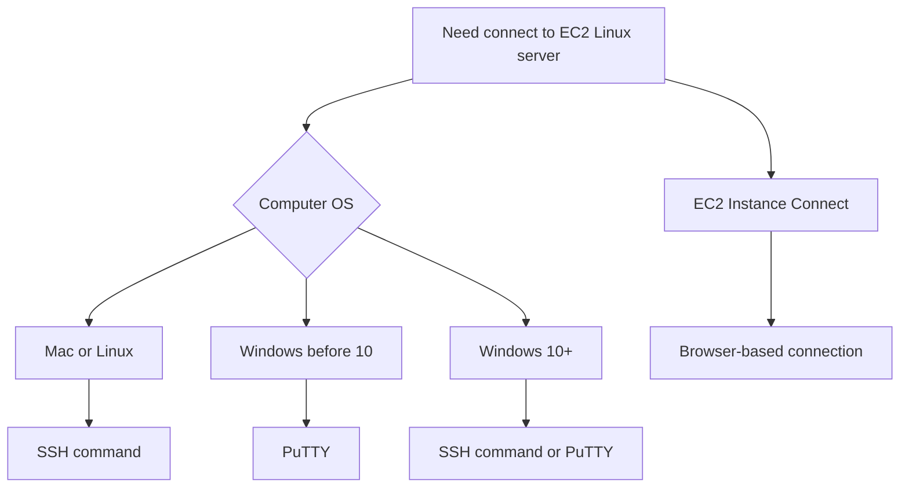

# 37. SSH Overview

## 🎯 Giới thiệu

Bài học giới thiệu cách kết nối vào server trong cloud để thực hiện maintenance hoặc action. Với Linux servers, có thể dùng **SSH** để tạo **secure shell** vào server. Nội dung cũng so sánh các lựa chọn kết nối tùy theo operating system của máy người học.

## 1. 🔐 SSH là gì?

**SSH** là một command line interface utility dùng để kết nối bảo mật vào server.

Trong bài học:

- SSH dùng để kết nối vào Linux servers.
- Mục tiêu là mở secure shell vào EC2 instance.
- Khi dùng SSH, bạn có thể điều khiển server từ terminal hoặc command line.

📌 SSH là một trong những phần dễ gây khó khăn nhất trong course theo kinh nghiệm của giảng viên.

## 2. 💻 Cách kết nối theo Operating System

Tùy máy tính bạn đang dùng, có nhiều cách khác nhau để SSH vào EC2 instance.

### Mac hoặc Linux

- Dùng command line utility **SSH**.
- Người học nên xem lecture SSH cho Mac/Linux.

### Windows trước version 10

- Dùng **PuTTY**.
- PuTTY làm cùng việc với SSH.
- Khi giảng viên nói “SSH”, người dùng Windows có thể hiểu là dùng PuTTY.

### Windows version 10 trở lên

- Có thể dùng **SSH command**.
- Có lecture riêng cho SSH trên Windows 10.

### Mọi operating system

Có thể dùng:

- **EC2 Instance Connect**.

Đây là cách kết nối bằng web browser, không cần terminal hoặc PuTTY.

## 3. 🌐 EC2 Instance Connect

**EC2 Instance Connect** là phương pháp mới hơn, dùng web browser để kết nối vào EC2 instance.

Đặc điểm trong transcript:

- Dùng được trên Mac, Linux, Windows, mọi version.
- Không cần cài terminal tool riêng.
- Không cần quen command line.
- Giảng viên sẽ dùng nhiều trong các lecture sau.

⚠️ Trong transcript, EC2 Instance Connect hiện chỉ works với **Amazon Linux 2**, vì vậy course dùng Amazon Linux 2.

## 4. 🧰 Khi SSH gặp lỗi

Bài học đưa lời khuyên:

- Nếu SSH không hoạt động, hãy xem lại lecture.
- Có thể lỗi do:
  - Security Group rule.
  - Command sai.
  - Typo.
  - Một chi tiết bị bỏ sót.
- Có troubleshooting guide sau các lecture SSH.
- Nên thử **EC2 Instance Connect**, vì đôi khi phương pháp này giải quyết vấn đề.

📌 Nếu một phương pháp kết nối hoạt động, bạn đã đủ để tiếp tục course. Không cần tất cả các phương pháp đều hoạt động.

## 5. 🧘 Nếu không có cách nào hoạt động

Giảng viên nhấn mạnh:

- Nếu không có method nào hoạt động thì cũng không sao.
- Course chỉ ở mức introductory.
- Course sẽ không dùng SSH quá nhiều.
- Người học vẫn có thể tiếp tục.

## 📊 Bảng tóm tắt

| Máy tính người học | Cách kết nối được khuyến nghị |
|--------------------|-------------------------------|
| Mac | **SSH command** |
| Linux | **SSH command** |
| Windows trước version 10 | **PuTTY** |
| Windows 10+ | **SSH command** hoặc PuTTY |
| Mac/Linux/Windows mọi version | **EC2 Instance Connect** |

## 💡 Mẹo ghi nhớ cho kỳ thi AWS

- 🔐 **SSH** dùng để secure shell vào Linux server.
- 🪟 Windows cũ dùng **PuTTY** để thực hiện SSH.
- 🌐 **EC2 Instance Connect** là browser-based connection.
- 📌 Trong course, EC2 Instance Connect được dùng nhiều vì đơn giản.
- ⚠️ Nếu SSH lỗi, hãy kiểm tra **Security Group**, command và typo.

## ✅ Kết luận

Bài học đặt nền tảng cho việc kết nối vào EC2 Linux server. Người dùng có thể chọn SSH command, PuTTY hoặc EC2 Instance Connect tùy operating system. EC2 Instance Connect là cách đơn giản và dùng được qua browser, miễn là instance phù hợp với điều kiện được nêu trong transcript.
