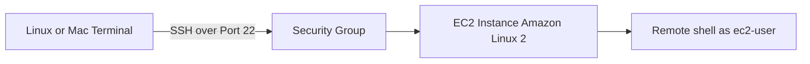

# 38. How to SSH using Linux or Mac

## 🎯 Giới thiệu

Bài học hướng dẫn cách dùng **SSH** từ Linux hoặc Mac để kết nối vào **EC2 Instance** chạy **Amazon Linux 2**. Nội dung bao gồm chuẩn bị file `.pem`, kiểm tra **Security Group**, chạy SSH command, xử lý lỗi permission và thử command bên trong instance.

## 1. 🔐 SSH dùng để làm gì?

**SSH** cho phép bạn điều khiển remote machine hoặc server bằng terminal / command line.

Trong bài học:

- EC2 machine chạy **Amazon Linux 2**.
- EC2 instance có **public IP**.
- Security Group đã mở **Port 22** cho SSH.
- Laptop kết nối qua internet tới EC2 instance bằng SSH.



## 2. 📁 Chuẩn bị PEM File

Khi tạo EC2 instance, bạn đã tải file key pair:

- **EC2 Tutorial.pem**.

Trong bài học, giảng viên khuyên:

- Xóa space trong tên file nếu có.
- Đổi thành dạng không có khoảng trắng, ví dụ **EC2Tutorial.pem**.
- Đặt file vào một directory dễ dùng, ví dụ folder **aws-course**.

📌 SSH command cần reference đúng file `.pem`, nên terminal phải ở đúng directory chứa file.

## 3. 🌐 Lấy Public IPv4 và kiểm tra Security Group

Trước khi SSH:

- Vào EC2 instance overview.
- Copy **Public IPv4 address**.
- Kiểm tra tab **Security**.
- Đảm bảo Security Group có rule:
  - **Port 22**.
  - **SSH**.
  - Source: `0.0.0.0/0` nếu làm theo bài.

⚠️ Nếu không có port 22, cần thêm rule SSH vào Security Group.

## 4. 👤 User mặc định: ec2-user

Amazon Linux 2 AMI có user mặc định:

- **ec2-user**.

SSH command có dạng:

```bash
ssh ec2-user@<public-ip>
```

Nhưng nếu chưa chỉ định key file, bạn có thể gặp lỗi authentication vì chưa dùng file key đã tải.

## 5. 🧪 SSH với PEM File

Cần chạy command với option `-i` để chỉ định private key:

```bash
ssh -i EC2Tutorial.pem ec2-user@<public-ip>
```

Nếu terminal không ở đúng directory chứa file `.pem`, command sẽ không hoạt động.

Một số command hỗ trợ di chuyển directory trong bài:

```bash
pwd
ls
cd aws-course
cd ..
```

## 6. ⚠️ Lỗi Unprotected Key File và chmod

Nếu gặp lỗi **unprotected key file**, cần đổi permission của file `.pem`.

Command trong bài:

```bash
chmod 0400 EC2Tutorial.pem
```

Sau đó chạy lại SSH command:

```bash
ssh -i EC2Tutorial.pem ec2-user@<public-ip>
```

Có thể có prompt yes/no để trust instance. Nếu có, nhập **yes**.

## 7. ✅ Sau khi SSH thành công

Sau khi kết nối thành công, prompt hiển thị dạng:

- **ec2-user@...**

Điều này nghĩa là commands sẽ chạy trực tiếp trên **Amazon Linux 2 AMI EC2 instance**.

Các command được thử:

```bash
whoami
ping google.com
```

- `whoami` trả về **ec2-user**.
- `ping google.com` kiểm tra instance có thể ping Google.
- Dùng **Control + C** để dừng ping.

Để thoát khỏi instance:

```bash
exit
```

Hoặc dùng:

- **Control + D**.

## 8. ⚠️ Public IP có thể thay đổi

Nếu stop rồi start lại instance:

- **Public IP can change**.
- Cần cập nhật public IP trong SSH command.

📌 Đây là lỗi phổ biến khi hôm trước SSH được nhưng hôm sau không vào được.

## 📊 Bảng tóm tắt

| Tiêu chí | Mô tả |
|----------|------|
| Protocol | **SSH** |
| Port | **22** |
| OS của EC2 | **Amazon Linux 2** |
| User mặc định | **ec2-user** |
| Key file | **EC2Tutorial.pem** |
| SSH command | `ssh -i EC2Tutorial.pem ec2-user@<public-ip>` |
| Permission fix | `chmod 0400 EC2Tutorial.pem` |
| Kiểm tra user | `whoami` |
| Dừng ping | **Control + C** |
| Thoát SSH | `exit` hoặc **Control + D** |

## 💡 Mẹo ghi nhớ cho kỳ thi AWS

- 🔑 SSH vào Amazon Linux 2 dùng user **ec2-user**.
- 🔐 Phải mở **port 22** trong **Security Group**.
- 📁 File `.pem` phải được reference đúng path.
- ⚠️ Lỗi permission key file trên Mac/Linux xử lý bằng `chmod 0400`.
- 🌐 Stop/start instance có thể làm **Public IP** thay đổi.

## ✅ Kết luận

Bài học hướng dẫn đầy đủ quy trình SSH vào EC2 instance từ Linux hoặc Mac: chuẩn bị key file, kiểm tra Security Group port 22, dùng user ec2-user, sửa permission bằng chmod và chạy command trong remote terminal. Đây là kỹ năng thực hành quan trọng khi làm việc với EC2 Linux instances.
