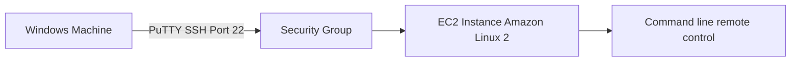
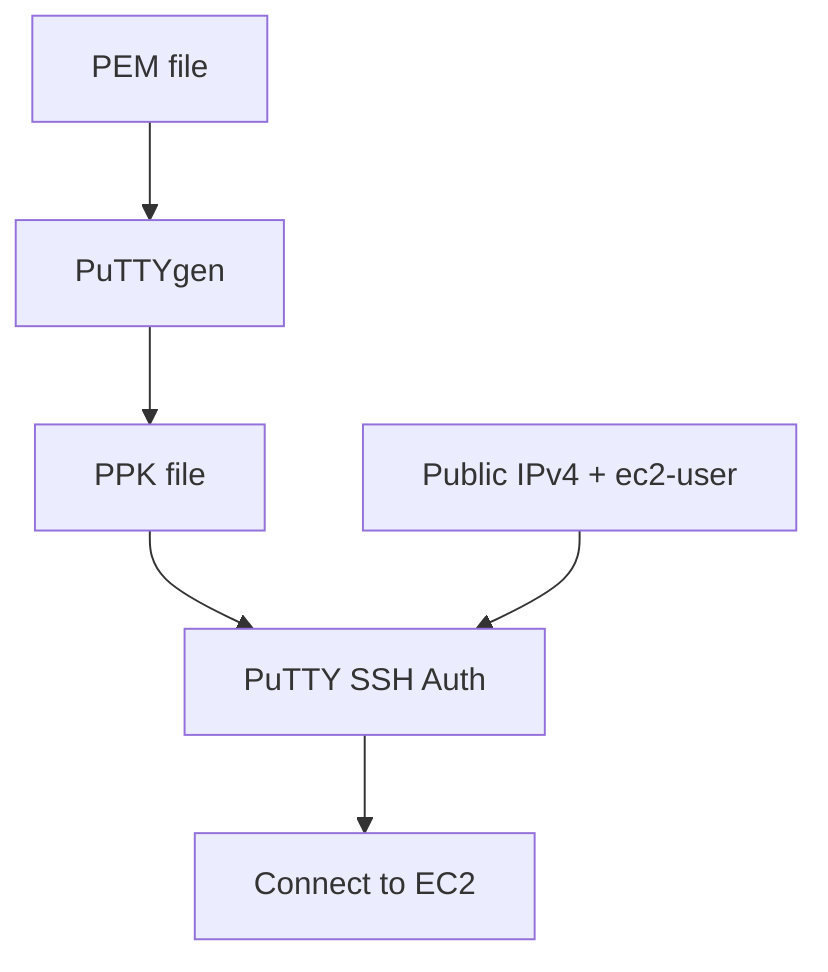

# 39. How to SSH using Windows

## 🎯 Giới thiệu

Bài học hướng dẫn cách dùng **PuTTY** trên Windows để SSH vào **EC2 Instance** chạy **Amazon Linux 2**. Nội dung phù hợp với Windows 7, Windows 8 hoặc phiên bản Windows cũ hơn; Windows 10 cũng có thể dùng phương pháp này.

## 1. 🔐 SSH trên Windows bằng PuTTY

**SSH** cho phép điều khiển machine remotely bằng command line.

Trong bài học:

- EC2 machine chạy **Amazon Linux 2**.
- EC2 instance có **public IP**.
- Security Group mở **SSH port 22** từ any IP.
- Windows machine kết nối qua internet vào EC2 instance.



## 2. 🧰 Cài đặt PuTTY

**PuTTY** là free SSH client cho Windows.

Các bước:

- Download PuTTY.
- Chọn installer phù hợp, ví dụ **64-bit installer**.
- Cài đặt PuTTY.

Sau khi cài, có hai công cụ quan trọng:

- **PuTTY app**.
- **PuTTYgen**.

## 3. 🔑 Chuyển PEM sang PPK bằng PuTTYgen

Nếu bạn chưa tải key pair ở định dạng **PPK**, có thể dùng **PuTTYgen** để convert từ **PEM** sang **PPK**.

Các bước trong bài:

- Mở **PuTTYgen**.
- Click **Load**.
- Chọn hiển thị **All Files** để thấy file `.pem`.
- Chọn file **EC2 tutorial.pem**.
- Sau khi import thành công, chọn **Save private key**.
- Lưu thành file **EC2tutorial.PPK**.

📌 PuTTY dùng file `.ppk`, không dùng trực tiếp `.pem` trong flow này.

## 4. 🌐 Cấu hình PuTTY Session

Mở **PuTTY app** và cấu hình:

- Host name hoặc IP address: dùng **public IPv4 address** của EC2 instance.
- Connection type: **SSH**.
- Save session dưới tên, ví dụ: **EC2 Instance**.

Sau đó cần thêm username:

```text
ec2-user@<public-ip>
```

Lý do:

- **ec2-user** là user đã được tạo sẵn trên **Amazon Linux 2**.

## 5. 🔐 Gắn Private Key trong PuTTY

Trong PuTTY:

- Load saved session **EC2 Instance**.
- Vào phần **SSH → Auth**.
- Browse tới file private key `.ppk`, ví dụ **EC2tutorial.PPK**.
- Quay lại **Session**.
- Click **Save** để lưu cấu hình.
- Click **Open** để kết nối.

Khi được hỏi có trust host không:

- Chọn accept / yes.

Sau đó PuTTY dùng key file để authenticate và bạn vào được **Amazon Linux 2 AMI**.



## 6. ✅ Kiểm tra sau khi kết nối

Sau khi kết nối thành công, có thể chạy:

```bash
whoami
ping google.com
```

Kết quả:

- `whoami` trả về **ec2-user**.
- `ping google.com` chạy command từ EC2 instance.
- Dùng **Control + C** để stop command ping.

Để thoát session:

- Close PuTTY session.

## 7. 💾 Lưu Session để dùng lại

Bài học nhấn mạnh cần save session sau khi cấu hình:

- Host name có `ec2-user@<public-ip>`.
- Private key `.ppk` trong SSH Auth.

Lần sau mở PuTTY:

- Load session **EC2 Instance**.
- Click Open.
- Kết nối lại trực tiếp.

## 📊 Bảng tóm tắt

| Tiêu chí | Mô tả |
|----------|------|
| Tool | **PuTTY** |
| Key converter | **PuTTYgen** |
| File ban đầu | `.pem` |
| File PuTTY dùng | `.ppk` |
| EC2 OS | **Amazon Linux 2** |
| User | **ec2-user** |
| Port | **22** |
| Host format | `ec2-user@<public-ip>` |
| Test command | `whoami`, `ping google.com` |
| Dừng ping | **Control + C** |

## 💡 Mẹo ghi nhớ cho kỳ thi AWS

- 🪟 Windows cũ dùng **PuTTY** để SSH.
- 🔑 PuTTY cần key dạng **PPK**.
- 🧰 **PuTTYgen** dùng để convert **PEM → PPK**.
- 👤 Amazon Linux 2 dùng user **ec2-user**.
- 🔐 Security Group phải mở **port 22**.

## ✅ Kết luận

Bài học cho thấy cách SSH vào EC2 từ Windows bằng PuTTY: cài PuTTY, convert key từ PEM sang PPK bằng PuTTYgen, cấu hình host với ec2-user và public IPv4, gắn private key trong SSH Auth, save session và kết nối vào Amazon Linux 2 instance.
