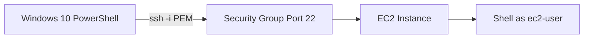

# 40. How to SSH using Windows 10

## 🎯 Giới thiệu

Bài học hướng dẫn cách SSH vào **EC2 Instance** từ **Windows 10** bằng SSH command trong **Windows PowerShell** hoặc **Command Prompt**. Nếu máy không có SSH command, người học cần dùng phương pháp **PuTTY** ở bài trước.

## 1. 🧪 Kiểm tra SSH Command trên Windows 10

Mở **Windows PowerShell** hoặc **Command Prompt** và gõ:

```bash
ssh
```

Nếu command hiển thị help/output:

- SSH command khả dụng.

Nếu không có SSH command:

- Cần dùng phương pháp **PuTTY** ở lecture trước.

📌 Trong bài học, giảng viên dùng PowerShell.

## 2. 📁 Đi tới Directory chứa PEM File

Cần đứng đúng directory chứa file `.pem`.

Ví dụ trong transcript:

```powershell
ls
cd .\Desktop
ls
```

File quan trọng:

- **EC2Tutorial.pem**.

File `.ppk` không liên quan trong phương pháp SSH command này. `.ppk` chỉ dùng nếu muốn dùng PuTTY.

## 3. 🔒 Kiểm tra Security Group

Trước khi SSH, cần đảm bảo Security Group mở:

- **port 22**.
- Type: **SSH**.

Nếu port 22 không mở, SSH sẽ không kết nối được.

## 4. 🔐 SSH Command trên Windows 10

Command tương tự trên Mac/Linux:

```powershell
ssh -i EC2Tutorial.pem ec2-user@<public-ip>
```

Trong đó:

- `-i` dùng để chỉ định key file.
- `EC2Tutorial.pem` là private key file đã tải.
- `ec2-user` là user của Amazon Linux 2.
- `<public-ip>` là public IPv4 address của EC2 instance.

Có thể dùng phím **Tab** để autocomplete tên file.

Khi được hỏi authenticity của host:

- Nhập **yes** để tiếp tục.

Sau đó bạn sẽ vào được EC2 instance.



## 5. ⚠️ Xử lý Permission Issue trên Windows

Nếu gặp permission issue với file `.pem`, cần chỉnh permission file.

Các bước trong transcript:

- Right click file `.pem`.
- Chọn **Properties**.
- Vào tab **Security**.
- Chọn **Advanced**.
- Đảm bảo owner của file là chính bạn.
- Disable inheritance.
- Remove inherited permissions.
- Thêm chính user của bạn làm principal.
- Cấp **Full Control** cho user của bạn.

Sau khi chỉnh:

- Trong Security tab chỉ còn user của bạn với full permission.
- Chạy lại SSH command sẽ không gặp permission issue.

## 6. 🧪 Dùng Command Prompt cũng được

Ngoài PowerShell, có thể dùng **Command Prompt**.

Cần:

- Đi tới đúng directory chứa `.pem`, ví dụ Desktop.
- Paste lại SSH command.

Command vẫn hoạt động nếu SSH command có sẵn.

## 7. 🚪 Thoát SSH Session

Để thoát khỏi EC2 instance:

```bash
exit
```

Hoặc dùng:

- **Control + D**.

## 📊 Bảng tóm tắt

| Tiêu chí | Mô tả |
|----------|------|
| OS | **Windows 10** |
| Tool | **PowerShell** hoặc **Command Prompt** |
| Kiểm tra SSH | Gõ `ssh` |
| Không có SSH | Dùng **PuTTY** |
| Key file | **EC2Tutorial.pem** |
| SSH command | `ssh -i EC2Tutorial.pem ec2-user@<public-ip>` |
| User | **ec2-user** |
| Port cần mở | **22** |
| Permission fix | Owner là chính user, disable inheritance, Full Control |
| Thoát | `exit` hoặc **Control + D** |

## 💡 Mẹo ghi nhớ cho kỳ thi AWS

- 🪟 Windows 10 có thể dùng **SSH command** trực tiếp.
- 🔑 SSH command dùng file **.pem**, không phải **.ppk**.
- 👤 Amazon Linux 2 dùng user **ec2-user**.
- 🔐 Security Group phải mở **port 22**.
- ⚠️ Permission issue trên Windows xử lý qua file properties và security permissions.

## ✅ Kết luận

Bài học hướng dẫn SSH vào EC2 instance từ Windows 10 bằng PowerShell hoặc Command Prompt. Quy trình chính gồm kiểm tra SSH command, đứng đúng folder chứa PEM file, mở port 22 trong Security Group, chạy `ssh -i` với user ec2-user và xử lý permission issue nếu cần.
