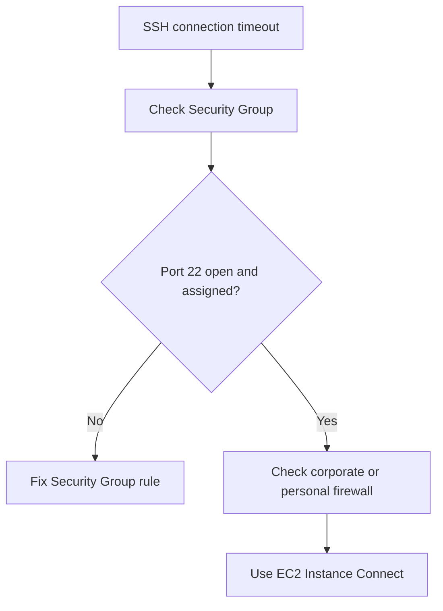
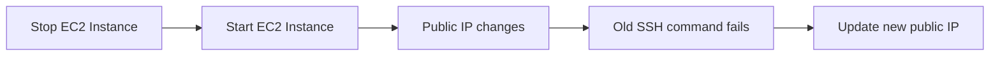

# 41. SSH Troubleshooting

## 🎯 Giới thiệu

Bài học là checklist xử lý lỗi khi **SSH** vào **EC2 instance**. Nội dung tập trung vào các lỗi phổ biến như **connection timeout**, **ssh command not found**, **connection refused**, **Permission denied**, và trường hợp public IP thay đổi sau khi stop/start instance.

## 1. ⚠️ Connection Timeout

Nếu gặp **connection timeout**:

- Đây là **Security Group issue**.
- Timeout không chỉ áp dụng cho SSH mà còn cho các connection khác.
- Nguyên nhân có thể là Security Group hoặc firewall.

Cần kiểm tra:

- Security Group có mở rule SSH đúng không.
- Security Group có được assign đúng cho EC2 instance không.



## 2. 🧱 Vẫn Timeout dù Security Group đúng

Nếu Security Group đã cấu hình đúng nhưng vẫn timeout:

- Có thể **corporate firewall** đang block connection.
- Có thể **personal firewall** đang block connection.

Giải pháp được khuyến nghị:

- Dùng **EC2 Instance Connect** ở lecture tiếp theo.

## 3. 🪟 SSH không hoạt động trên Windows

Nếu lỗi:

```text
ssh command not found
```

Ý nghĩa:

- Máy không có SSH command.

Giải pháp:

- Dùng **PuTTY**.
- Xem lại video hướng dẫn.
- Nếu vẫn không hoạt động, dùng **EC2 Instance Connect**.

## 4. ❌ Connection Refused

Nếu gặp **connection refused**:

- Instance reachable.
- Nhưng không có SSH utility đang chạy trên instance.

Hướng xử lý:

- Thử restart instance.
- Nếu không được, terminate instance và tạo instance mới.
- Đảm bảo dùng **Amazon Linux 2**.

📌 Khác với timeout, connection refused cho thấy request đã tới instance nhưng service phía trong không sẵn sàng.

## 5. 🔑 Permission Denied

Lỗi:

```text
Permission denied (publickey,gssapi-keyex,gssapi-with-mic)
```

Có hai nguyên nhân chính:

### Sai Security Key

- Bạn dùng wrong security key.
- Hoặc không dùng security key.
- Cần kiểm tra EC2 instance configuration để chắc chắn đã assign đúng key.

### Sai User

- Bạn dùng wrong user.
- Nếu dùng **Amazon Linux 2 EC2 instance**, cần dùng user:
  - **ec2-user**.

Ví dụ SSH format:

```text
ec2-user@<public-ip>
```

Ví dụ trong transcript:

```text
ec2-user@35.180.242.162
```

## 6. 🧘 Nothing is working

Nếu mọi thứ đều không hoạt động:

- Không hoảng loạn.
- Dùng **EC2 Instance Connect**.
- Đảm bảo đã start **Amazon Linux 2**.
- Sau đó vẫn có thể follow tutorial.

## 7. 🌐 Hôm qua connect được, hôm nay không được

Nguyên nhân có thể là:

- Bạn đã stop EC2 instance.
- Sau đó start lại.
- Khi làm vậy, **public IP của EC2 instance sẽ thay đổi**.

Cần sửa:

- SSH command.
- PuTTY configuration.
- Lưu lại public IP mới.



## 📊 Bảng tóm tắt

| Lỗi | Ý nghĩa | Cách xử lý |
|-----|---------|------------|
| Connection timeout | Security Group hoặc firewall issue | Kiểm tra Security Group, nếu đúng thì dùng EC2 Instance Connect |
| Still timeout | Corporate/personal firewall block | Dùng EC2 Instance Connect |
| ssh command not found | Windows không có SSH command | Dùng PuTTY |
| Connection refused | Instance reachable nhưng SSH utility không chạy | Restart, hoặc terminate và tạo mới bằng Amazon Linux 2 |
| Permission denied | Sai key hoặc sai user | Kiểm tra key, dùng **ec2-user** |
| Nothing working | Không kết nối được bằng các cách thường | Dùng **EC2 Instance Connect** |
| Hôm qua được, hôm nay không | Public IP thay đổi sau stop/start | Cập nhật public IP mới |

## 💡 Mẹo ghi nhớ cho kỳ thi AWS

- ⚠️ **Timeout = Security Group hoặc firewall**.
- ❌ **Connection refused = instance reachable, nhưng SSH service có vấn đề**.
- 🔑 **Permission denied = sai key hoặc sai user**.
- 👤 Amazon Linux 2 dùng user **ec2-user**.
- 🌐 Stop/start EC2 có thể làm **public IP** thay đổi.
- 🧰 Khi bí, dùng **EC2 Instance Connect**.

## ✅ Kết luận

Bài troubleshooting cung cấp checklist nhanh cho lỗi SSH vào EC2. Các điểm cần nhớ nhất là timeout thường liên quan đến Security Group/firewall, permission denied thường do sai key hoặc user, và public IP có thể thay đổi sau khi stop/start instance. EC2 Instance Connect là giải pháp thay thế khi SSH truyền thống gặp khó khăn.
