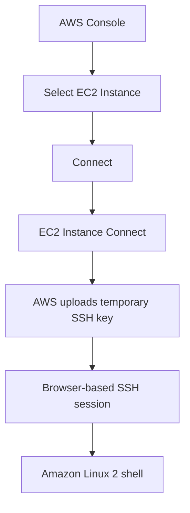
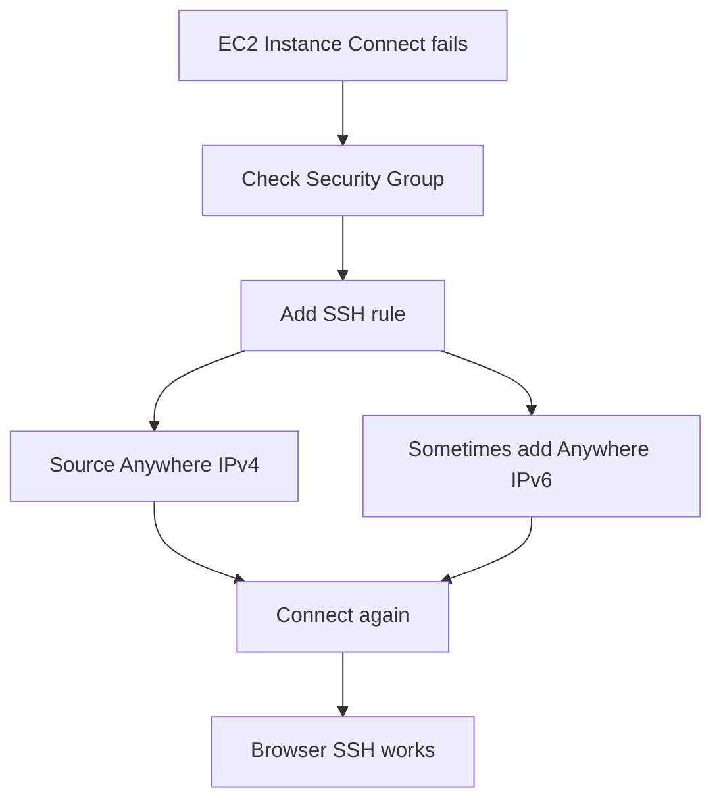

# 42. EC2 Instance Connect

## 🎯 Giới thiệu

Bài học giới thiệu **EC2 Instance Connect**, một lựa chọn thay thế cho SSH truyền thống. Phương pháp này cho phép mở **browser-based SSH session** vào **EC2 Instance**, đơn giản hơn vì không cần tự quản lý SSH keys như khi dùng terminal hoặc PuTTY.

## 1. 🌐 EC2 Instance Connect là gì?

**EC2 Instance Connect** cho phép kết nối vào EC2 instance trực tiếp từ web browser.

Các bước trong console:

- Chọn **My First Instance**.
- Click **Connect**.
- Chọn tab **EC2 Instance Connect**.
- Kiểm tra public IP address.
- Username mặc định là **ec2-user**.
- Click **Connect**.

📌 AWS đoán username là **ec2-user** vì instance đang dùng Amazon Linux 2.

## 2. 🔑 Không cần quản lý SSH Key thủ công

Trong EC2 Instance Connect:

- Không có SSH key option để người dùng chọn.
- Khi connect, AWS upload temporary SSH key.
- Sau đó thiết lập connection.

Ý nghĩa:

- Không cần tự quản lý SSH keys.
- Không cần terminal.
- Không cần PuTTY.
- Session chạy ngay trong browser.



## 3. ✅ Chạy Commands trong Browser Session

Sau khi kết nối, bạn đang ở trong **Amazon Linux 2 AMI**.

Có thể chạy commands như:

```bash
whoami
ping google.com
```

Kết quả cho thấy session hoạt động như SSH thông thường, nhưng chạy trong browser.

Trong course, khi giảng viên nói “use SSH”, bạn có thể dùng một trong các cách:

- Terminal SSH.
- PuTTY.
- SSH command trên Windows.
- **EC2 Instance Connect**.

## 4. 🔒 EC2 Instance Connect vẫn phụ thuộc vào SSH

Dù dùng browser, **EC2 Instance Connect** vẫn dựa vào SSH behind the scenes.

Bài học chứng minh bằng cách:

- Xóa inbound rule **SSH port 22** khỏi Security Group.
- Thử dùng EC2 Instance Connect.
- Connection không hoạt động.

Thông báo lỗi cho thấy có problem connecting to instance.

Kết luận:

- Cần mở **port 22**.
- EC2 Instance Connect vẫn cần Security Group cho phép SSH.

## 5. 🛠️ Sửa lỗi bằng Security Group Rule

Để EC2 Instance Connect hoạt động lại:

- Vào Security Group.
- Edit inbound rules.
- Add rule:
  - Type: **SSH**.
  - Source: **Anywhere IPv4**.
- Save rules.

Trong một số setup, có thể cần thêm:

- **Anywhere IPv6**.

Sau khi thêm rules, connect lại sẽ vào được instance.



## 📊 Bảng tóm tắt

| Tiêu chí | Mô tả |
|----------|------|
| Service / Feature | **EC2 Instance Connect** |
| Kiểu kết nối | Browser-based SSH session |
| Username | **ec2-user** |
| SSH key | AWS upload temporary SSH key |
| Có cần terminal không | Không |
| Có cần PuTTY không | Không |
| Vẫn cần SSH port 22 | Có |
| Security Group cần | Inbound **SSH port 22** |
| Source trong bài | Anywhere IPv4, đôi khi thêm Anywhere IPv6 |

## 💡 Mẹo ghi nhớ cho kỳ thi AWS

- 🌐 **EC2 Instance Connect = SSH trong browser**.
- 🔑 Không cần tự chọn SSH key vì AWS dùng temporary SSH key.
- 👤 Với Amazon Linux 2, username là **ec2-user**.
- 🔐 Dù browser-based, vẫn cần mở **port 22** trong **Security Group**.
- ⚠️ Nếu EC2 Instance Connect fail, kiểm tra SSH inbound rule trước.

## ✅ Kết luận

EC2 Instance Connect là cách kết nối vào EC2 instance đơn giản qua browser, không cần quản lý SSH keys thủ công. Tuy nhiên, nó vẫn dựa trên SSH phía sau, nên Security Group phải mở port 22. Đây là phương pháp thuận tiện để dùng trong course thay cho terminal SSH hoặc PuTTY.
