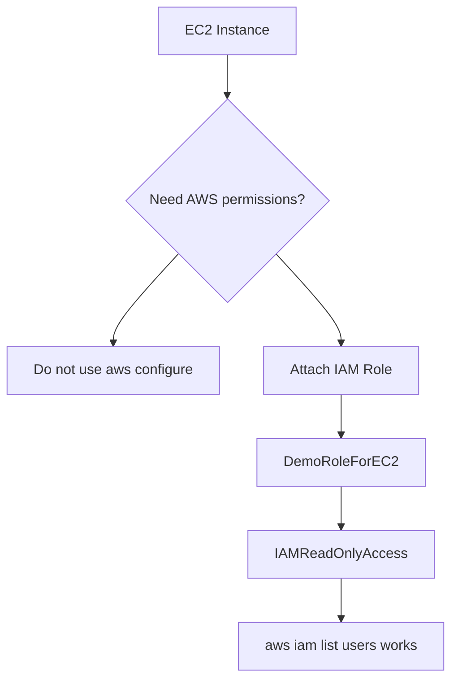
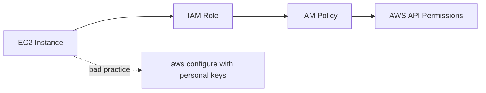

# 43. EC2 Instance Roles Demo

## 🎯 Giới thiệu

Bài học thực hành dùng **IAM roles** cho **EC2 Instance**. Nội dung nhấn mạnh best practice quan trọng: không bao giờ nhập **Access Key ID** và **Secret Access Key** trực tiếp vào EC2 instance bằng `aws configure`; thay vào đó, cấp quyền cho EC2 thông qua **IAM role**.

## 1. 🔌 Kết nối vào EC2 Instance

Đầu tiên, kết nối vào EC2 instance bằng một trong các cách:

- SSH.
- **EC2 Instance Connect**.
- PuTTY.

Trong bài học, giảng viên dùng **EC2 Instance Connect** vì chạy trong web browser và đơn giản hơn.

Sau khi connect thành công, prompt hiển thị:

- **ec2-user@...** và private IP.

Có thể thử commands:

```bash
ping google.com
clear
```

Dùng **Control + C** để thoát ping.

## 2. 🧰 AWS CLI trên Amazon Linux AMI

Amazon Linux AMI trong bài học đã có **AWS CLI** được cài sẵn.

Command được thử:

```bash
aws iam list users
```

Kết quả ban đầu:

- Unable to locate credentials.
- Có gợi ý dùng `aws configure`.

## 3. ⚠️ Không dùng aws configure trên EC2 Instance

Có thể chạy:

```bash
aws configure
```

và nhập:

- Access Key ID.
- Secret Access Key.
- Region name.

Nhưng bài học nhấn mạnh đây là **really, really, really bad idea**.

Lý do:

- Nếu nhập personal credentials vào EC2 instance, người khác trong account có thể connect vào instance.
- Họ có thể retrieve credentials trong instance.
- Điều này không an toàn.

⚠️ Rule of thumb:

- Never, ever, ever enter IAM API key vào EC2 Instance.
- Không nhập **Access Key ID** và **Secret Access Key** vào EC2 instance.

## 4. ✅ Dùng IAM Role cho EC2 Instance

Thay vì nhập credentials thủ công, dùng **IAM role**.

Trong IAM đã có role:

- **DemoRoleForEC2**.

Role này có policy:

- **IAMReadOnlyAccess**.

Cách attach role vào EC2 instance:

- Vào EC2 instance.
- Tab **Security** cho thấy ban đầu chưa có IAM Role.
- Chọn **Actions → Security → Modify IAM role**.
- Chọn **DemoRoleForEC2**.
- Save.

Sau đó tab Security hiển thị:

- IAM role attached to instance: **DemoRoleForEC2**.



## 5. 🧪 Kiểm chứng Role hoạt động

Sau khi attach role, chạy lại:

```bash
aws iam list users
```

Kết quả:

- Nhận được response về IAM users.
- Không cần chạy `aws configure`.
- Credentials được cung cấp qua IAM role.

## 6. 🔁 Policy thay đổi và Propagation

Bài học chứng minh quyền đến từ role:

- Detach policy khỏi role.
- Chạy lại command.
- Nhận **access denied**.

Sau đó:

- Attach lại **IAMReadOnlyAccess** vào role.
- Chạy command lại.
- Ban đầu vẫn có thể access denied do thay đổi IAM cần một chút thời gian để propagate.
- Chạy lại lần nữa thì có output mong đợi.

📌 IAM changes có thể mất một chút thời gian để propagate vào AWS.

## 7. 🔐 Best Practice quan trọng

Best practice trong bài:

- Cung cấp AWS credentials cho EC2 Instances **only through IAM roles**.
- Không nhập API keys cá nhân vào EC2 instance.



## 📊 Bảng tóm tắt

| Tiêu chí | Mô tả |
|----------|------|
| Tool trong instance | **AWS CLI** |
| Command demo | `aws iam list users` |
| Lỗi ban đầu | Unable to locate credentials |
| Bad practice | Dùng `aws configure` nhập Access Key ID và Secret Access Key |
| Best practice | Dùng **IAM role** cho EC2 Instance |
| Role trong bài | **DemoRoleForEC2** |
| Policy trong bài | **IAMReadOnlyAccess** |
| Khi detach policy | Access denied |
| Khi attach lại policy | Có thể cần chờ propagation |

## 💡 Mẹo ghi nhớ cho kỳ thi AWS

- ⚠️ Never put **Access Key ID** và **Secret Access Key** vào EC2 instance.
- 🔐 EC2 cần AWS permissions → attach **IAM role**.
- 🧾 Permissions của EC2 đến từ policy attached vào role.
- ⏳ IAM permission changes có thể cần thời gian để propagate.
- ✅ Best practice: **Use IAM roles for EC2 Instances**.

## ✅ Kết luận

Bài học thực hành cho thấy cách cấp quyền AWS cho EC2 instance đúng chuẩn bằng IAM role. Không nên dùng `aws configure` với personal credentials trên EC2 vì rủi ro bảo mật. Thay vào đó, attach IAM role như DemoRoleForEC2 với IAMReadOnlyAccess để EC2 có quyền gọi AWS API một cách an toàn hơn.
