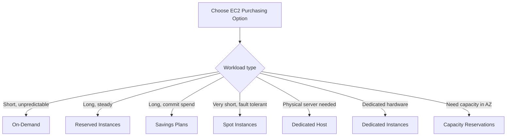

# 44. EC2 Instance Purchasing Options

## 🎯 Giới thiệu

Bài học tổng quan các lựa chọn mua **EC2 Instances Purchasing Options**. Mục tiêu là biết chọn option phù hợp theo workload: ngắn hạn, dài hạn, cần tiết kiệm chi phí, chịu được failure, cần phần cứng dedicated, hoặc cần reserve capacity trong một **AZ** cụ thể.

## 1. 💳 On-Demand Instances

**On-Demand EC2 instances** là loại đã được dùng trong các bài trước.

Đặc điểm:

- Chạy instances on demand.
- Phù hợp cho short workloads.
- Pricing predictable.
- Pay by the second.

Chi tiết billing:

- Linux hoặc Windows: billing per second sau first minute.
- Các operating systems khác: billing per hour.

Ưu điểm:

- Không upfront payment.
- Không long-term commitment.

Nhược điểm:

- Highest cost.

Recommended for:

- Short-term workloads.
- Uninterrupted workloads.
- Workloads không predict được application behavior.

## 2. 📅 Reserved Instances

**Reserved Instances** dùng cho long workloads.

Đặc điểm:

- Term: **1 year** hoặc **3 years**.
- Discount so với On-Demand có thể lên tới **72%** theo transcript.
- Reserve specific instance attributes:
  - Instance type.
  - Region.
  - Tenancy.
  - OS.
- Payment options:
  - All upfront.
  - Partial upfront.
  - No upfront.
- All upfront cho maximum discounts.

Scope:

- Region.
- Zone, nghĩa là reserve capacity trong specific **AZ**.

Use case:

- Steady-state usage applications.
- Ví dụ: database chạy lâu dài.

Có thể:

- Buy hoặc sell Reserved Instances trong marketplace nếu không cần nữa.

## 3. 🔁 Convertible Reserved Instances

**Convertible Reserved Instances** là dạng linh hoạt hơn của Reserved Instances.

Cho phép thay đổi:

- Instance type.
- Instance family.
- Operating system.
- Scope.
- Tenancy.

Vì linh hoạt hơn nên discount thấp hơn:

- Up to **66%** theo transcript.

Use case:

- Long workloads nhưng muốn có flexibility về instance type hoặc cấu hình theo thời gian.

## 4. 📈 EC2 Savings Plans

**Savings Plans** hiện đại hơn theo transcript vì không commit vào một instance type cụ thể.

Đặc điểm:

- Term: **1 year** hoặc **3 years**.
- Commit vào một mức usage bằng dollars.
- Ví dụ: “spend $10 per hour for the next 1, 2, 3 years”.
- Usage vượt ngoài Savings Plan bị bill theo On-Demand price.
- Discount dựa trên long-term usage, khoảng **70%** theo transcript.

Bạn bị locked vào:

- Specific instance family.
- Region.

Ví dụ:

- **M5** instance family trong **us-east-1**.

Nhưng linh hoạt ở:

- Instance size, ví dụ **m5.xlarge**, **m5.2xlarge**.
- OS, ví dụ Linux hoặc Windows.
- Tenancy: host, dedicated, default.

## 5. 🎯 Spot Instances

**Spot Instances** có discount mạnh nhất:

- Up to **90%** compared to On-Demand.

Đặc điểm:

- Rất rẻ.
- Có thể mất instance bất kỳ lúc nào.
- Bạn define max price sẵn sàng trả.
- Nếu spot price vượt max price, bạn lose instance.

Phù hợp cho workload resilient to failure:

- Batch jobs.
- Data analysis.
- Image processing.
- Distributed workloads.
- Workloads có flexible start and end time.

Không phù hợp cho:

- Critical jobs.
- Databases.

⚠️ Transcript nhấn mạnh exam sẽ test điểm Spot không phù hợp cho critical jobs hoặc databases.

## 6. 🏢 Dedicated Hosts

**Dedicated Host** cho bạn một physical server với EC2 instance capacity dedicated cho use case của bạn.

Use cases:

- Compliance requirements.
- Existing server-bound software licenses.
- Licensing based on:
  - Per-socket.
  - Per-core.
  - Per VM software licenses.

Payment:

- On-Demand, pay per second.
- Reserve 1 hoặc 3 years.

Đặc điểm:

- Most expensive option trong AWS theo transcript.
- Vì bạn reserve một physical server.
- Cho visibility vào lower level hardware.

## 7. 🧱 Dedicated Instances

**Dedicated Instances** chạy trên hardware dedicated cho bạn.

Khác với Dedicated Hosts:

- Có thể share hardware với instances khác trong cùng account.
- Không control instance placements.

Điểm cần nhớ:

- Dedicated Instances = instance chạy trên hardware dành riêng.
- Dedicated Host = bạn có access/visibility vào physical server.

## 8. 🪑 Capacity Reservations

**Capacity Reservations** cho phép reserve On-Demand instance capacity trong một specific **AZ**.

Đặc điểm:

- Reserve capacity trong specific AZ.
- No time commitment.
- Có thể reserve hoặc cancel bất kỳ lúc nào.
- No billing discounts.
- Mục đích duy nhất là reserve capacity.

Billing:

- Charged at On-Demand rates dù có chạy instances hay không.
- Nếu reserve capacity nhưng không launch instance, vẫn bị charge.

Nếu muốn discount:

- Kết hợp với regional Reserved Instances hoặc Savings Plan.

Phù hợp cho:

- Short-term uninterrupted workloads.
- Workloads cần ở specific AZ.

## 9. 🏨 Resort Analogy

Bài học dùng resort analogy để dễ nhớ:

- **On-Demand**: đến resort lúc nào cũng được, trả full price.
- **Reserved**: plan ahead, ở lâu 1–3 năm nên được discount.
- **Savings Plan**: commit một mức chi tiêu cố định mỗi tháng/thời gian.
- **Spot Instances**: phòng trống được discount phút chót, nhưng có thể bị đuổi nếu người khác trả cao hơn.
- **Dedicated Host**: book toàn bộ building/resort.
- **Capacity Reservation**: book một room dù chưa chắc ở, nhưng chắc chắn có khi cần, và vẫn trả full price.

## 📊 Bảng tóm tắt

| Purchasing Option | Phù hợp cho | Ưu điểm | Lưu ý |
|------------------|-------------|---------|-------|
| On-Demand | Short-term, unpredictable workloads | Không upfront, không commitment | Highest cost |
| Reserved Instances | Long workloads, steady-state | Discount up to 72% | Reserve specific attributes |
| Convertible Reserved Instances | Long workloads cần flexibility | Có thể đổi instance type/family/OS/scope/tenancy | Discount up to 66% |
| Savings Plans | Long-term usage commit theo dollars | Flexible size, OS, tenancy | Locked vào instance family và region |
| Spot Instances | Fault-tolerant short workloads | Discount up to 90% | Có thể mất instance bất kỳ lúc nào |
| Dedicated Host | Compliance, server-bound licenses | Physical server dedicated | Most expensive |
| Dedicated Instances | Dedicated hardware | Không share với customers khác | Không control placement |
| Capacity Reservations | Reserve capacity trong specific AZ | Đảm bảo capacity khi cần | No discount, trả dù không chạy instance |

## 💡 Mẹo ghi nhớ cho kỳ thi AWS

- 💳 **On-Demand** = linh hoạt nhất, đắt nhất, không commitment.
- 📅 **Reserved Instances** = long workload, steady-state, database chạy lâu.
- 📈 **Savings Plans** = commit spend bằng dollars, không commit exact instance type.
- 🎯 **Spot Instances** = rẻ nhất nhưng có thể mất, không dùng cho critical jobs/databases.
- 🏢 **Dedicated Host** = physical server, compliance/license use case.
- 🪑 **Capacity Reservation** = reserve capacity trong specific AZ, không discount, vẫn trả tiền dù không dùng.

## ✅ Kết luận

EC2 Purchasing Options giúp tối ưu chi phí hoặc đảm bảo capacity tùy workload. Khi ôn thi AWS, cần chọn đúng option: On-Demand cho ngắn hạn khó đoán, Reserved/Savings Plans cho dài hạn, Spot cho workload chịu lỗi, Dedicated Host cho compliance hoặc license, Dedicated Instances cho dedicated hardware, và Capacity Reservations khi cần capacity trong specific AZ.
