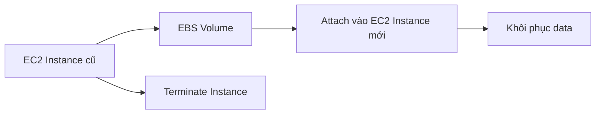
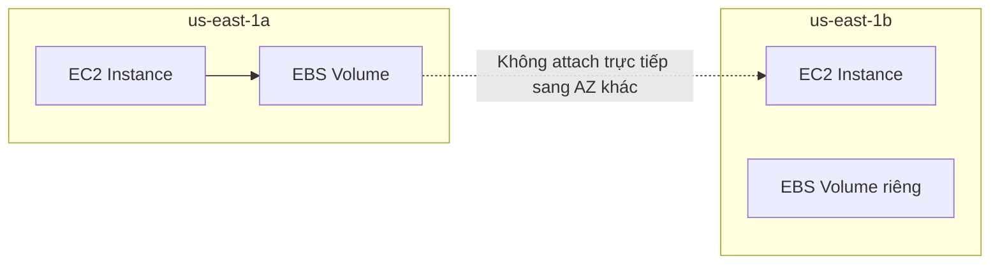
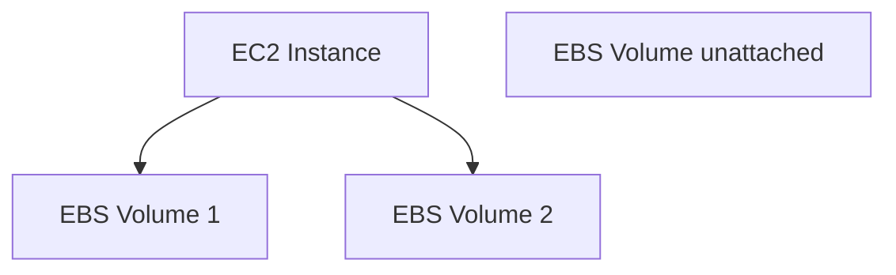

# 45. EBS Overview

## 🎯 Giới thiệu
Bài học giới thiệu các lựa chọn storage cho EC2 instances, tập trung trước tiên vào **EBS volumes**.

- **EBS** là viết tắt của **Elastic Block Store**.
- **EBS volume** là một **network drive** có thể attach vào EC2 instance khi instance đang chạy.
- Mục tiêu chính: **persist data** ngay cả sau khi EC2 instance bị terminated.

## 1. EBS Volume là gì? 💾

**EBS volume** có thể hiểu giống như một “network USB stick”:

- Có thể attach vào một EC2 instance.
- Có thể detach khỏi EC2 instance này và attach sang EC2 instance khác.
- Kết nối qua network, không phải physical drive gắn trực tiếp.
- Vì dùng network nên có thể có một chút **latency**.

📌 Ở cấp độ **Certified Cloud Practitioner**, một **EBS volume** chỉ có thể mounted vào **một instance tại một thời điểm**.

## 2. Persist data sau khi instance bị terminated ✅

Điểm quan trọng của EBS:

- Data có thể tồn tại độc lập với lifecycle của EC2 instance.
- Có thể recreate một instance mới.
- Sau đó mount lại cùng EBS volume để lấy lại data cũ.

## 3. EBS gắn với Availability Zone ⚠️

EBS volume bị ràng buộc với một **Availability Zone** cụ thể.

- Volume tạo trong một AZ chỉ attach được vào EC2 instance trong cùng AZ.
- Nếu muốn chuyển EBS volume sang AZ khác, cần dùng **snapshot**.
- EC2 instances cũng bound với AZ, và EBS volumes cũng vậy.

## 4. Một EC2 có thể có nhiều EBS volumes 📂

Một EC2 instance có thể attach nhiều EBS volumes.

- Ví dụ: một EC2 instance attach 2 EBS volumes.
- Một EBS volume cũng có thể ở trạng thái **unattached**.
- Volume unattached có thể được attach on demand khi cần.

## 5. Provision capacity và billing 💰

Khi tạo EBS volume, cần provision trước:

- Dung lượng, ví dụ số **GB**.
- Hiệu năng, ví dụ **IOPS**.

Bạn sẽ bị billed dựa trên **provisioned capacity**.

Có thể tăng capacity theo thời gian nếu muốn:

- Tăng size.
- Tăng performance.

## 6. Delete on Termination 🔥

Khi tạo EC2 instance, EBS volume có thuộc tính **Delete on Termination**.

- **Root EBS volume**: mặc định **enabled**, nghĩa là bị xóa khi EC2 instance bị terminated.
- **EBS volumes khác**: mặc định **disabled**, nghĩa là không bị xóa khi EC2 instance bị terminated.

Use case quan trọng:

- Nếu muốn giữ lại root volume sau khi terminate instance để lưu data, hãy disable **Delete on Termination** cho root volume.

## 📊 Bảng tóm tắt

| Tiêu chí | Mô tả |
|----------|------|
| Dịch vụ | EBS - Elastic Block Store |
| Loại storage | Network drive |
| Persist data | Có, có thể tồn tại sau EC2 termination |
| Attach | Một EBS volume attach một instance tại một thời điểm ở CCP level |
| AZ constraint | EBS volume locked trong một Availability Zone |
| Unattached volume | Có thể tạo volume nhưng chưa attach |
| Billing | Theo provisioned capacity |
| Delete on Termination root volume | Mặc định enabled |
| Delete on Termination volume khác | Mặc định disabled |

## 💡 Mẹo ghi nhớ cho kỳ thi AWS

- **EBS = network USB stick** cho EC2.
- EBS bị khóa theo **Availability Zone**.
- Muốn move EBS qua AZ khác → dùng **EBS Snapshot**.
- Root EBS volume mặc định bị xóa khi terminate EC2, nhưng có thể thay đổi bằng **Delete on Termination**.

## ✅ Kết luận

**EBS volumes** là lựa chọn storage quan trọng cho EC2 instances khi cần persist data. Chúng là network drives, có thể detach/attach nhanh, bị ràng buộc theo Availability Zone và cần provision capacity trước. Thuộc tính **Delete on Termination** là điểm cần nhớ kỹ khi ôn thi AWS.
