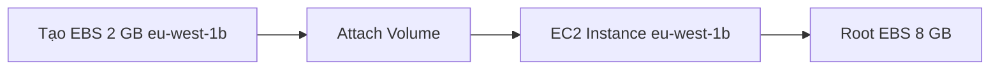
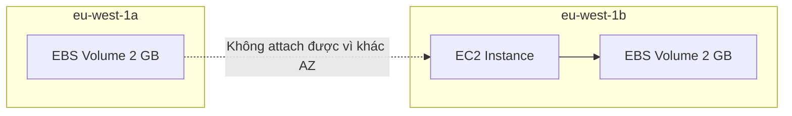
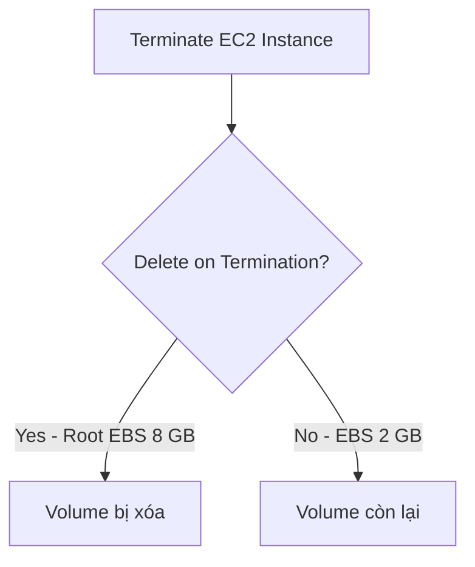

# 46. EBS Hands On

## 🎯 Giới thiệu
Bài thực hành minh họa cách xem, tạo, attach và delete **EBS volumes** trong AWS Console, đồng thời kiểm tra hành vi **Delete on Termination**.

## 1. Xem EBS volume đang attach vào EC2 📂

Trong EC2 Console:

- Chọn EC2 instance.
- Vào tab **Storage**.
- Xem **root device** và **block devices**.

Trong demo, EC2 instance đang có:

- Một EBS volume root.
- Size: **8 GB**.
- Trạng thái: **in-use**.
- Đang attached vào EC2 instance.

## 2. Tạo EBS volume thứ hai 💾

Trong phần **Volumes**, tạo volume mới:

- Type: **gp2**.
- Size: **2 GB**.
- Availability Zone: cùng AZ với EC2 instance.

📌 Vì EBS volumes bound với **Availability Zone**, volume phải được tạo trong cùng AZ với EC2 instance nếu muốn attach trực tiếp.

## 3. Attach volume vào EC2 instance ✅

Sau khi volume ở trạng thái **available**:

- Chọn volume.
- Chọn **Actions**.
- Chọn **Attach volume**.
- Chọn EC2 instance đang chạy.

Kết quả:

- EC2 instance có 2 block devices.
- Volume 8 GB root.
- Volume 2 GB mới attach.

⚠️ Việc format và sử dụng block device mới trên Linux được nhắc là ngoài phạm vi bài học.

## 4. Thử tạo volume ở AZ khác ⚠️

Demo tạo thêm một volume:

- Type: **gp2**.
- Size: **2 GB**.
- Availability Zone: **eu-west-1a**.

EC2 instance lại nằm ở **eu-west-1b**.

Khi attach volume này vào EC2 instance, volume không attach được vì khác AZ.

## 5. Delete volume 🗑️

Nếu volume đang **available** và không attach vào instance:

- Có thể chọn **Actions**.
- Chọn **Delete volume**.

Điều này cho thấy cloud cho phép tạo và xóa volumes rất nhanh, chỉ trong vài giây.

## 6. Kiểm tra Delete on Termination 🔥

Trong tab **Storage** của EC2 instance:

- Root volume 8 GB có **Delete on Termination = Yes**.
- Volume 2 GB attach thêm có **Delete on Termination = No**.

Khi terminate EC2 instance:

- Root volume 8 GB biến mất.
- Volume 2 GB vẫn còn lại.

## 📊 Bảng tóm tắt

| Thao tác | Kết quả |
|----------|--------|
| Xem Storage tab | Thấy root device và block devices |
| Tạo volume cùng AZ | Có thể attach vào EC2 instance |
| Tạo volume khác AZ | Không attach được vào EC2 instance khác AZ |
| Attach volume | EC2 instance có thêm block device |
| Delete volume available | Volume bị xóa |
| Terminate EC2 | Root volume mặc định bị xóa |
| Volume attach thêm | Mặc định không bị xóa khi terminate EC2 |

## 💡 Mẹo ghi nhớ cho kỳ thi AWS

- Muốn attach EBS vào EC2 → phải cùng **Availability Zone**.
- Root EBS volume mặc định **Delete on Termination = Yes**.
- EBS volume attach thêm mặc định **Delete on Termination = No**.

## ✅ Kết luận

Bài hands-on cho thấy cách quản lý EBS volumes trong thực tế: xem volume, tạo volume, attach volume, kiểm tra AZ constraint và quan sát hành vi **Delete on Termination** khi EC2 instance bị terminated.
