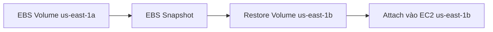
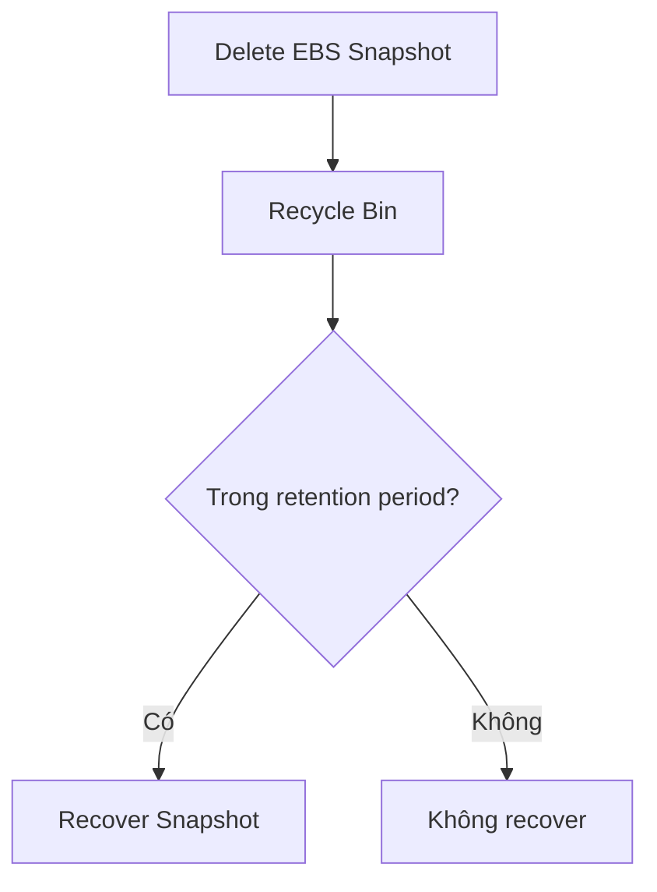

# 47. EBS Snapshots

## 🎯 Giới thiệu
Bài học giới thiệu **EBS Snapshots**, cách backup EBS volume tại một thời điểm và các tính năng quan trọng liên quan đến snapshot.

## 1. EBS Snapshot là gì? 📸

**EBS Snapshot** là backup tại một thời điểm của **EBS volume**.

- Không bắt buộc detach EBS volume khỏi EC2 instance để tạo snapshot.
- Tuy nhiên, việc detach được khuyến nghị để đảm bảo trạng thái data tốt hơn.
- Snapshot có thể được copy sang Availability Zone khác hoặc Region khác.

## 2. Di chuyển EBS volume qua AZ bằng Snapshot 🚀

Vì EBS volume bị locked trong một AZ, không thể attach trực tiếp sang EC2 instance ở AZ khác.

Cách chuyển dữ liệu:

1. Tạo **EBS Snapshot** từ EBS volume.
2. Restore snapshot thành EBS volume mới ở AZ khác.
3. Attach volume mới vào EC2 instance ở AZ đó.

## 3. EBS Snapshot Archive 🧊

**EBS Snapshot Archive** cho phép chuyển snapshot sang **archive tier**.

- Có thể rẻ hơn tới **75%**.
- Khi restore từ archive tier, cần chờ **24 đến 72 giờ**.
- Không phù hợp nếu cần restore ngay lập tức.

## 4. Recycle Bin cho EBS Snapshots 🗑️

**Recycle Bin** giúp bảo vệ EBS Snapshots khỏi accidental deletion.

- Snapshot bị delete sẽ vào Recycle Bin thay vì bị xóa vĩnh viễn ngay.
- Có thể recover snapshot nếu xóa nhầm.
- Retention có thể đặt từ **1 ngày đến 1 năm**.

## 5. Fast Snapshot Restore ⚡

**Fast Snapshot Restore** giúp:

- Force full initialization của snapshot.
- Không có latency trong lần sử dụng đầu tiên.
- Hữu ích khi snapshot rất lớn và cần tạo EBS volume hoặc instance từ snapshot thật nhanh.

⚠️ Tính năng này tốn nhiều tiền, cần cẩn thận khi dùng.

## 📊 Bảng tóm tắt

| Tính năng | Mô tả |
|----------|------|
| EBS Snapshot | Backup point-in-time của EBS volume |
| Detach khi snapshot | Không bắt buộc, nhưng recommended |
| Copy snapshot | Có thể copy qua AZ hoặc Region |
| Snapshot Archive | Rẻ hơn, restore mất 24-72 giờ |
| Recycle Bin | Recover snapshot khi xóa nhầm |
| Retention Recycle Bin | 1 ngày đến 1 năm |
| Fast Snapshot Restore | Không latency lần đầu, nhưng tốn tiền |

## 💡 Mẹo ghi nhớ cho kỳ thi AWS

- Move EBS volume qua AZ khác → **Snapshot + Restore**.
- Snapshot Archive rẻ hơn nhưng restore chậm.
- Recycle Bin dùng để chống accidental deletion.
- Fast Snapshot Restore nhanh nhưng expensive.

## ✅ Kết luận

**EBS Snapshots** là cơ chế backup quan trọng cho EBS volumes. Chúng hỗ trợ restore sang AZ khác, copy sang Region khác, archive để tiết kiệm chi phí, Recycle Bin để recover khi xóa nhầm và Fast Snapshot Restore cho nhu cầu khởi tạo nhanh.
