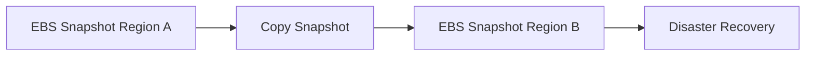
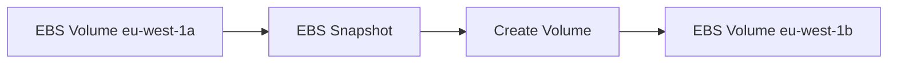
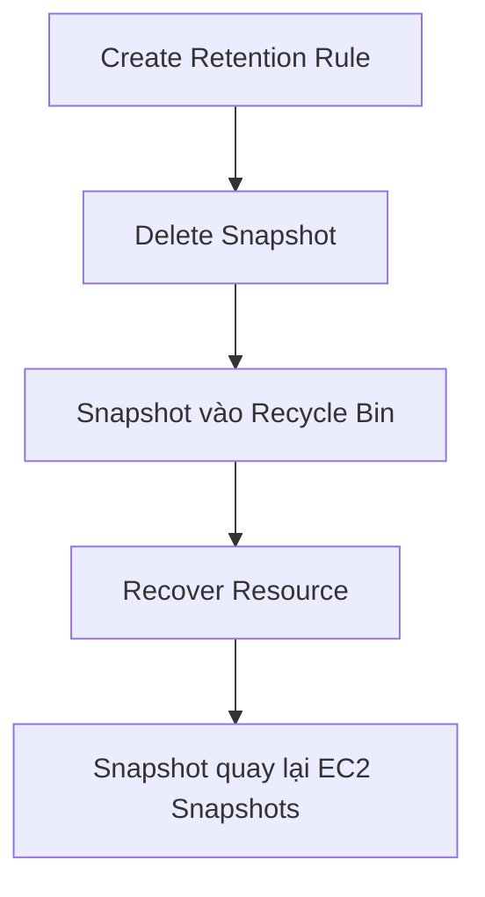

# 48. EBS Snapshots - Hands On

## 🎯 Giới thiệu
Bài thực hành hướng dẫn tạo **EBS Snapshot**, copy snapshot sang Region khác, restore thành volume ở AZ khác, dùng **Recycle Bin**, và xem **Storage Tier** của snapshot.

## 1. Tạo EBS Snapshot 📸

Từ một **GP2 EBS Volume** 2 GB:

- Chọn **Actions**.
- Chọn **Create snapshot**.
- Thêm description, ví dụ **DemoSnapshots**.
- Chọn **Create snapshots**.

Trong menu **Snapshots**, snapshot hiển thị trạng thái:

- **Completed**.
- **100% Available**.

## 2. Copy Snapshot sang Region khác 🌍

Có thể right-click snapshot và chọn **Copy Snapshots**.

- Chọn destination Region bất kỳ.
- Hữu ích cho **Disaster Recovery Strategy**.
- Mục tiêu là backup data sang Region khác của AWS.

## 3. Restore Snapshot thành Volume mới 🔁

Từ snapshot:

- Chọn **Actions**.
- Chọn **Create volume from snapshots**.
- Chọn volume size/type, ví dụ **2 GB GP2 Volume**.
- Chọn target AZ, ví dụ từ **eu-west-1a** sang **eu-west-1b**.
- Có thể encrypt volume nếu muốn.

Kết quả:

- Tạo thêm một EBS volume mới.
- Volume mới được restored từ snapshot.
- Có thể nằm ở AZ khác.

## 4. Recycle Bin cho EBS Snapshots 🗑️

**Recycle Bin** giúp bảo vệ snapshot khỏi accidental deletion.

Trong demo:

- Tạo **Retention Rule**.
- Name: **DemoRetentionRule**.
- Resource type: **EBS Snapshots**.
- Apply to all resources.
- Retention: **1 day**.
- Rule Lock Setting: **unlocked**.

Khi delete snapshot:

- Snapshot không mất vĩnh viễn ngay.
- Snapshot xuất hiện trong Recycle Bin.
- Có thể chọn snapshot và **Recover**.

## 5. Storage Tiers 🧊

Snapshot ban đầu ở **Standard Storage Tier**.

Có thể move storage tier bằng cách **Archive snapshots**.

⚠️ Nếu muốn restore từ archive tier, cần chờ **24 đến 72 giờ**.

## 📊 Bảng tóm tắt

| Thao tác | Ý nghĩa |
|----------|--------|
| Create snapshot | Backup EBS volume |
| Copy snapshot | Copy sang Region khác, hỗ trợ Disaster Recovery |
| Create volume from snapshot | Restore volume từ snapshot |
| Chọn AZ khác khi restore | Giúp “copy” EBS volume qua Availability Zone |
| Recycle Bin | Bảo vệ snapshot khỏi accidental deletion |
| Retention Rule | Quy định snapshot ở Recycle Bin bao lâu |
| Archive snapshot | Chuyển sang pricing/storage tier khác, restore chậm |

## 💡 Mẹo ghi nhớ cho kỳ thi AWS

- **Snapshot** là cách chuyển EBS volume qua AZ khác.
- **Copy Snapshot** sang Region khác thường gắn với **Disaster Recovery Strategy**.
- **Recycle Bin** giúp recover snapshot nếu xóa nhầm.
- **Archive** tiết kiệm chi phí nhưng restore mất 24-72 giờ.

## ✅ Kết luận

Bài hands-on cho thấy EBS Snapshot không chỉ để backup mà còn dùng để restore volume sang AZ khác, hỗ trợ Disaster Recovery bằng cách copy sang Region khác và bảo vệ khỏi accidental deletion bằng Recycle Bin.
