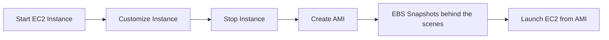
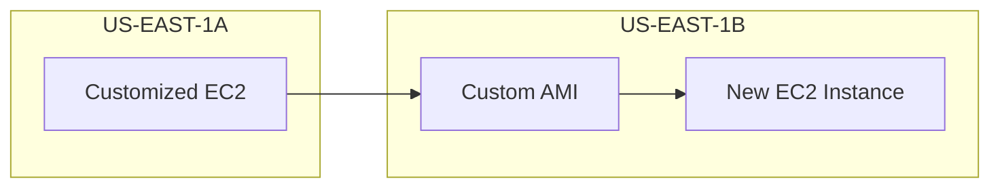

# 49. AMI Overview

## 🎯 Giới thiệu
Bài học giới thiệu **AMI - Amazon Machine Image**, thành phần dùng để launch và customize EC2 instances.

- **AMI** là viết tắt của **Amazon Machine Image**.
- AMI đại diện cho một bản customization của EC2 instance.
- Có thể dùng AMIs do AWS tạo, tự tạo AMI riêng, hoặc dùng AMI từ AWS Marketplace.

## 1. AMI chứa gì? 📦

AMI có thể chứa cấu hình phần mềm của EC2 instance, bao gồm:

- **Operating system**.
- Software configuration.
- Monitoring tools.
- Các software cần cài sẵn cho EC2 instance.

Lợi ích khi tạo own AMI:

- Faster boot time.
- Faster configuration time.
- Software cần thiết đã được prepackaged trong AMI.

## 2. AMI theo Region 🌍

AMI được build cho một **Region** cụ thể.

- Có thể copy AMI across Region.
- Việc copy AMI giúp tận dụng AWS global infrastructure.

## 3. Các loại AMI 🚀

Có ba nhóm AMI chính được nhắc trong bài:

### Public AMI

- Được cung cấp bởi AWS.
- Ví dụ trong course: **Amazon Linux 2 AMI**.
- Đây là AMI phổ biến trong AWS.

### Own AMI

- Do người dùng tự tạo và maintain.
- Có thể có tools để automate, nhưng vẫn là task của cloud user.

### AWS Marketplace AMI

- Được tạo bởi người khác hoặc vendor.
- Có thể được bán trên AWS Marketplace.
- Giúp tiết kiệm thời gian vì software đã được cấu hình sẵn.

## 4. AMI process từ EC2 instance 🔁

Quy trình tạo AMI từ EC2 instance:

1. Start EC2 instance.
2. Customize instance.
3. Stop instance để đảm bảo **data integrity**.
4. Build AMI từ instance.
5. AWS tạo **EBS snapshots** behind the scenes.
6. Launch instances từ AMI mới.

## 5. Copy EC2 instance bằng AMI 📌

Ví dụ trong bài:

- Launch instance ở **US-EAST-1A**.
- Customize instance.
- Create custom AMI.
- Launch instance ở **US-EAST-1B** từ custom AMI.

## 📊 Bảng tóm tắt

| Tiêu chí | Mô tả |
|----------|------|
| AMI | Amazon Machine Image |
| Vai trò | Customization/template cho EC2 instance |
| Public AMI | Do AWS cung cấp, ví dụ Amazon Linux 2 AMI |
| Own AMI | Người dùng tự tạo và maintain |
| AWS Marketplace AMI | AMI do vendor/người khác tạo, có thể bán |
| Region | AMI built theo Region, có thể copy across Region |
| Behind the scenes | Create AMI cũng tạo EBS snapshots |
| Lợi ích | Faster boot time và configuration time |

## 💡 Mẹo ghi nhớ cho kỳ thi AWS

- **AMI = template để launch EC2 instance**.
- Custom AMI giúp launch nhanh hơn vì software đã prepackaged.
- Create AMI từ EC2 instance sẽ tạo **EBS snapshots behind the scenes**.

## ✅ Kết luận

**AMI** là cơ chế đóng gói EC2 instance thành template để tái sử dụng. AMI giúp chuẩn hóa cấu hình, tăng tốc boot/configuration và có thể dùng để launch EC2 instances ở AZ khác hoặc copy across Region.
