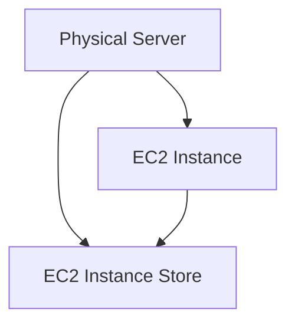
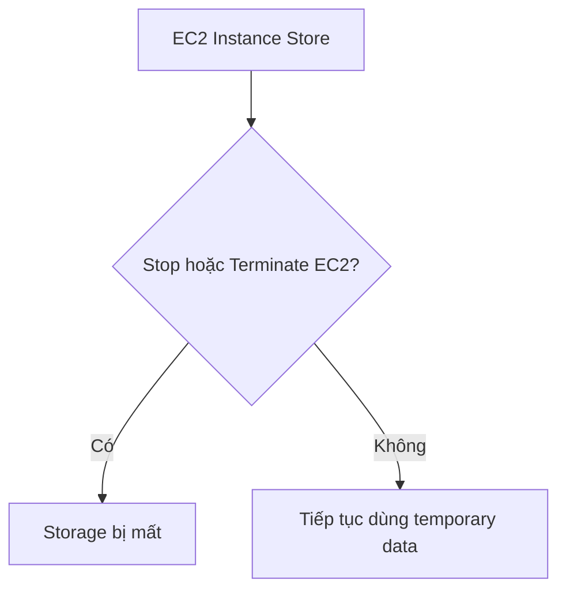

# 51. EC2 Instance Store

## 🎯 Giới thiệu
Bài học giới thiệu **EC2 Instance Store**, loại storage gắn trực tiếp vào physical server phía dưới EC2 instance, dùng cho nhu cầu disk performance rất cao.

## 1. EC2 Instance Store là gì? 💾

EC2 instance là virtual machine nhưng chạy trên một real hardware server.

Một số server có disk space gắn trực tiếp bằng physical connection. Storage này được gọi là:

- **EC2 Instance Store**.
- Hardware drive attached to physical server.

Khác với EBS:

- EBS là network drive.
- EC2 Instance Store là storage gắn trực tiếp vào host hardware.

## 2. Khi nào dùng EC2 Instance Store? ⚡

EC2 Instance Store phù hợp khi cần:

- Better I/O performance.
- Good throughput.
- Extremely high disk performance.

Use cases được nhắc trong bài:

- Buffer.
- Cache.
- Scratch data.
- Temporary content.

## 3. Ephemeral storage ⚠️

Điểm quan trọng nhất:

- Nếu **stop** hoặc **terminate** EC2 instance có Instance Store, storage sẽ bị mất.
- Vì vậy Instance Store là **ephemeral storage**.
- Không dùng cho durable long-term storage.

Đối với long-term storage, bài học nhắc rằng **EBS** là use case phù hợp hơn.

## 4. Trách nhiệm backup và replication 🔒

Nếu underlying server của EC2 instance bị fail:

- Có rủi ro mất data.
- Hardware attached storage cũng fail theo.

Nếu dùng EC2 Instance Store, bạn chịu trách nhiệm:

- Backup.
- Replication.
- Thiết kế phù hợp với nhu cầu.

## 5. So sánh performance với EBS 📊

Bài học đưa ví dụ minh họa:

- Một số instance size như dòng **I3** có Instance Store.
- Read IOPS và Write IOPS có thể rất cao.
- Có ví dụ đạt tới hàng triệu IOPS.
- Trong khi EBS volume type **gp2** được nhắc có thể đạt **32,000 IOPS**.

⚠️ Các con số chỉ để minh họa, không cần nhớ chi tiết.

## 📊 Bảng tóm tắt

| Tiêu chí | EC2 Instance Store |
|----------|--------------------|
| Loại storage | Hardware disk attached to physical server |
| Hiệu năng | Rất cao cho disk I/O |
| Durability | Không phù hợp long-term durable storage |
| Khi stop/terminate EC2 | Storage bị mất |
| Tên gọi | Ephemeral storage |
| Use cases | Buffer, cache, scratch data, temporary content |
| Backup/replication | Trách nhiệm của người dùng |

## 💡 Mẹo ghi nhớ cho kỳ thi AWS

- Cần **very high performance hardware attached volume** cho EC2 → nghĩ đến **EC2 Instance Store**.
- Cần durable long-term storage → không chọn Instance Store, nghĩ đến **EBS**.
- Instance Store mất data khi stop/terminate instance.

## ✅ Kết luận

**EC2 Instance Store** cung cấp disk performance rất cao vì gắn trực tiếp vào physical server, nhưng là **ephemeral storage**. Nó phù hợp cho dữ liệu tạm thời như cache hoặc buffer, không phù hợp cho long-term storage.
