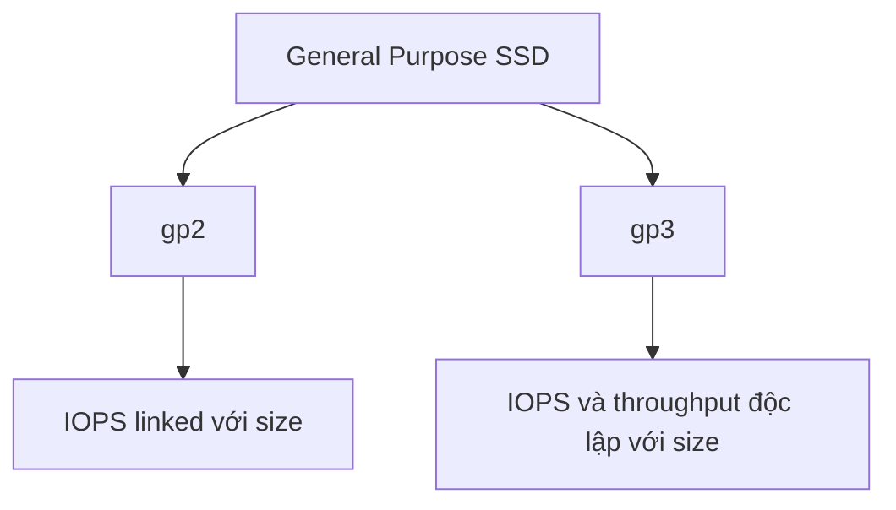

# 52. EBS Volume Types

## 🎯 Giới thiệu
Bài học tổng quan các loại **EBS volume types**, cách phân nhóm và use cases chính cho từng loại volume.

Có 6 loại được nhắc:

- **gp2**.
- **gp3**.
- **io1**.
- **io2 Block Express**.
- **st1**.
- **sc1**.

## 1. Các nhóm EBS volume types 📂

### General Purpose SSD: gp2, gp3

- Balance price và performance.
- Phù hợp nhiều workloads.
- Đây là loại đã được dùng trong course.

### Provisioned IOPS SSD: io1, io2 Block Express

- Highest-performance SSD volumes.
- Dùng cho mission-critical, low-latency, high-throughput workloads.

### Throughput Optimized HDD: st1

- Low-cost HDD.
- Cho frequently accessed, throughput-intensive workloads.

### Cold HDD: sc1

- Lowest-cost HDD.
- Cho less frequently accessed workloads.

## 2. Các yếu tố định nghĩa EBS volume ⚙️

Một EBS volume được định nghĩa bằng nhiều yếu tố:

- Size.
- Throughput.
- IOPS - **I/O operations per second**.

📌 Khi không chắc, bài học nhắc luôn consult documentation.

## 3. Boot volumes ⚠️

Chỉ các volume types sau có thể dùng làm **boot volumes**:

- **gp2**.
- **gp3**.
- **io1**.
- **io2**.

**st1** và **sc1** không thể là boot volumes.

## 4. gp2 vs gp3 💾

### gp3

- Newer generation.
- Baseline: **3,000 IOPS**.
- Throughput: **125 MB/s**.
- Có thể tăng IOPS lên **16,000**.
- Có thể tăng throughput lên **1,000 MB/s**.
- IOPS và throughput có thể tăng **independently** với storage size.

### gp2

- Older version.
- Small gp2 volumes có thể burst lên **3,000 IOPS**.
- Size và IOPS linked với nhau.
- Tăng GB thì IOPS tăng theo, tối đa **16,000 IOPS**.

## 5. Provisioned IOPS volumes: io1 và io2 ⚡

Dùng cho critical business applications cần:

- Sustain IOPS performance.
- Rất nhiều IOPS, ví dụ hơn 16,000.
- Database workload nhạy cảm với storage performance và consistency.

### io1

- Size từ **4 GB đến 16 TB**.
- Max provisioned IOPS khoảng **64,000** cho Nitro EC2 instances.
- Khoảng **32,000** cho loại instance khác.
- Provisioned IOPS có thể tăng independently với storage size.

### io2 Block Express

- Size lên tới **64 TB**.
- Sub-millisecond latency.
- Max IOPS lên tới **256,000**.
- IOPS to GB ratio: **1,000:1**.

📌 Provisioned IOPS volumes hỗ trợ **EBS Multi-Attach**.

## 6. st1 và sc1 🧊

### st1 - Throughput Optimized HDD

Use cases:

- Big data.
- Data warehousing.
- Log processing.

Thông số minh họa:

- Max throughput: **500 MB/s**.
- Max IOPS: **500**.

### sc1 - Cold HDD

Use case:

- Archive data.
- Infrequently accessed data.
- Khi cần lowest possible cost.

Thông số minh họa:

- Max throughput: **250 MB/s**.
- Max IOPS: **250**.

⚠️ st1 và sc1 không thể dùng làm boot volumes.

## 📊 Bảng tóm tắt nhanh

| Volume type | Nhóm | Use case chính | Boot volume? |
|------------|------|----------------|--------------|
| gp2 | General Purpose SSD | Cost-effective, low-latency | Có |
| gp3 | General Purpose SSD | Cost-effective, IOPS/throughput độc lập | Có |
| io1 | Provisioned IOPS SSD | Database/workloads cần consistent IOPS | Có |
| io2 Block Express | Provisioned IOPS SSD | High-performance I/O, sub-millisecond latency | Có |
| st1 | Throughput Optimized HDD | Big data, data warehousing, log processing | Không |
| sc1 | Cold HDD | Archive, infrequently accessed, lowest cost | Không |

## 💡 Mẹo ghi nhớ cho kỳ thi AWS

- General purpose SSD → **gp2/gp3**.
- Database rất nhạy với storage performance → **io1/io2**.
- High throughput, low cost HDD → **st1**.
- Archive/infrequent access, lowest cost → **sc1**.
- Muốn hơn **32,000 IOPS** → cần **EC2 Nitro** với **io1/io2**.
- Chỉ **gp2/gp3/io1/io2** làm boot volumes.

## ✅ Kết luận

Các EBS volume types phục vụ các nhu cầu khác nhau: **gp2/gp3** cho workload phổ biến, **io1/io2** cho performance-critical workloads, **st1** cho throughput-intensive HDD workloads, và **sc1** cho archive hoặc dữ liệu ít truy cập với chi phí thấp nhất.
