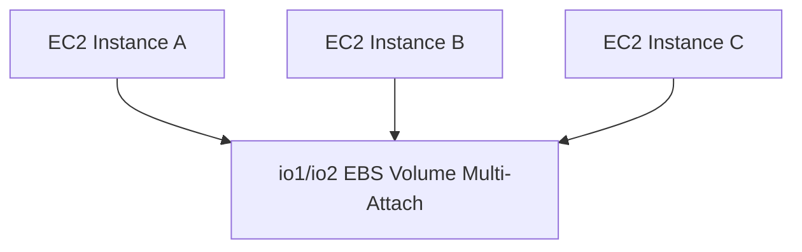

# 53. EBS Multi-Attach

## 🎯 Giới thiệu
Bài học giới thiệu tính năng **EBS Multi-Attach**, cho phép attach cùng một EBS volume vào nhiều EC2 instances trong cùng Availability Zone.

## 1. EBS Multi-Attach là gì? 🔗

**Multi-Attach** cho phép:

- Cùng một EBS volume attach vào nhiều EC2 instances.
- Các EC2 instances phải nằm trong cùng **Availability Zone**.
- Tính năng chỉ available cho **io1** và **io2** EBS volumes.

## 2. Read/Write permissions ✍️

Mỗi instance attached vào volume có:

- Full read permissions.
- Full write permissions.

Điều này nghĩa là nhiều EC2 instances có thể read/write cùng lúc vào high-performance volume.

## 3. Use cases 📌

Các use cases được nhắc:

- Higher application availability.
- Clustered Linux application.
- Ví dụ: Teradata.
- Ứng dụng phải manage concurrent write operations.

## 4. Giới hạn quan trọng ⚠️

Cần nhớ các giới hạn:

- Chỉ trong cùng một **Availability Zone**.
- Không cho phép attach EBS volume từ một AZ sang EC2 instance ở AZ khác.
- Tối đa **16 EC2 instances** attach cùng một volume.
- Cần file system **cluster-aware**.
- Không dùng file system thông thường như **XFS** hoặc **EX4** cho use case này.

## 📊 Bảng tóm tắt

| Tiêu chí | Mô tả |
|----------|------|
| Tính năng | EBS Multi-Attach |
| Volume types hỗ trợ | io1, io2 |
| Phạm vi | Cùng Availability Zone |
| Số EC2 tối đa | 16 instances |
| Quyền trên volume | Full read/write cho mỗi instance |
| Use case | Clustered Linux application, concurrent writes |
| File system yêu cầu | Cluster-aware file system |

## 💡 Mẹo ghi nhớ cho kỳ thi AWS

- **EBS Multi-Attach = nhiều EC2 cùng attach một io1/io2 volume**.
- Phải cùng AZ.
- Số cần nhớ: **up to 16 EC2 instances**.
- Cần **cluster-aware file system**.

## ✅ Kết luận

**EBS Multi-Attach** là edge case cho workloads đặc biệt cần nhiều EC2 instances read/write cùng một high-performance EBS volume. Tính năng này chỉ hỗ trợ **io1/io2**, giới hạn trong cùng AZ và yêu cầu cluster-aware file system.
