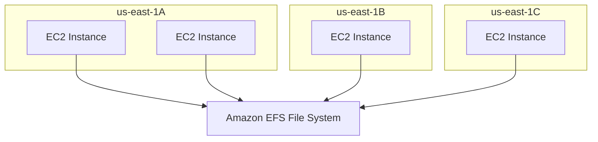
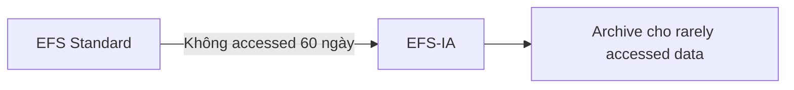

# 54. Amazon EFS

## 🎯 Giới thiệu
Bài học giới thiệu **Amazon EFS - Elastic File System**, một managed **NFS** có thể mounted trên nhiều EC2 instances, kể cả instances ở nhiều Availability Zones.

## 1. Amazon EFS là gì? 📂

**EFS** là managed **NFS** - Network File System.

- Có thể mount trên nhiều EC2 instances.
- EC2 instances có thể nằm ở nhiều Availability Zones khác nhau.
- Highly available.
- Highly scalable.
- Expensive hơn EBS; khoảng 3 lần cost của **gp2 EBS volume**.
- Pay per use, không cần provision capacity trước.

## 2. Use cases của EFS 🚀

Các use cases được nhắc:

- Content management.
- Web serving.
- Data sharing.
- WordPress.

EFS dùng internally:

- **NFS protocol**.
- Security group để control access.

## 3. Compatibility và security 🔒

Các điểm quan trọng:

- Chỉ compatible với **Linux-based AMI**.
- Không dùng cho Windows trong bài học này.
- Có thể enable encryption at rest bằng **KMS**.
- Là standard file system trên Linux.
- Dùng **POSIX system**.
- Có standard file API.

## 4. Scalability và capacity 📈

EFS không cần plan capacity trước.

- File system tự động scale.
- Pay-per-use theo mỗi GB data dùng trong EFS.
- Có thể có thousands of concurrent NFS clients.
- Throughput trên **10 GB+**.
- Có thể grow tới **petabyte scale** automatically.

## 5. Performance modes ⚙️

Performance mode được set khi tạo EFS.

### General Purpose

- Default mode.
- Cho latency-sensitive use cases.
- Ví dụ: web server, CMS.

### Max I/O

- Higher latency.
- Higher throughput.
- Highly parallel.
- Phù hợp big data applications hoặc media processing.

## 6. Throughput modes 🚦

### Bursting

- Throughput tăng theo storage size.
- Ví dụ trong bài: 1 TB tương ứng 50 MB/s và burst tới 100 MB/s.

### Provisioned

- Set throughput regardless of storage size.
- Ví dụ: 1 GB/s cho 1 TB storage.
- Throughput tách khỏi storage size.

### Elastic

- Automatically scale throughput up/down theo workload.
- Ví dụ: reads tới 3 GB/s và writes tới 1 GB/s theo workload.
- Phù hợp unpredictable workloads.

## 7. Storage classes và Lifecycle Policies 🧊

EFS có storage tiers:

### Standard

- Cho frequently accessed files.

### EFS-IA

- Infrequent Access.
- Lower price để store files.
- Có cost khi retrieve files.

### Archive

- Cho rarely accessed data.
- Ví dụ data chỉ accessed vài lần mỗi năm.
- Rẻ hơn nhiều để store.

Có thể dùng **Lifecycle Policies** để tự động move files giữa các tiers.

Ví dụ:

- File ở EFS Standard.
- Không accessed trong 60 ngày.
- Lifecycle Policy move file sang **EFS-IA**.

## 8. Availability và durability 🌐

### Standard

- Multi-AZ setup.
- Phù hợp production workloads.
- Resistant to disasters.

### One Zone

- Chỉ một Availability Zone.
- Rẻ hơn.
- Phù hợp development.
- Vẫn có backups.
- Compatible với IA storage tier, tạo option **EFS One Zone-IA**.

📌 Dùng đúng EFS storage classes có thể tiết kiệm tới **90% cost savings**.

## 📊 Bảng tóm tắt

| Tiêu chí | Amazon EFS |
|----------|------------|
| Tên đầy đủ | Elastic File System |
| Loại | Managed NFS / Network File System |
| Mount | Nhiều EC2 instances, across AZ |
| Compatibility | Linux-based AMI |
| Protocol | NFS |
| Access control | Security group |
| Capacity | Auto scale, không cần provision trước |
| Billing | Pay per use theo GB dùng |
| Encryption | Encryption at rest với KMS |
| Storage tiers | Standard, EFS-IA, Archive |
| Availability | Standard multi-AZ hoặc One Zone |

## 💡 Mẹo ghi nhớ cho kỳ thi AWS

- Nhiều EC2 instances cần share cùng file system across AZ → **EFS**.
- EFS dùng **NFS**, chỉ cho **Linux-based AMI** trong bài.
- EFS đắt hơn EBS nhưng auto scale và pay-per-use.
- Production → **Standard multi-AZ**.
- Development/cost saving → **One Zone**.
- Lifecycle Policies giúp chuyển file sang EFS-IA hoặc Archive.

## ✅ Kết luận

**Amazon EFS** là managed NFS file system có thể mount đồng thời trên nhiều Linux EC2 instances across AZ. EFS phù hợp cho data sharing, web serving, content management và WordPress, với khả năng auto scale, pay-per-use và storage tiers để tối ưu chi phí.
