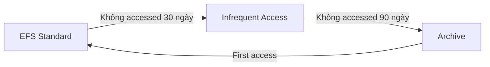
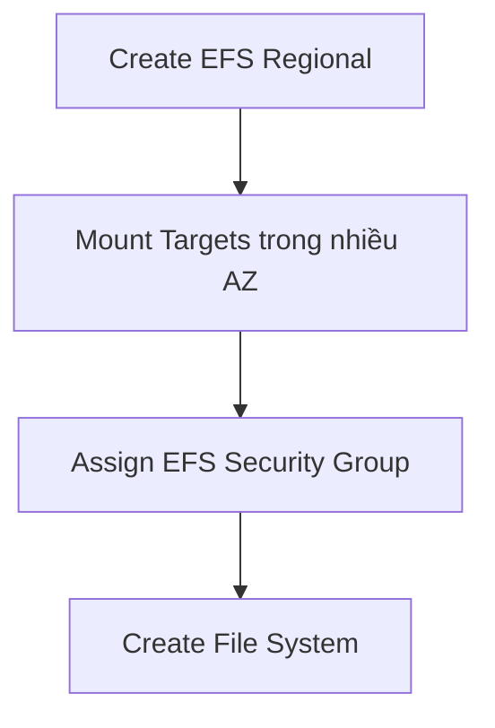
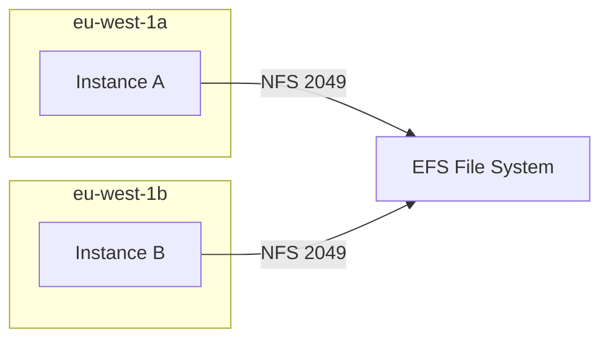
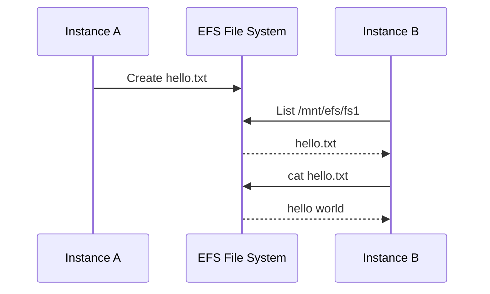

# 55. Amazon EFS - Hands On

## 🎯 Giới thiệu
Bài thực hành tạo **Amazon EFS**, cấu hình lifecycle management, throughput/performance settings, mount EFS vào hai EC2 instances ở hai Availability Zones khác nhau và kiểm tra data sharing.

## 1. Tạo EFS file system 📂

Trong Amazon EFS Console:

- Chọn tạo file system.
- Name là optional.
- Chọn **VPC**, trong demo dùng default VPC.
- Có thể click create nhanh, nhưng bài chọn **Customize** để xem options.

## 2. File system type 🌐

Có hai lựa chọn:

### Regional

- File system trong Region across multiple Availability Zones.
- High availability và high durability.
- Phù hợp production.
- Được dùng trong hands-on.

### One Zone

- Chọn một Availability Zone cụ thể.
- Giảm chi phí.
- Phù hợp development environments.
- Không phù hợp production nếu AZ đó unavailable vì data sẽ inaccessible.

## 3. Automatic backups và Lifecycle Management 🧊

### Automatic backups

- Có thể enable hoặc disable.
- Bài học khuyến nghị keep enabled.

### Lifecycle Management

Dùng để move data across storage tiers nhằm tiết kiệm chi phí.

Ví dụ cấu hình trong bài:

- File không accessed 30 ngày → chuyển sang **Infrequent Access**.
- File không accessed 90 ngày → chuyển sang **Archive**.
- Khi file được accessed lần đầu → transition back into **Standard**.

Encryption được leave enabled.

## 4. Throughput modes ⚙️

Bài hands-on nhắc ba throughput modes:

### Bursting

- Throughput scale theo amount of storage đang dùng.
- Nhiều storage hơn thì throughput cao hơn.

### Elastic

- Recommended setting.
- Tự động scale I/O theo workload.
- Pay for what you use.
- Phù hợp unpredictable I/O, ví dụ từ 0 MB/s lên 100 MB/s rất nhanh.

### Provisioned

- Dùng khi biết trước throughput cần thiết.
- Ví dụ provision 100 MB/s.
- Có bursting limit, ví dụ 300 MB/s.
- Vì provision trước nên pay in advance.

## 5. Performance mode 📈

### General Purpose

- High performance.
- Low latency.
- Phù hợp latency-sensitive applications.
- Với elastic throughput, đây là option được dùng.

### Max I/O

- Dành cho highly parallelized workloads.
- Chấp nhận higher latency để có more I/O.
- Phù hợp big data settings.

📌 Recommended setup trong bài: **Enhanced / Elastic** với **General Purpose**.

## 6. Network access settings và Security Group 🔒

Khi tạo EFS:

- Chọn VPC.
- Vì chọn Regional nên có 3 AZ available.
- Mỗi AZ có subnet và mount target.
- Cần assign security group.

Trong demo:

- Tạo security group riêng: **sg-efs-demo**.
- Sau đó attach security group này vào EFS file system.
- File system policy là optional và không chỉnh trong bài.

## 7. Tạo EC2 Instance A và mount EFS 🚀

Launch **Instance A**:

- AMI: **Amazon Linux 2**.
- Instance type: **t2.micro**.
- No key pair, dùng **EC2 Instance Connect**.
- Subnet: **eu-west-1a**.
- Storage mặc định: 8 GB GP2.

Trong phần file systems:

- Add **EFS** file system.
- Mount point: **/mnt/efs/fs1**.
- Console tự động tạo và attach security groups.
- Console tự động thêm required **User Data scripts** để mount shared file system.

## 8. Tạo EC2 Instance B ở AZ khác 🔁

Launch **Instance B**:

- AMI: **Amazon Linux 2**.
- Subnet: **eu-west-1b**.
- Dùng cùng EFS file system.
- Mount point giống Instance A: **/mnt/efs/fs1**.

Sau khi hai instances running:

- EFS network tab hiển thị nhiều security groups ở các AZ.
- Console auto-created các security groups như **efs-sg-1** và **efs-sg-2**.
- Inbound rule cho phép **NFS** trên port **2049** từ security group của EC2 instance.

## 9. Kiểm tra shared file system ✅

Kết nối vào Instance A bằng **EC2 Instance Connect**:

- Kiểm tra thư mục: `ls /mnt/efs/fs1/`.
- Dùng `sudo su` để nâng quyền.
- Tạo file `hello.txt` trong `/mnt/efs/fs1/` với nội dung **hello world**.
- Dùng `cat` để kiểm tra nội dung.

Kết nối vào Instance B:

- Chạy `ls /mnt/efs/fs1/`.
- Thấy cùng file `hello.txt`.
- Chạy `cat hello.txt` và thấy **hello world**.

Điều này chứng minh:

- EFS được mounted như network drive trên cả hai EC2 instances.
- Hai instances ở khác AZ cùng share một EFS file system.

## 10. Cleanup 🧹

Sau demo:

- Terminate hai EC2 instances.
- Delete EFS file system bằng file system ID.
- Delete extra security groups được tạo trong demo.

## 📊 Bảng tóm tắt nhanh

| Hạng mục | Nội dung |
|---------|----------|
| File system type | Regional cho production, One Zone cho dev/cost saving |
| Backups | Recommended enabled |
| Lifecycle | Move sang IA, Archive, rồi back to Standard khi accessed |
| Throughput | Bursting, Elastic, Provisioned |
| Recommended throughput | Elastic |
| Performance mode | General Purpose hoặc Max I/O |
| Mount point | /mnt/efs/fs1 |
| Protocol | NFS |
| Port | 2049 |
| Demo result | Instance A và B share cùng file hello.txt |

## 💡 Mẹo ghi nhớ cho kỳ thi AWS

- EFS dùng **NFS port 2049**.
- Muốn nhiều EC2 instances ở nhiều AZ share file system → **EFS**.
- **Elastic throughput** phù hợp unpredictable workloads.
- **Regional** cho production, **One Zone** cho development/cost reduction.
- EC2 console có thể tự động thêm User Data scripts để mount EFS.

## ✅ Kết luận

Bài hands-on chứng minh sức mạnh của **Amazon EFS**: một file system có thể được mount vào nhiều EC2 instances ở nhiều AZ khác nhau, cho phép các instances share cùng data thông qua NFS. EFS hỗ trợ lifecycle management, throughput modes và security group để kiểm soát access.
