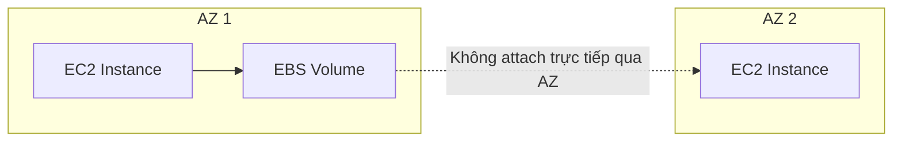
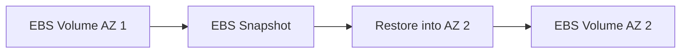
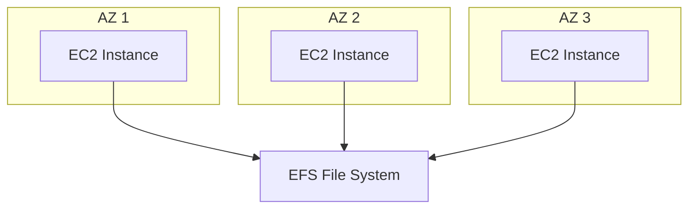

# 56. EFS vs EBS

## 🎯 Giới thiệu
Bài học so sánh **EBS volumes**, **EFS file systems** và nhắc lại vai trò của **EC2 Instance Store**.

## 1. EBS Volumes 💾

Đặc điểm chính của EBS:

- Attach vào một instance tại một thời điểm.
- Ngoại lệ: **Multi-Attach** cho **io1/io2** trong use case cụ thể.
- Locked ở **Availability Zone** level.
- EBS volume ở AZ 1 không attach trực tiếp được vào EC2 instance ở AZ 2.

## 2. I/O và volume size 📈

Với **gp2**:

- I/O tăng khi disk size tăng.

Với **gp3** và **io1**:

- Có thể tăng I/O independently với disk size.

## 3. Migrate EBS qua AZ 🔁

Để migrate EBS volume sang AZ khác:

1. Take snapshot.
2. Snapshot nằm trong **EBS snapshots**.
3. Restore snapshot vào AZ khác.

## 4. Backup và Root EBS Volume ⚠️

Lưu ý với EBS:

- EBS volume backups dùng I/O.
- Không nên chạy backup khi application đang xử lý nhiều traffic vì có thể ảnh hưởng performance.
- Root EBS volume của EC2 instance mặc định bị terminated khi EC2 instance terminated.
- Có thể disable behavior này.

## 5. EFS File Systems 📂

Đặc điểm chính của EFS:

- Là network file system.
- Có thể attach vào hàng trăm instances across Availability Zones.
- Một EFS file system có nhiều mount targets trong nhiều AZ.
- Nhiều instances có thể share cùng một file system.
- Hữu ích cho WordPress.
- Chỉ cho Linux instances vì dùng **POSIX system**.

## 6. EFS Cost và Storage Tiers 💰

- EFS có price point cao hơn EBS.
- Có thể dùng storage tiers để tiết kiệm chi phí.

## 7. EC2 Instance Store ⚡

Bài học nhắc lại:

- Instance Store physically attached vào EC2 instance.
- Nếu mất EC2 instance, sẽ mất storage.

## 📊 Bảng so sánh nhanh

| Tiêu chí | EBS | EFS | EC2 Instance Store |
|----------|-----|-----|--------------------|
| Loại storage | Block storage / volume | Network file system | Local hardware attached storage |
| Attach | Một instance tại một thời điểm, trừ Multi-Attach io1/io2 | Hàng trăm instances | Gắn với EC2 instance cụ thể |
| AZ | Locked theo AZ | Across AZ với mount targets | Theo underlying EC2 host |
| Migrate across AZ | Snapshot rồi restore | Không nhấn mạnh migrate, vì dùng across AZ | Không phù hợp |
| Linux only | Không nêu như giới hạn chính | Có, do POSIX system | Không nêu |
| Cost | Thấp hơn EFS | Cao hơn EBS, có storage tiers | Không nêu |
| Khi mất instance | Root EBS mặc định bị xóa nhưng có thể disable | File system share riêng | Storage bị mất |

## 💡 Mẹo ghi nhớ cho kỳ thi AWS

- Một EC2 cần block storage persistent trong một AZ → **EBS**.
- Nhiều EC2 across AZ cần share file system → **EFS**.
- Cần migrate EBS qua AZ → **Snapshot + Restore**.
- Cần local storage cực nhanh nhưng tạm thời → **EC2 Instance Store**.

## ✅ Kết luận

**EBS** phù hợp cho block storage gắn với một EC2 trong một AZ, **EFS** phù hợp cho shared file system across AZ cho nhiều Linux instances, còn **EC2 Instance Store** là local storage hiệu năng cao nhưng mất dữ liệu khi mất EC2 instance.
