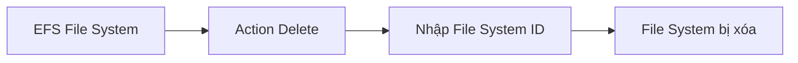
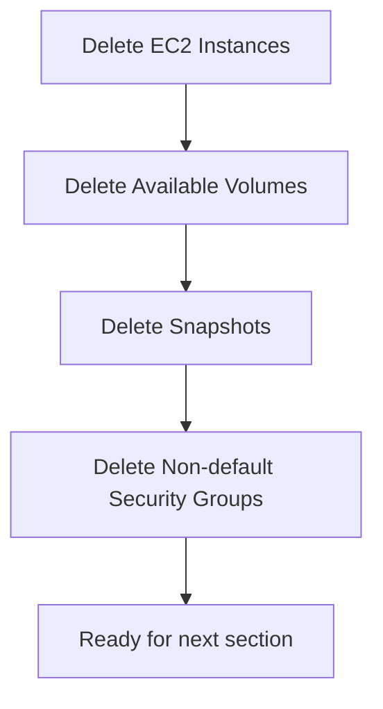

# 57. EBS & EFS - Section Cleanup

## 🎯 Giới thiệu
Bài học hướng dẫn cleanup tài nguyên đã tạo trong section **EBS & EFS** để tránh bị tính phí storage hoặc để chuẩn bị sang section tiếp theo.

## 1. Delete EFS File System 🗑️

Trong EFS Console:

- Chọn file system.
- Vào **Action**.
- Chọn **Delete**.
- Nhập **file system ID** để xác nhận.
- Delete file system.

## 2. Terminate EC2 Instances 🔥

Trong EC2 Console:

- Kiểm tra các EC2 instances đang running.
- Terminate bất kỳ EC2 instance nào còn chạy.

📌 Đây là bước cần làm trước khi xóa một số security groups còn attached vào instances.

## 3. Delete EBS Volumes 💾

Trong phần **Volumes**:

- Kiểm tra các volumes ở trạng thái **available**.
- Right-click và delete các volumes không còn cần dùng.

⚠️ Nếu không xóa volumes còn lại, vẫn có thể phát sinh storage cost.

## 4. Delete EBS Snapshots 📸

Trong phần **Snapshots**:

- Delete các snapshots đã tạo trong section.
- Mục tiêu là tránh trả tiền cho snapshot storage.

## 5. Delete Security Groups 🔒

Trong phần **Security Groups**:

- Có thể xóa các security groups đã tạo trong section.
- Không xóa security group **default**.
- Một security group chỉ xóa được khi không còn EC2 instances hoặc resources associated với nó.

Nếu chưa xóa được:

- Chờ EC2 instances shutdown/terminate hoàn toàn.
- Thử delete security group lại.

## 📊 Bảng tóm tắt nhanh

| Resource | Cleanup action | Lưu ý |
|----------|----------------|------|
| EFS File System | Delete bằng file system ID | Xóa file system không dùng nữa |
| EC2 Instances | Terminate | Cần terminate trước khi xóa SG liên quan |
| EBS Volumes | Delete volumes available | Tránh storage cost |
| EBS Snapshots | Delete snapshots | Tránh snapshot storage cost |
| Security Groups | Delete non-default SG | Không delete default; cần không còn associated resources |

## 💡 Mẹo ghi nhớ cho kỳ thi AWS

- Sau hands-on, luôn cleanup để tránh cost.
- EBS volumes và snapshots có thể phát sinh phí storage nếu để lại.
- Security group không xóa được nếu còn resource đang dùng nó.

## ✅ Kết luận

Section cleanup tập trung vào việc xóa **EFS file system**, terminate **EC2 instances**, delete **EBS volumes**, delete **EBS snapshots** và dọn các **security groups** không còn dùng. Sau khi cleanup xong, môi trường sẵn sàng cho section tiếp theo.
