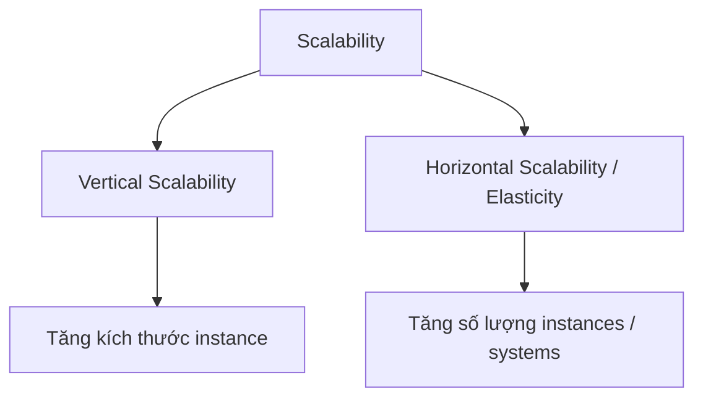
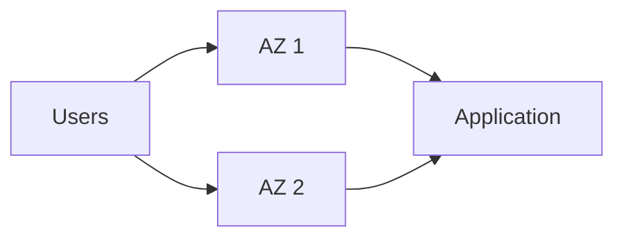

# 58. High Availability and Scalability

## 🎯 Giới thiệu

Bài học giới thiệu các khái niệm nền tảng về **Scalability** và **High Availability** — hai khái niệm rất dễ xuất hiện trong câu hỏi thi AWS.

- **Scalability**: hệ thống có thể xử lý tải lớn hơn bằng cách thích nghi.
- **High Availability**: hệ thống vẫn hoạt động khi một data center hoặc một **Availability Zone (AZ)** gặp sự cố.
- Hai khái niệm này có liên quan nhưng **không giống nhau**.

## 1. 📈 Scalability là gì?

**Scalability** nghĩa là ứng dụng hoặc hệ thống có thể xử lý nhiều tải hơn.

Có 2 dạng chính:

- **Vertical Scalability**
- **Horizontal Scalability**, còn được gọi là **Elasticity**

## 2. ⬆️ Vertical Scalability

**Vertical Scalability** nghĩa là tăng kích thước của instance.

Ví dụ trong bài:

- Một **junior operator** xử lý được 5 cuộc gọi/phút.
- Một **senior operator** xử lý được 10 cuộc gọi/phút.
- Khi thay junior bằng senior, ta đã **scale up**.

Trong AWS:

- Ứng dụng chạy trên `t2.micro`.
- Muốn tăng năng lực xử lý thì chuyển sang `t2.large`.

📌 Use case thường gặp:

- Các hệ thống **non-distributed system**.
- Ví dụ: database trên **RDS** hoặc **ElastiCache**.

⚠️ Lưu ý:

- Vertical scaling có giới hạn vì phụ thuộc vào giới hạn phần cứng.

## 3. ↔️ Horizontal Scalability

**Horizontal Scalability** nghĩa là tăng số lượng instances hoặc systems cho ứng dụng.

Ví dụ call center:

- 1 operator bị quá tải.
- Thêm operator thứ 2, thứ 3, rồi nhiều operator hơn.
- Đây là **horizontal scaling**.

Trong AWS:

- **Scale out**: tăng số lượng instances.
- **Scale in**: giảm số lượng instances.

Horizontal scaling thường dùng cho:

- Web application.
- Modern application.
- Distributed systems.
- **Auto Scaling Groups**.
- **Load Balancers**.

⚠️ Lưu ý:

- Không phải ứng dụng nào cũng có thể trở thành distributed system.

## 4. 🏢 High Availability

**High Availability** nghĩa là chạy ứng dụng hoặc hệ thống trong ít nhất:

- 2 data centers, hoặc
- 2 **Availability Zones** trong AWS.

Mục tiêu:

- Sống sót khi một data center hoặc một AZ gặp sự cố.
- Nếu một nơi bị mất kết nối, nơi còn lại vẫn tiếp tục phục vụ.

## 5. Active và Passive High Availability

High Availability có thể ở dạng:

### Passive

- Ví dụ: **RDS Multi AZ**.
- Một phần hệ thống ở trạng thái dự phòng.

### Active

- Thường đi cùng **Horizontal Scaling**.
- Nhiều instances hoặc systems cùng xử lý request cùng lúc.

## 6. 💻 Ví dụ trong EC2

### Vertical Scaling

- Tăng kích thước instance.
- Ví dụ từ instance nhỏ như `t2.nano` đến instance rất lớn như `u-t12tb1.metal`.

### Horizontal Scaling

- Tăng hoặc giảm số lượng instances.
- Trong AWS gọi là:
  - **Scale out**: tăng instances.
  - **Scale in**: giảm instances.

### High Availability

- Chạy cùng một ứng dụng trên nhiều **AZ**.
- Có thể áp dụng với:
  - **Auto Scaling Group** có multi-AZ.
  - **Load Balancer** có multi-AZ.

## 📊 Bảng tóm tắt

| Tiêu chí | Mô tả |
|----------|------|
| Scalability | Hệ thống thích nghi để xử lý tải lớn hơn |
| Vertical Scalability | Tăng kích thước instance |
| Horizontal Scalability | Tăng số lượng instances/systems |
| Scale out | Thêm instances |
| Scale in | Giảm instances |
| High Availability | Chạy trên ít nhất 2 data centers hoặc 2 AZ |
| Passive HA | Ví dụ RDS Multi AZ |
| Active HA | Nhiều hệ thống cùng xử lý traffic |

## 💡 Mẹo ghi nhớ cho kỳ thi AWS

- Thấy **increase instance size** → nghĩ đến **Vertical Scalability**.
- Thấy **add more instances** → nghĩ đến **Horizontal Scalability / Scale out**.
- Thấy **multiple AZ** hoặc **survive data center loss** → nghĩ đến **High Availability**.
- Nhớ ví dụ call center để phân biệt nhanh các khái niệm.

## ✅ Kết luận

Bài học giúp phân biệt rõ:

- **Vertical Scalability**: tăng sức mạnh của một instance.
- **Horizontal Scalability**: tăng số lượng instances.
- **High Availability**: chạy hệ thống trên nhiều AZ/data centers để chống lỗi.

Đây là nền tảng quan trọng trước khi học sâu về **Elastic Load Balancing** và **Auto Scaling Groups**.
