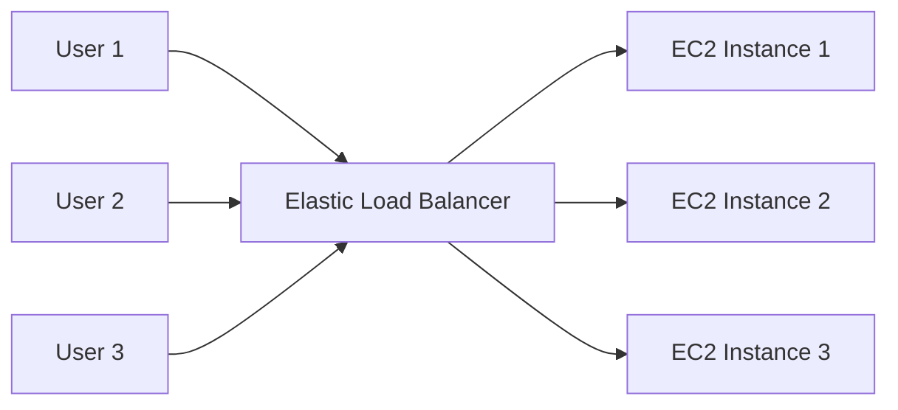
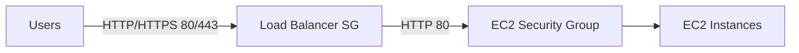

# 59. Elastic Load Balancing (ELB) Overview

## 🎯 Giới thiệu

Bài học giới thiệu **Elastic Load Balancing (ELB)** — dịch vụ dùng để phân phối traffic đến nhiều backend EC2 instances hoặc servers.

Một **load balancer** đóng vai trò là điểm truy cập duy nhất cho users, sau đó forward traffic đến nhiều backend instances.

## 1. ⚖️ Load Balancing là gì?

Load balancer là một server hoặc một tập hợp servers có nhiệm vụ:

- Nhận traffic từ users.
- Forward traffic đến nhiều backend hoặc downstream EC2 instances/servers.
- Giúp phân phối tải đều hơn giữa các instances.
- Cho users một endpoint duy nhất để kết nối.

📌 Users không cần biết họ đang kết nối đến backend instance nào.

## 2. ✅ Lợi ích của Load Balancer

Sử dụng load balancer giúp:

- Spread load across multiple downstream instances.
- Expose a single point of access cho application.
- Seamlessly handle failures của downstream instances.
- Thực hiện **health checks** trên instances.
- Cung cấp **SSL termination** cho HTTPS traffic.
- Enforce **stickiness with cookies**.
- Hỗ trợ **high availability across zones**.
- Tách **public traffic** khỏi **private traffic** trong cloud.

## 3. 🛠️ ELB là Managed Load Balancer

**Elastic Load Balancer** là managed load balancer.

AWS sẽ quản lý:

- Upgrades.
- Maintenance.
- High availability.
- Khả năng hoạt động ổn định của load balancer.

Người dùng chỉ cần cấu hình một số “configuration knobs” để điều chỉnh hành vi.

📌 Bài học nhấn mạnh rằng dùng ELB là lựa chọn hợp lý hơn so với tự vận hành load balancer, vì tự quản lý sẽ rất khó về scalability.

## 4. 🔗 ELB tích hợp với nhiều dịch vụ AWS

ELB có thể tích hợp với:

- **EC2 instances**.
- **Auto Scaling Groups**.
- **Amazon ECS**.
- **Certificate Manager**.
- **CloudWatch**.
- **Route 53**.
- **WAF**.
- **Global Accelerator**.

## 5. 🩺 Health Checks

**Health checks** giúp ELB xác định EC2 instance có hoạt động đúng không.

Nếu instance không hoạt động đúng, ELB sẽ không gửi traffic đến instance đó.

Ví dụ trong bài:

- Protocol: `HTTP`
- Port: `4567`
- Endpoint: `/health`
- Response mong đợi: HTTP status code `200`

## 6. 📦 Các loại Managed Load Balancers trên AWS

Bài học liệt kê 4 loại managed load balancers:

| Load Balancer | Thế hệ | Protocol hỗ trợ | Ghi chú |
|---|---|---|---|
| **Classic Load Balancer (CLB)** | Older generation / V1 | HTTP, HTTPS, TCP, SSL | AWS không khuyến khích dùng nữa |
| **Application Load Balancer (ALB)** | Newer generation | HTTP, HTTPS, WebSocket | Dành cho application layer |
| **Network Load Balancer (NLB)** | Newer generation | TCP, TLS, UDP | Dành cho network traffic |
| **Gateway Load Balancer (GWLB)** | Newer generation | IP protocol | Hoạt động ở network layer, Layer 3 |

📌 Khuyến nghị trong bài: dùng newer generation load balancers vì có nhiều tính năng hơn.

## 7. 🌐 Internal và External Load Balancers

Load balancer có thể được thiết lập theo 2 kiểu:

- **Internal**: private access trong network.
- **External**: public load balancer cho websites và public applications.

## 8. 🔒 Security Groups cho Load Balancer

Mô hình bảo mật được nhấn mạnh:

- Users truy cập load balancer từ anywhere bằng HTTP/HTTPS.
- EC2 instances chỉ cho phép traffic đến từ security group của load balancer.

Cấu hình mẫu:

| Thành phần | Rule |
|---|---|
| Load Balancer Security Group | Allow port 80 hoặc 443 từ `0.0.0.0/0` |
| EC2 Security Group | Allow HTTP port 80 từ Security Group của Load Balancer |

## 📊 Bảng tóm tắt nhanh

| Tiêu chí | Mô tả |
|----------|------|
| ELB | Managed Load Balancer của AWS |
| Mục tiêu | Phân phối traffic đến nhiều backend instances |
| Endpoint | Users chỉ cần truy cập một endpoint |
| Health Checks | Kiểm tra instance có hoạt động đúng không |
| SSL Termination | Hỗ trợ xử lý HTTPS traffic |
| Stickiness | Có thể dùng cookies để giữ user trên cùng backend |
| HA | Hỗ trợ high availability across zones |
| Security Best Practice | EC2 chỉ nhận traffic từ Load Balancer Security Group |

## 💡 Mẹo ghi nhớ cho kỳ thi AWS

- Thấy “single point of access” + “multiple EC2 instances” → nghĩ đến **ELB**.
- Thấy “HTTP/HTTPS/WebSocket” → nghĩ đến **ALB**.
- Thấy “TCP/UDP/TLS” → nghĩ đến **NLB**.
- Thấy “network layer / Layer 3 / IP protocol” → nghĩ đến **GWLB**.
- EC2 instances phía sau load balancer nên chỉ allow traffic từ **Load Balancer Security Group**.

## ✅ Kết luận

**Elastic Load Balancing** giúp ứng dụng có một endpoint duy nhất, phân phối traffic đến nhiều backend instances, hỗ trợ health checks, SSL termination, stickiness, high availability và tích hợp với nhiều dịch vụ AWS.
