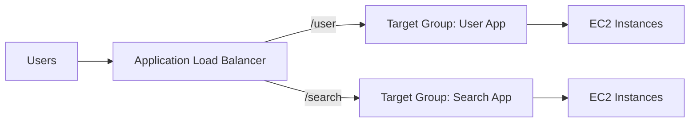
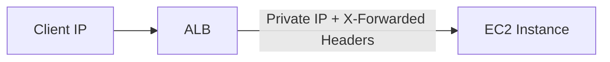

# 61. Application Load Balancer (ALB)

## 🎯 Giới thiệu

Bài học giới thiệu **Application Load Balancer (ALB)** — một load balancer hoạt động ở **Layer 7**, tức tầng HTTP.

ALB cho phép route traffic đến nhiều HTTP applications, nhiều target groups, và rất phù hợp cho **microservices** và **container-based applications**.

## 1. 🌐 ALB là Layer 7 Load Balancer

**Application Load Balancer** hoạt động ở **Layer 7**.

Điều này nghĩa là ALB xử lý traffic HTTP-level và có thể hiểu các thông tin như:

- Path trong URL.
- Hostname.
- Query string.
- Headers.

ALB có thể route đến nhiều HTTP applications chạy trên nhiều machines.

## 2. 🎯 Target Groups

Các machines phía sau ALB được gom vào **target group**.

ALB có thể route traffic đến nhiều target groups khác nhau.

Target groups có thể là:

- **EC2 instances**.
- **ECS tasks**.
- **Lambda functions**.
- **IP addresses** — phải là private IP addresses.

📌 Health checks được thực hiện ở target group level.

## 3. 🧩 ALB cho Microservices và Containers

ALB rất phù hợp cho:

- **Microservices**.
- **Container-based applications**.
- Ứng dụng chạy với **ECS**.

Lý do:

- ALB hỗ trợ routing đến nhiều applications.
- Có port mapping feature để redirect đến dynamic port trên ECS instance.

## 4. 🚦 Routing Rules trong ALB

ALB hỗ trợ route traffic dựa trên nhiều điều kiện.

### Path-based routing

Ví dụ:

- `example.com/users` → target group cho user application.
- `example.com/posts` → target group cho posts application.

### Host-based routing

Ví dụ:

- `one.example.com` → target group 1.
- `other.example.com` → target group 2.

### Query string và headers

Ví dụ:

- `example.com/reserves?id=123&order=false`

ALB có thể route dựa trên query strings và headers.

## 5. 🔁 Redirect Support

ALB hỗ trợ redirect.

Ví dụ:

- Redirect từ HTTP sang HTTPS tự động tại load balancer level.

## 6. 📡 Protocol Support

ALB hỗ trợ:

- **HTTP/2**.
- **WebSockets**.
- HTTP-based routing.

## 7. 🆚 So sánh với Classic Load Balancer

Transcript nêu rằng nếu dùng **Classic Load Balancer** cho nhiều applications, thường cần nhiều CLB — một load balancer cho mỗi application.

Với **ALB**:

- Có thể dùng một ALB đứng trước nhiều applications.
- Route thông minh đến nhiều target groups.

## 8. 🧾 Client IP và X-Forwarded Headers

Application servers không thấy trực tiếp IP thật của client.

Load balancer thực hiện **connection termination** và khi nói chuyện với EC2 instance, nó dùng private IP của load balancer.

Để biết thông tin client thật, EC2 instance cần đọc các headers:

- **X-Forwarded-For**: IP thật của client.
- **X-Forwarded-Port**: port được sử dụng.
- **X-Forwarded-Proto**: protocol được sử dụng.

## 📊 Bảng tóm tắt

| Tiêu chí | Mô tả |
|----------|------|
| Loại load balancer | Application Load Balancer |
| Layer | Layer 7 |
| Protocol chính | HTTP |
| Hỗ trợ | HTTP/2, WebSockets, Redirect |
| Routing | Path, Hostname, Query String, Headers |
| Phù hợp cho | Microservices, Containers, ECS |
| Target groups | EC2, ECS tasks, Lambda, Private IPs |
| Client IP | Dùng X-Forwarded-For |

## 💡 Mẹo ghi nhớ cho kỳ thi AWS

- Thấy **Layer 7**, **HTTP**, **path-based routing**, **host-based routing** → nghĩ đến **ALB**.
- Thấy **microservices** hoặc **containers/ECS** → ALB thường là lựa chọn phù hợp.
- Muốn biết IP thật của client phía backend → dùng **X-Forwarded-For**.

## ✅ Kết luận

**Application Load Balancer (ALB)** là load balancer Layer 7 cho HTTP traffic, hỗ trợ routing thông minh đến nhiều target groups và rất phù hợp với microservices, containers và ECS.
