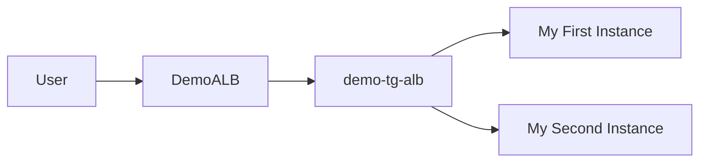
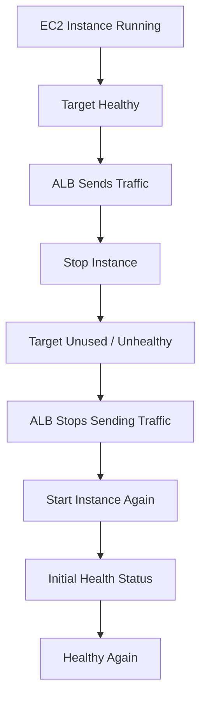

# 62. Application Load Balancer (ALB) - Hands On - Part 1

## 🎯 Giới thiệu

Bài hands-on hướng dẫn tạo **Application Load Balancer (ALB)** để phân phối traffic đến 2 **EC2 instances**.

Mục tiêu:

- Tạo 2 EC2 instances chạy web server bằng **EC2 user data**.
- Tạo **ALB** internet-facing.
- Tạo **target group**.
- Register EC2 instances vào target group.
- Kiểm tra load balancing và health checks.

## 1. 🚀 Launch 2 EC2 Instances

Đầu tiên, bài học tạo 2 EC2 instances.

Cấu hình chính:

- Số lượng: 2 instances.
- AMI: **Amazon Linux 2**.
- Instance type: `t2.micro`.
- Key pair: không dùng key pair vì có thể dùng **EC2 Instance Connect** nếu cần.
- Security Group: dùng security group hiện có cho phép HTTP và SSH.
- Storage: basic storage.
- Advanced details: thêm **EC2 user data** để tạo web server.

Sau khi instances ready:

- Truy cập public IPv4 của từng instance.
- Cả hai trả về `Hello World`.
- Phần cuối của response khác nhau, giúp xác định request đang đi vào instance nào.

## 2. ⚖️ Mục tiêu: Một URL cho nhiều EC2 Instances

Thay vì truy cập từng public IP riêng lẻ, mục tiêu là có một URL duy nhất.

URL này sẽ đi qua **Application Load Balancer** và ALB sẽ phân phối traffic đến 2 EC2 instances.

## 3. 🧱 Chọn loại Load Balancer

Trong màn hình tạo load balancer, transcript nhắc lại 3 loại chính:

| Load Balancer | Dùng cho |
|---|---|
| **Application Load Balancer** | HTTP và HTTPS traffic |
| **Network Load Balancer** | TCP, UDP, TLS over TCP, ultra high performance |
| **Gateway Load Balancer** | Security, intrusion detection, firewalls, analyze network traffic |

Bài hands-on tập trung vào **Application Load Balancer**.

## 4. 🌐 Tạo Application Load Balancer

Cấu hình ALB:

- Name: `DemoALB`.
- Scheme: **internet-facing**.
- Address type: **IPv4**.
- Network mapping: deploy vào tất cả Availability Zones có sẵn.

## 5. 🔒 Security Group cho ALB

Tạo security group mới cho ALB:

- Name: `demo-sg-load-balancer`.
- Mục đích: Allow HTTP into ALB.
- Inbound rule: allow HTTP từ anywhere.
- Outbound rules: giữ mặc định.

Sau đó chọn security group này cho ALB và remove default security group.

## 6. 🎯 Tạo Target Group

Target group là nhóm EC2 instances mà ALB sẽ gửi traffic đến.

Cấu hình:

- Name: `demo-tg-alb`.
- Target type: instances.
- Protocol: HTTP.
- Port: 80.
- HTTP version: 1.
- Health check: giữ cấu hình mặc định trong bài.

Sau đó register cả 2 EC2 instances vào target group trên port 80.

## 7. 👂 Listener và Routing

Cấu hình listener:

- Protocol: HTTP.
- Port: 80.
- Forward traffic đến `demo-tg-alb`.

Sau đó tạo load balancer.

## 8. ✅ Kiểm tra Load Balancing

Khi ALB active, AWS cung cấp một DNS name.

Khi truy cập DNS name:

- Response trả về `Hello World`.
- Refresh nhiều lần thì backend instance thay đổi.
- Điều này chứng minh ALB đang load balance giữa 2 EC2 instances.

## 9. 🩺 Kiểm tra Health Checks

Trong target group:

- Hai targets ban đầu healthy.
- ALB gửi traffic đến cả hai.

Khi stop một EC2 instance:

- Target đó chuyển sang trạng thái unused/stopped.
- ALB chỉ gửi traffic đến instance còn healthy.

Khi start instance lại:

- Target chuyển qua initial health status.
- Sau khi healthy, ALB tiếp tục gửi traffic đến cả hai instances.

## 📊 Bảng tóm tắt

| Tiêu chí | Mô tả |
|----------|------|
| Mục tiêu | Tạo ALB trước 2 EC2 instances |
| EC2 AMI | Amazon Linux 2 |
| Instance type | t2.micro |
| ALB name | DemoALB |
| ALB scheme | Internet-facing |
| ALB protocol | HTTP port 80 |
| Target group | demo-tg-alb |
| Target type | EC2 instances |
| Health check | Target group kiểm tra instance healthy/unhealthy |
| Kết quả | ALB route traffic giữa các healthy instances |

## 💡 Mẹo ghi nhớ cho kỳ thi AWS

- ALB không gửi traffic đến targets bị unhealthy.
- Target group là nơi register EC2 instances.
- Listener định nghĩa protocol/port mà load balancer nhận traffic.
- ALB cung cấp DNS name để users truy cập.

## ✅ Kết luận

Bài hands-on minh họa luồng cơ bản của **Application Load Balancer**: tạo EC2 instances, tạo target group, tạo ALB, register targets, kiểm tra health checks và xác nhận load balancing qua DNS name của ALB.
