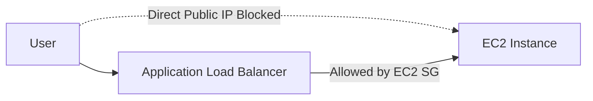
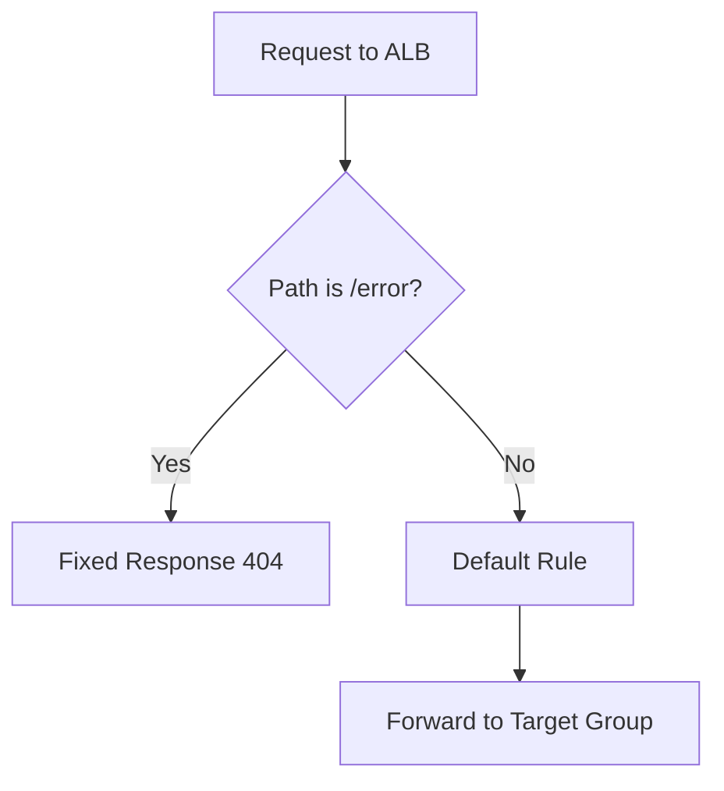

# 63. Application Load Balancer (ALB) - Hands On - Part 2

## 🎯 Giới thiệu

Bài hands-on tiếp tục với **Application Load Balancer (ALB)** và tập trung vào 2 chủ đề nâng cao hơn:

- Tăng cường **network security** giữa ALB và EC2 instances.
- Tạo **listener rules** cho ALB.

## 1. 🔒 Network Security: Chỉ cho phép traffic từ ALB vào EC2

Ban đầu:

- Có thể truy cập EC2 instance trực tiếp qua public IP.
- Cũng có thể truy cập EC2 instance thông qua ALB.

Tuy nhiên, cách tốt hơn là:

- Không cho user truy cập trực tiếp EC2 instance.
- Chỉ cho EC2 nhận HTTP traffic đến từ security group của ALB.

## 2. 🛠️ Cập nhật Security Group của EC2

Trong security group của EC2 instance:

- Xóa rule HTTP đang allow từ everywhere.
- Thêm rule HTTP mới.
- Source không phải CIDR block.
- Source là **security group của load balancer**.

Kết quả:

- Truy cập trực tiếp public IP của EC2 sẽ timeout.
- Truy cập thông qua ALB vẫn hoạt động.

📌 Đây là cách tighten network security trong bài.

## 3. 🚦 Listener Rules trong ALB

Trong ALB:

- Vào phần **Listeners**.
- Mỗi listener có các **rules**.
- Default rule hiện tại forward mọi request đến target group.

Có thể thêm rules mới để xử lý request dựa trên conditions.

## 4. 🧩 Conditions trong Listener Rules

ALB có thể filter request dựa trên:

- Host headers.
- Path.
- HTTP request method.
- Source IP.
- Query string.
- HTTP header.

Trong bài hands-on, rule dùng path:

- Path: `/error`

## 5. 🎬 Actions trong Listener Rules

Khi request match condition, ALB có thể thực hiện action:

- Forward đến target group cụ thể.
- Redirect đến URL cụ thể.
- Return a fixed response.

Trong bài:

- Action: fixed response.
- Status code: `404`.
- Body: `not found, custom error`.
- Content type: text/plain.

## 6. 🔢 Rule Priority

ALB rules có priority.

- Priority `1` là cao nhất.
- Priority có thể lên đến `50,000`.
- Nếu nhiều rules cùng match, rule có priority cao nhất sẽ thắng.

Trong bài, `DemoRule` được đặt priority `5`.

## 7. ✅ Kiểm tra Rule `/error`

Khi truy cập:

- DNS name của ALB + `/error`

Kết quả:

- Request match path pattern `/error`.
- ALB trả về fixed response `404`.
- Nội dung: `not found, custom error`.

## 📊 Bảng tóm tắt

| Tiêu chí | Mô tả |
|----------|------|
| Security improvement | EC2 chỉ nhận HTTP từ ALB Security Group |
| Truy cập EC2 trực tiếp | Bị timeout sau khi cập nhật rule |
| Truy cập qua ALB | Vẫn hoạt động |
| Listener rule condition | Path `/error` |
| Listener rule action | Fixed response |
| Response | 404, `not found, custom error` |
| Priority | Số nhỏ hơn có priority cao hơn |

## 💡 Mẹo ghi nhớ cho kỳ thi AWS

- EC2 phía sau ALB nên allow inbound traffic từ **ALB Security Group**, không phải từ everywhere.
- ALB listener rules có thể route theo path, host, method, source IP, query string, headers.
- Khi nhiều rules cùng match, priority cao hơn sẽ được áp dụng.

## ✅ Kết luận

Bài hands-on cho thấy cách tăng bảo mật bằng security group và cách dùng **ALB listener rules** để xử lý request theo điều kiện, ví dụ path `/error` trả về fixed response `404`.
