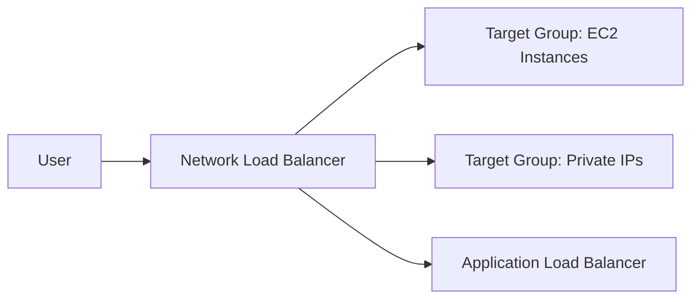

# 64. Network Load Balancer (NLB)

## 🎯 Giới thiệu

Bài học giới thiệu **Network Load Balancer (NLB)** — load balancer hoạt động ở **Layer 4**, xử lý traffic **TCP** và **UDP**.

NLB phù hợp khi cần:

- Extreme performance.
- TCP hoặc UDP traffic.
- Static IPs.
- Ultra low latency.

## 1. 🌐 NLB là Layer 4 Load Balancer

**Network Load Balancer** hoạt động ở **Layer 4**.

Layer 4 xử lý:

- **TCP** traffic.
- **UDP** traffic.

📌 Trong transcript nhấn mạnh: nếu trong exam thấy **UDP**, hãy nghĩ đến **Network Load Balancer**.

## 2. 🚀 Hiệu năng rất cao

NLB có thể:

- Handle millions of requests per second.
- Duy trì ultra low latency.

Đây là điểm khác biệt quan trọng của NLB so với ALB.

## 3. 📌 Static IP per Availability Zone

Một đặc điểm quan trọng của NLB:

- Có một static IP cho mỗi Availability Zone.
- Có thể gán **Elastic IP** cho từng AZ.

Use case:

- Ứng dụng cần được truy cập qua một tập hợp static IPs.
- Ví dụ chỉ được access qua 1, 2 hoặc 3 IPs cố định.

## 4. 🎯 Target Groups của NLB

NLB cũng sử dụng target groups.

Target groups có thể là:

- **EC2 instances**.
- **IP addresses** — phải là private IPs.
- **Application Load Balancer**.

## 5. 🔗 NLB đứng trước ALB

Transcript nhấn mạnh NLB có thể đứng trước ALB.

Ý nghĩa:

- **NLB** cung cấp fixed IP addresses.
- **ALB** cung cấp HTTP routing rules.

Đây là một combination hợp lệ.

## 6. 🩺 Health Checks

NLB target groups hỗ trợ health checks bằng:

- **TCP**.
- **HTTP**.
- **HTTPS**.

Nếu backend application hỗ trợ HTTP hoặc HTTPS, có thể định nghĩa health check bằng các protocol đó.

## 📊 Bảng tóm tắt

| Tiêu chí | Mô tả |
|----------|------|
| Load Balancer | Network Load Balancer |
| Layer | Layer 4 |
| Protocol | TCP, UDP |
| Hiệu năng | Millions of requests per second, ultra low latency |
| IP | 1 static IP per AZ |
| Elastic IP | Có thể gán cho từng AZ |
| Target groups | EC2, private IPs, ALB |
| Health checks | TCP, HTTP, HTTPS |

## 💡 Mẹo ghi nhớ cho kỳ thi AWS

- Thấy **TCP** hoặc **UDP** → nghĩ đến **NLB**.
- Thấy **extreme performance** hoặc **ultra low latency** → nghĩ đến **NLB**.
- Thấy yêu cầu **static IPs** hoặc **Elastic IP per AZ** → nghĩ đến **NLB**.
- Cần fixed IP nhưng vẫn muốn HTTP routing → có thể dùng **NLB in front of ALB**.

## ✅ Kết luận

**Network Load Balancer (NLB)** là load balancer Layer 4 cho TCP/UDP traffic, có hiệu năng rất cao, hỗ trợ static IP per AZ và có thể dùng trước ALB để kết hợp fixed IP với HTTP routing rules.
