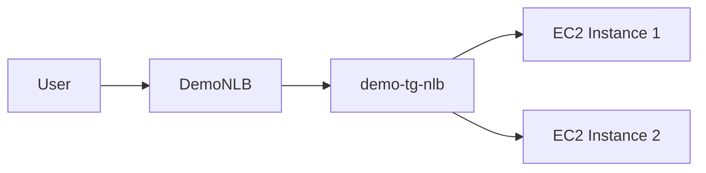
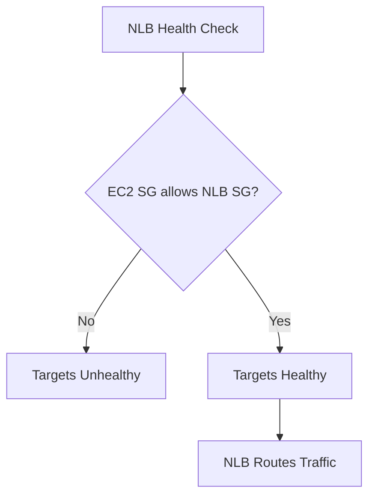

# 65. Network Load Balancer (NLB) - Hands On

## 🎯 Giới thiệu

Bài hands-on hướng dẫn tạo **Network Load Balancer (NLB)**, gắn target group, cấu hình security group và xử lý lỗi health check do EC2 security group chưa allow traffic từ NLB.

## 1. 🚀 Tạo Network Load Balancer

Load balancer được tạo với cấu hình:

- Name: `DemoNLB`.
- Scheme: internet-facing.
- Address type: IPv4.
- Network mapping: chọn VPC hiện có.
- Chọn tất cả Availability Zones.

📌 Với mỗi AZ được enable cho NLB:

- AWS gán một fixed IPv4 address.
- Nếu có **Elastic IP**, có thể dùng Elastic IP cho từng AZ.

## 2. 🔒 Security Group cho NLB

Transcript cho biết có thể attach security group cho NLB và đây là recommended.

Tạo security group:

- Name: `demo-sg-nlb`.
- Inbound rule: allow HTTP từ anywhere trên port 80.
- Outbound rules: giữ mặc định.

Sau đó chọn `demo-sg-nlb` cho NLB và remove default security group.

## 3. 👂 Listener và Routing

Cấu hình listener:

- Protocol: TCP.
- Port: 80.
- Forward đến target group.

NLB hỗ trợ các protocol như:

- TCP.
- TCP_UDP.
- TLS.
- UDP.

Trong bài dùng TCP over port 80.

## 4. 🎯 Tạo Target Group cho NLB

Cấu hình target group:

- Target type: instances.
- Name: `demo-tg-nlb`.
- Protocol: TCP.
- Port: 80.
- VPC: VPC hiện có.

Health check:

- Protocol: HTTP.
- Healthy threshold: 2.
- Timeout: 2 seconds.
- Interval: 5 seconds.

Sau đó register 2 EC2 instances vào target group.

## 5. ⚠️ Lỗi Health Check ban đầu

Khi test NLB, ban đầu DNS name không hoạt động.

Trong target group:

- Instances ở trạng thái initial.
- Sau đó chuyển thành unhealthy.
- Lý do: health checks failed.

Nguyên nhân trong bài:

- EC2 security group chỉ allow HTTP từ security group của **Application Load Balancer**.
- Chưa allow HTTP từ security group của **Network Load Balancer**.

## 6. 🛠️ Sửa Security Group của EC2

Trong inbound rules của EC2 security group:

- Thêm rule HTTP.
- Source: `demo-sg-nlb`.
- Mục đích: allow traffic from NLB.

Sau khi cập nhật:

- NLB có thể nói chuyện với EC2 instances.
- Health checks pass.
- Targets chuyển sang healthy.

## 7. ✅ Kiểm tra Load Balancing

Sau khi targets healthy:

- Truy cập DNS name của NLB.
- Response trả về `Hello World` từ một EC2 instance.
- Refresh sau một lúc thấy IP thay đổi.
- Điều này chứng minh NLB đang load balance đến 2 instances.

## 8. 🧹 Cleanup

Transcript khuyến nghị để tránh chi phí:

- Delete `DemoNLB`.
- Optionally delete NLB target group.
- Optionally delete NLB security group.

## 📊 Bảng tóm tắt

| Tiêu chí | Mô tả |
|----------|------|
| Load Balancer | DemoNLB |
| Scheme | Internet-facing |
| Address type | IPv4 |
| AZ mapping | Chọn tất cả AZs |
| Listener | TCP port 80 |
| Target group | demo-tg-nlb |
| Target protocol | TCP port 80 |
| Health check | HTTP |
| Lỗi gặp phải | EC2 SG chưa allow traffic từ NLB SG |
| Cách sửa | Thêm inbound HTTP từ `demo-sg-nlb` vào EC2 SG |

## 💡 Mẹo ghi nhớ cho kỳ thi AWS

- NLB có fixed IPv4 address cho mỗi AZ.
- EC2 targets phải allow traffic từ NLB security group nếu dùng security group cho NLB.
- NLB listener có thể là TCP, TCP_UDP, TLS, UDP.
- Health check của NLB target group có thể dùng HTTP nếu backend là HTTP application.

## ✅ Kết luận

Bài hands-on cho thấy cách tạo **Network Load Balancer**, target group và listener TCP, đồng thời nhấn mạnh lỗi phổ biến: EC2 security group phải cho phép traffic từ security group của NLB thì health checks mới pass.
