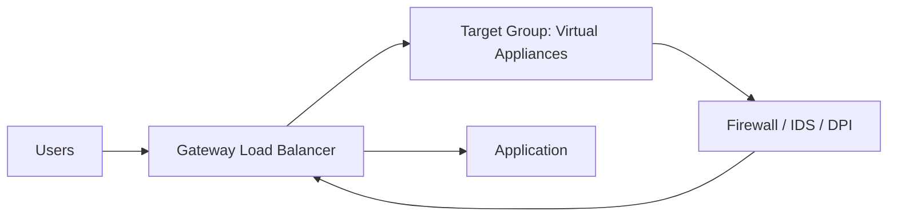

# 66. Gateway Load Balancer (GWLB)

## 🎯 Giới thiệu

Bài học giới thiệu **Gateway Load Balancer (GWLB)** — dịch vụ dùng để deploy, scale và manage fleet các third-party network virtual appliances trong AWS.

GWLB thường dùng khi muốn toàn bộ network traffic đi qua các appliance như:

- Firewall.
- Intrusion detection and prevention system.
- Deep packet inspection system.
- Payload modification ở network level.

## 1. 🛡️ Use Cases của Gateway Load Balancer

Sử dụng **Gateway Load Balancer** khi muốn tất cả traffic của network được kiểm tra trước khi đến application.

Ví dụ use cases:

- Cho traffic đi qua firewall.
- Dùng intrusion detection and prevention.
- Deep packet inspection.
- Modify payloads ở network level.

## 2. 🔁 Luồng Traffic với GWLB

Thông thường users có thể truy cập application trực tiếp qua load balancer như ALB.

Nhưng nếu muốn inspect traffic trước, ta đặt **Gateway Load Balancer** vào luồng traffic.

Luồng xử lý:

1. Users gửi traffic.
2. Route tables trong VPC được cập nhật để traffic đi qua GWLB.
3. GWLB phân phối traffic đến target group chứa virtual appliances.
4. Appliances analyze traffic.
5. Nếu traffic được chấp nhận, nó quay lại GWLB.
6. GWLB forward traffic đến application.
7. Nếu không được chấp nhận, appliance có thể drop traffic.

📌 Với application, quá trình này transparent.

## 3. 🌐 GWLB hoạt động ở Layer 3

Gateway Load Balancer hoạt động ở:

- **Layer 3**.
- Network layer.
- IP packets.

GWLB có 2 chức năng chính:

### Transparent Network Gateway

- Tất cả traffic trong VPC đi qua một single entry và single exit.
- Entry/exit đó là Gateway Load Balancer.

### Load Balancer

- Phân phối traffic đến tập virtual appliances trong target group.

## 4. 📡 GENEVE Protocol

Transcript nhấn mạnh một dấu hiệu quan trọng cho exam:

- Nếu thấy **GENEVE protocol** trên port `6081`, hãy nghĩ đến **Gateway Load Balancer**.

## 5. 🎯 Target Groups của GWLB

Target groups cho GWLB là các third-party appliances.

Targets có thể là:

- **EC2 instances**, register bằng instance ID.
- **IP addresses**, nhưng phải là private IPs.

Ví dụ:

- Virtual appliances chạy trong AWS.
- Appliances chạy trong own network hoặc own data center và được register bằng private IP.

## 📊 Bảng tóm tắt

| Tiêu chí | Mô tả |
|----------|------|
| Load Balancer | Gateway Load Balancer |
| Layer | Layer 3 / Network Layer |
| Traffic type | IP packets |
| Use cases | Firewall, intrusion detection, deep packet inspection |
| Chức năng 1 | Transparent network gateway |
| Chức năng 2 | Load balancer cho virtual appliances |
| Protocol keyword | GENEVE |
| Port keyword | 6081 |
| Target group | EC2 instances hoặc private IPs |

## 💡 Mẹo ghi nhớ cho kỳ thi AWS

- Thấy **GENEVE port 6081** → nghĩ ngay đến **Gateway Load Balancer**.
- Thấy yêu cầu inspect traffic bằng firewall/IDS/DPI → nghĩ đến **GWLB**.
- GWLB hoạt động ở **Layer 3**, khác với ALB Layer 7 và NLB Layer 4.

## ✅ Kết luận

**Gateway Load Balancer** giúp đưa toàn bộ network traffic qua các virtual appliances để inspect, filter hoặc modify traffic. Nó vừa là transparent network gateway vừa là load balancer cho appliances.
