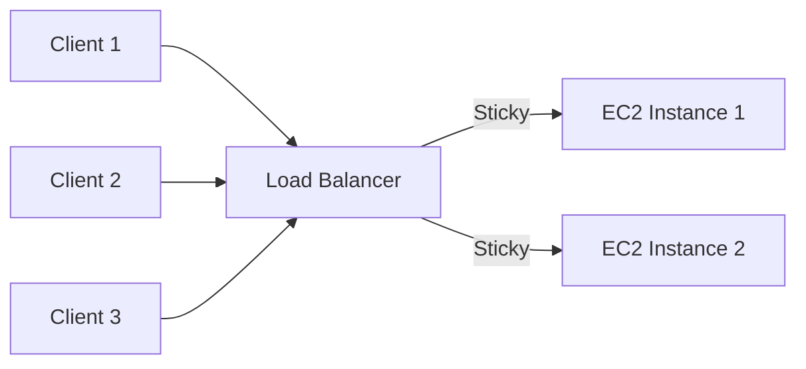

# 67. Elastic Load Balancer - Sticky Sessions

## 🎯 Giới thiệu

Bài học giới thiệu **Sticky Sessions**, còn gọi là **Session Affinity**, trong **Elastic Load Balancer**.

Sticky Sessions đảm bảo các request tiếp theo từ cùng một client sẽ tiếp tục đi đến cùng backend instance.

## 1. 📌 Sticky Sessions là gì?

Thông thường load balancer phân phối request giữa nhiều EC2 instances.

Với **Sticky Sessions**:

- Client gửi request đầu tiên đến ALB.
- Request được đưa đến một backend instance.
- Những request tiếp theo từ cùng client tiếp tục đi đến instance đó.

Sticky Sessions có thể enable cho:

- **Classic Load Balancer**.
- **Application Load Balancer**.
- **Network Load Balancer**.

## 2. 🍪 Sticky Sessions hoạt động bằng Cookie

Sticky Sessions dùng cookie.

Cookie có:

- Thông tin stickiness.
- Expiration date.

Khi cookie hết hạn:

- Client có thể bị redirect đến EC2 instance khác.

## 3. ✅ Use Case

Use case chính:

- Đảm bảo user luôn kết nối đến cùng backend instance.
- Tránh mất session data.
- Ví dụ: login information của user.

## 4. ⚠️ Rủi ro khi bật Stickiness

Bật sticky sessions có thể gây imbalance.

Lý do:

- Một số users có thể “rất sticky”.
- Một vài backend instances có thể nhận nhiều load hơn các instances khác.

## 5. 🍪 Các loại Cookie cho Sticky Sessions

Transcript nhắc đến 2 nhóm chính:

- **Application-based cookie**.
- **Duration-based cookie**.

### Application-based cookie

Có thể là custom cookie do target/application tạo ra.

Đặc điểm:

- Có thể chứa custom attributes theo yêu cầu application.
- Cookie name phải được chỉ định riêng cho từng target group.
- Không được dùng các tên reserved:
  - `AWSALB`
  - `AWSALBAPP`
  - `AWSALBTG`

Transcript cũng nhắc đến application cookie được tạo bởi load balancer, với cookie name:

- `AWSALBAPP`

### Duration-based cookie

Đây là cookie do load balancer tạo ra.

Cookie name:

- `AWSALB` cho ALB.
- `AWSELB` cho CLB.

Cookie có expiry dựa trên duration cụ thể.

## 6. 🛠️ Hands-on: Enable Stickiness

Trong bài demo:

1. Mở target group.
2. Chọn Actions.
3. Edit attributes.
4. Tìm phần **stickiness**.
5. Turn on stickiness.
6. Chọn loại cookie.

Có 2 lựa chọn:

- Load balancer generated cookie.
- Application based cookie.

Trong bài chọn:

- Load balancer generated cookie.
- Duration mặc định: 1 day.

Duration có thể chỉnh từ:

- 1 second đến 7 days.

## 7. 🔍 Kiểm tra Sticky Sessions

Sau khi bật stickiness:

- Refresh trang nhiều lần.
- Response luôn đến từ cùng một instance.
- Trong Web Developer Tools → Network → Cookies có thể thấy:
  - Response cookie.
  - Request cookie.
  - Cookie expiry.
  - Cookie value.

Cookie được browser gửi lại cho load balancer, nhờ đó stickiness hoạt động.

## 📊 Bảng tóm tắt

| Tiêu chí | Mô tả |
|----------|------|
| Tên tính năng | Sticky Sessions / Session Affinity |
| Mục tiêu | Cùng client đi đến cùng backend instance |
| Cơ chế | Cookie |
| Load balancers hỗ trợ | CLB, ALB, NLB |
| Use case | Giữ session data như login information |
| Rủi ro | Có thể gây imbalance giữa backend instances |
| Cookie types | Application-based, Duration-based |
| Duration range | 1 second đến 7 days |

## 💡 Mẹo ghi nhớ cho kỳ thi AWS

- Thấy “same user must go to same backend instance” → nghĩ đến **Sticky Sessions**.
- Sticky Sessions dùng **cookie**.
- Bật stickiness có thể gây load imbalance.
- Cookie names như `AWSALB`, `AWSALBAPP`, `AWSELB` có thể xuất hiện trong ngữ cảnh ELB.

## ✅ Kết luận

**Sticky Sessions** giúp giữ cùng một client trên cùng backend instance bằng cookie. Tính năng này hữu ích cho session data nhưng có thể làm mất cân bằng tải giữa các instances.
