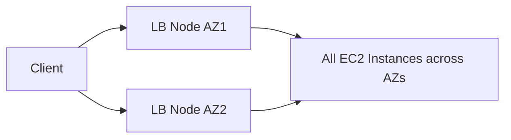
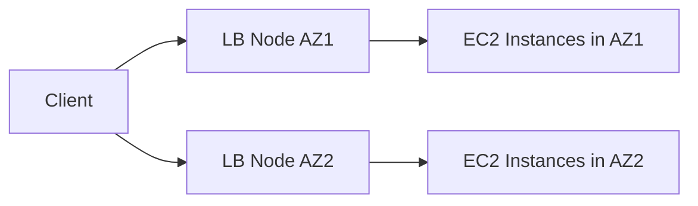

# 68. Elastic Load Balancer - Cross Zone Load Balancing

## 🎯 Giới thiệu

Bài học giải thích **Cross Zone Load Balancing** — cơ chế cho phép mỗi load balancer node phân phối traffic đều đến tất cả registered instances trong tất cả Availability Zones.

## 1. ⚖️ Cross Zone Load Balancing là gì?

Khi bật **Cross Zone Load Balancing**:

- Mỗi load balancer instance/node phân phối traffic đều đến tất cả registered instances.
- Không phụ thuộc instance đó đang ở Availability Zone nào.

Ví dụ trong bài:

- AZ1 có 2 EC2 instances.
- AZ2 có 8 EC2 instances.
- Tổng cộng 10 EC2 instances.

Với cross zone load balancing:

- Traffic được phân phối đều trên cả 10 instances.
- Mỗi instance nhận khoảng 10% traffic.

## 2. 🚫 Không bật Cross Zone Load Balancing

Khi không bật cross zone load balancing:

- Traffic bị giới hạn trong từng AZ.
- Load balancer node trong AZ nào thì gửi traffic đến EC2 instances trong AZ đó.

Ví dụ:

- Client gửi 50% traffic đến AZ1 và 50% đến AZ2.
- AZ1 chỉ có 2 EC2 instances nên mỗi instance ở AZ1 nhận nhiều traffic hơn.
- AZ2 có 8 EC2 instances nên mỗi instance ở AZ2 nhận ít traffic hơn.

📌 Không có đúng hay sai tuyệt đối; lựa chọn phụ thuộc use case.

## 3. 🧩 Hành vi theo từng Load Balancer

### Application Load Balancer

- Cross zone load balancing enabled by default.
- Có thể disable ở target group level.
- Không có charges khi data đi across Availability Zones.

### Network Load Balancer

- Cross zone load balancing disabled by default.
- Nếu enable, có thể phát sinh charges vì data đi từ AZ này sang AZ khác.

### Gateway Load Balancer

- Cross zone load balancing disabled by default.
- Nếu enable, có thể phát sinh charges.

### Classic Load Balancer

- Disabled by default.
- Nếu enable thì không bị charge cho inter AZ data transfer.
- Transcript không demo CLB vì CLB là previous generation và đang đi away.

## 4. 🛠️ Hands-on Settings

Trong bài demo:

- Với **NLB**: vào attributes, cross zone load balancing đang off, có thể edit và turn on.
- Với **GWLB**: tương tự NLB, off mặc định và turn on có thể kéo theo data charges.
- Với **ALB**: cross zone load balancing on by default.
- Với ALB target group: có thể inherit setting từ load balancer, force on, hoặc force off cho target group cụ thể.

## 📊 Bảng tóm tắt

| Load Balancer | Default Cross Zone | Có thể chỉnh? | Charge khi cross AZ? |
|---|---:|---|---|
| ALB | On | Disable ở target group level | No charges |
| NLB | Off | Có thể enable | Có thể có charges |
| GWLB | Off | Có thể enable | Có thể có charges |
| CLB | Off | Có thể enable | No charges |

## 💡 Mẹo ghi nhớ cho kỳ thi AWS

- **Cross Zone Load Balancing** giúp phân phối traffic đều trên tất cả instances across AZs.
- **ALB** bật mặc định.
- **NLB** và **GWLB** tắt mặc định; bật lên có thể có regional/data charges.
- Không bật cross zone có thể gây imbalance nếu số EC2 instances giữa các AZ không đều.

## ✅ Kết luận

**Cross Zone Load Balancing** quyết định traffic có được phân phối đều across tất cả AZs hay chỉ trong từng AZ. ALB bật mặc định, còn NLB và GWLB tắt mặc định và có thể phát sinh charges khi bật.
