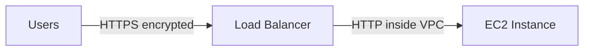
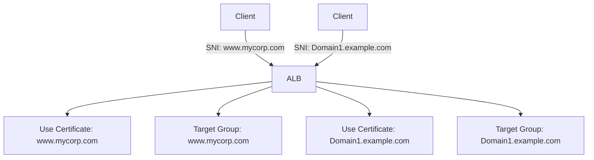

# 69. Elastic Load Balancer - SSL Certificates

## 🎯 Giới thiệu

Bài học giới thiệu **SSL/TLS Certificates** với load balancers, khái niệm **in-flight encryption**, **SSL termination**, **ACM**, và **SNI (Server Name Indication)**.

## 1. 🔐 SSL/TLS Certificates là gì?

**SSL certificate** cho phép traffic giữa clients và load balancer được mã hóa khi đang truyền qua network.

Đây được gọi là:

- **In-flight encryption**.

Transcript giải thích:

- **SSL** = Secure Sockets Layer.
- **TLS** = Transport Layer Security.
- TLS là phiên bản mới hơn của SSL.
- Ngày nay TLS certificates được dùng chủ yếu, nhưng nhiều người vẫn gọi chung là SSL certificates.

## 2. 🏢 Public SSL Certificates

Public SSL certificates được issued bởi **Certificate Authorities**.

Transcript liệt kê ví dụ:

- Comodo.
- Symantec.
- GoDaddy.
- GlobalSign.
- DigiCert.
- LetsEncrypt.

Khi public SSL certificate được attach vào load balancer, kết nối giữa clients và load balancer có thể được mã hóa.

## 3. ⏳ Expiration và Renewal

SSL certificates có expiration date.

Do đó cần:

- Renew thường xuyên.
- Đảm bảo certificate vẫn authentic.

## 4. 🔁 SSL Termination trên Load Balancer

Luồng kết nối:

1. Users kết nối bằng **HTTPS** qua public internet đến load balancer.
2. Load balancer thực hiện **SSL certificate termination**.
3. Backend load balancer có thể nói chuyện với EC2 instance bằng **HTTP**.
4. Traffic backend đi trong VPC private network.

Load balancer load một **X.509 certificate**, còn gọi là SSL/TLS server certificate.

## 5. 📜 Quản lý Certificates bằng ACM

AWS cho phép quản lý SSL certificates bằng:

- **ACM (AWS Certificate Manager)**.

Bạn cũng có thể upload own certificates vào ACM.

Khi tạo HTTPS listener:

- Phải chỉ định một default certificate.
- Có thể thêm optional list of certificates để support multiple domains.
- Có thể set security policy để support older SSL/TLS versions cho legacy clients.

## 6. 🧠 SNI là gì?

**SNI (Server Name Indication)** giải quyết vấn đề:

> Làm sao load multiple SSL certificates lên một web server hoặc load balancer để phục vụ nhiều websites?

Cách hoạt động:

- Client chỉ định hostname của target server trong initial SSL handshake.
- Server/load balancer biết cần load certificate nào.

## 7. ✅ SNI được hỗ trợ ở đâu?

SNI chỉ hoạt động với newer generation services:

- **Application Load Balancer**.
- **Network Load Balancer**.
- **CloudFront**.

SNI **không hoạt động** với:

- **Classic Load Balancer**.

## 8. 📦 SSL Certificates Support theo Load Balancer

| Load Balancer | SSL Certificate Support |
|---|---|
| Classic Load Balancer | Chỉ support một SSL certificate |
| ALB | Support multiple listeners với multiple SSL certificates, dùng SNI |
| NLB | Support multiple listeners và dùng SNI |

Nếu cần multiple hostnames với multiple SSL certificates trên CLB, transcript nói cách tốt nhất là dùng multiple Classic Load Balancers.

## 📊 Bảng tóm tắt

| Tiêu chí | Mô tả |
|----------|------|
| SSL | Secure Sockets Layer |
| TLS | Transport Layer Security, phiên bản mới hơn SSL |
| In-flight encryption | Mã hóa traffic khi truyền qua network |
| SSL termination | Load balancer terminate HTTPS và có thể forward HTTP backend |
| ACM | AWS Certificate Manager |
| X.509 certificate | SSL/TLS server certificate |
| SNI | Server Name Indication |
| SNI support | ALB, NLB, CloudFront |
| Không support SNI | Classic Load Balancer |

## 💡 Mẹo ghi nhớ cho kỳ thi AWS

- Multiple SSL certificates trên một load balancer → nghĩ đến **SNI**.
- SNI works with **ALB**, **NLB**, **CloudFront**.
- SNI does not work with **CLB**.
- HTTPS listener cần default certificate.
- Certificates có expiration date và cần renew.

## ✅ Kết luận

SSL/TLS certificates giúp mã hóa traffic giữa client và load balancer. Với **SNI**, ALB và NLB có thể phục vụ nhiều domains với nhiều SSL certificates trên cùng load balancer.
