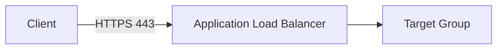
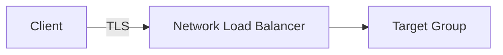

# 70. Elastic Load Balancer - SSL Certificates - Hands On

## 🎯 Giới thiệu

Bài hands-on minh họa cách enable **SSL/TLS certificates** trên cả **Application Load Balancer (ALB)** và **Network Load Balancer (NLB)**.

## 1. 🔐 Enable SSL Certificate trên ALB

Với **ALB**, cần thêm một listener mới.

Cấu hình listener:

- Protocol: **HTTPS**.
- Port mặc định: `443`.
- Action: forward đến target group cụ thể.

## 2. 🛡️ Secure Listener Settings cho ALB

Khi tạo HTTPS listener, có thể cấu hình:

- **SSL security policy**.
- Nơi chứa SSL/TLS certificate.

SSL security policy dùng để xác định cách negotiate certificates, ví dụ khi cần compatibility với older versions của SSL hoặc TLS.

Trong demo có thể để default.

## 3. 📜 Nguồn Certificate cho ALB

Certificate có thể đến từ:

- **ACM (Amazon Certificate Manager)**.
- **IAM** — transcript nói không recommended như domain method.
- Import certificate.

Nếu import:

- Paste private key.
- Paste certificate body.
- Paste certificate chain.
- Certificate sẽ được import vào ACM.

## 4. 🔐 Enable SSL/TLS trên NLB

Với **Network Load Balancer**, tạo listener:

- Protocol: **TLS**.
- Forward đến target group.

## 5. 🛡️ Secure Listener Settings cho NLB

Tương tự ALB, với NLB có thể cấu hình:

- Security policy.
- Certificate từ ACM.
- Certificate từ IAM.
- Import certificate.

Ngoài ra NLB còn có setting nâng cao:

- **Application Layer Protocol Negotiation (ALPN)**.

Transcript không đi sâu vào ALPN vì đây là advanced setting cho TLS.

## 📊 Bảng tóm tắt

| Tiêu chí | ALB | NLB |
|---|---|---|
| Secure listener protocol | HTTPS | TLS |
| Default port | 443 | Theo listener TLS |
| Action | Forward to target group | Forward to target group |
| Security policy | Có | Có |
| Certificate source | ACM, IAM, Import | ACM, IAM, Import |
| Advanced setting | Không nhấn mạnh | ALPN |

## 💡 Mẹo ghi nhớ cho kỳ thi AWS

- ALB dùng HTTPS listener để enable SSL/TLS.
- NLB dùng TLS listener để enable SSL/TLS.
- Certificate thường được quản lý qua **ACM**.
- Có thể import certificate bằng private key, certificate body và certificate chain.

## ✅ Kết luận

Bài hands-on cho thấy cách thêm HTTPS listener trên ALB và TLS listener trên NLB, đồng thời cấu hình SSL security policy và chọn certificate từ ACM, IAM hoặc import thủ công.
