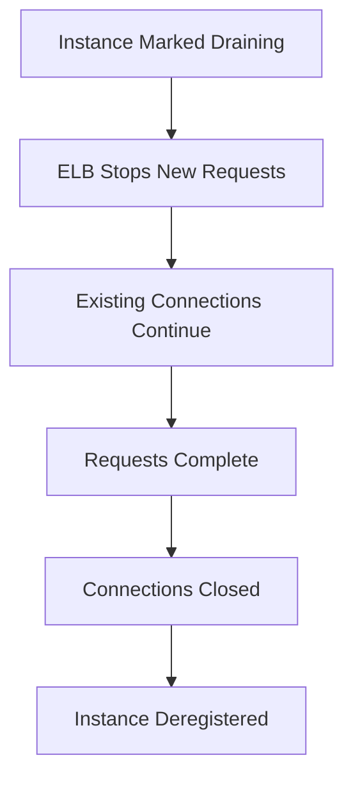

# 71. Elastic Load Balancer - Connection Draining

## 🎯 Giới thiệu

Bài học giải thích **Connection Draining**, một tính năng có thể xuất hiện trong kỳ thi AWS.

Tính năng này có hai tên:

- **Connection Draining**: dùng với Classic Load Balancer.
- **Deregistration Delay**: dùng với Application Load Balancer hoặc Network Load Balancer.

## 1. 🔁 Connection Draining là gì?

Ý tưởng chính:

- Cho EC2 instance thời gian hoàn tất các **in-flight requests** hoặc **active requests**.
- Áp dụng khi instance đang bị deregistered hoặc marked unhealthy.
- Load balancer ngừng gửi new requests đến instance đang draining.
- Existing requests vẫn có thời gian để hoàn tất.

## 2. 👥 Hành vi với Users

Nếu users đã kết nối đến EC2 instance đang draining:

- Họ có đủ thời gian trong draining period để hoàn tất request hiện tại.

Nếu new users kết nối đến ELB:

- ELB không tạo new connection đến instance đang draining.
- ELB gửi new connection đến EC2 instances khác.

## 3. ⏱️ Thời gian Connection Draining

Có thể cấu hình thời gian từ:

- `1` đến `3,600` seconds.

Default:

- `300` seconds.
- Tức 5 minutes.

Có thể disable bằng cách đặt value:

- `0`.

## 4. ⚙️ Chọn giá trị phù hợp

### Request ngắn

Nếu requests rất ngắn, ví dụ dưới 1 second:

- Có thể đặt draining period thấp hơn, ví dụ 30 seconds.
- Instance có thể bị drain nhanh và taken offline nhanh hơn.

### Request dài

Nếu requests có thể dài, ví dụ:

- Uploads.
- Long-lived requests.

Thì nên đặt giá trị cao hơn.

⚠️ Trade-off:

- Instance sẽ không biến mất ngay.
- Nó phải chờ đến khi Connection Draining period kết thúc.

## 📊 Bảng tóm tắt

| Tiêu chí | Mô tả |
|----------|------|
| CLB name | Connection Draining |
| ALB/NLB name | Deregistration Delay |
| Mục tiêu | Hoàn tất in-flight / active requests |
| New requests | Không gửi đến instance đang draining |
| Existing requests | Có thời gian để hoàn tất |
| Range | 1 đến 3,600 seconds |
| Default | 300 seconds / 5 minutes |
| Disable | Set value = 0 |

## 💡 Mẹo ghi nhớ cho kỳ thi AWS

- **Connection Draining** = CLB.
- **Deregistration Delay** = ALB/NLB.
- Mục tiêu: không cắt ngang active requests khi instance bị deregister hoặc unhealthy.
- Request càng dài thì draining period nên càng cao.

## ✅ Kết luận

**Connection Draining / Deregistration Delay** giúp EC2 instances hoàn tất request đang xử lý trước khi bị remove khỏi load balancer, đồng thời ngăn new requests đi vào instance đang draining.
