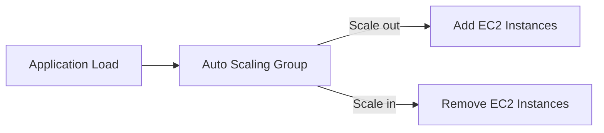
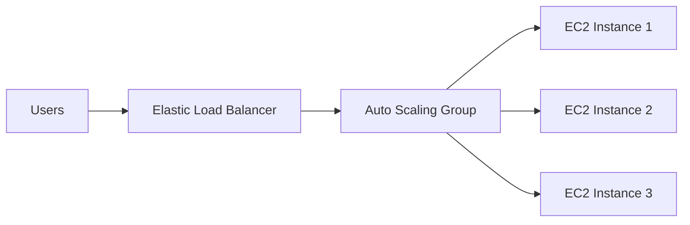
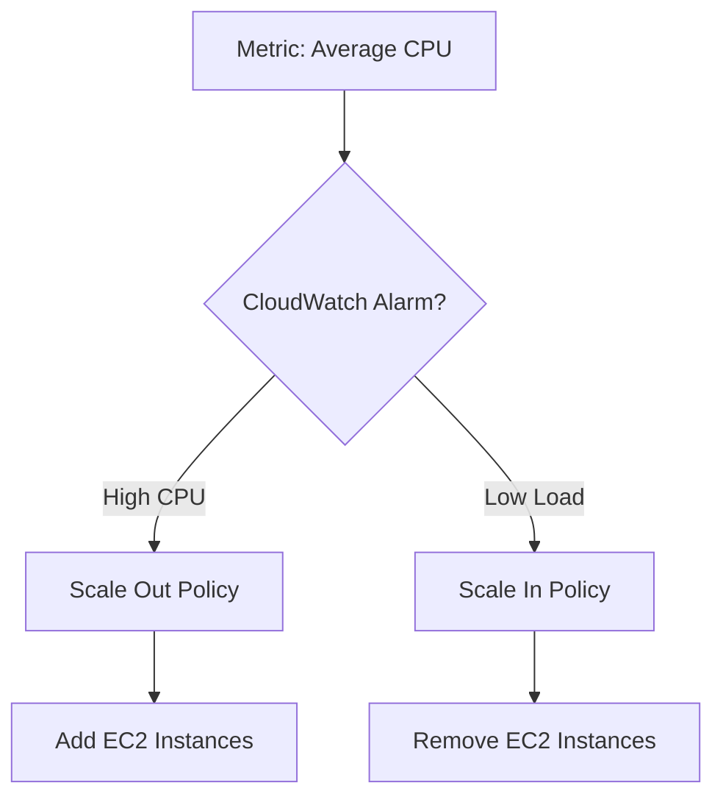

# 72. Auto Scaling Groups (ASG) Overview

## 🎯 Giới thiệu

Bài học giới thiệu **Auto Scaling Groups (ASG)** — cơ chế tự động thêm hoặc giảm **EC2 instances** để phù hợp với thay đổi về load.

ASG giúp tự động hóa việc tạo và loại bỏ servers bằng EC2 instance creation API call.

## 1. 📈 Mục tiêu của Auto Scaling Group

Mục tiêu chính của ASG:

- **Scale out**: thêm EC2 instances khi load tăng.
- **Scale in**: remove EC2 instances khi load giảm.

Kích thước của ASG có thể thay đổi theo thời gian.

## 2. 🔢 Min, Desired và Max Capacity

ASG có thể định nghĩa:

- **Minimum capacity**: số instances tối thiểu.
- **Desired capacity**: số instances mong muốn hiện tại.
- **Maximum capacity**: số instances tối đa.

Ví dụ trong bài:

- Minimum capacity: 2.
- Desired capacity: 4.
- Maximum capacity: 7.

Nếu tăng desired capacity nhưng vẫn dưới maximum capacity, ASG có thể scale out bằng cách thêm EC2 instances.

## 3. ⚖️ ASG kết hợp với Load Balancer

ASG có thể pair với load balancer.

Khi đó:

- EC2 instances trong ASG được linked vào load balancer.
- ELB phân phối traffic đến các instances trong ASG.
- Nếu ASG scale out, các EC2 instances mới cũng được ELB gửi traffic đến.

## 4. 🩺 Health Checks và Self-Healing

ELB có thể check health của EC2 instances.

Health check có thể được truyền đến ASG.

Nếu instance bị deemed unhealthy:

- ASG terminate instance đó.
- ASG tạo EC2 instance mới để replace.

📌 Đây là “superpower” của ASG khi kết hợp với load balancer.

## 5. 💰 Chi phí của ASG

Transcript nhấn mạnh:

- Auto Scaling Groups là free.
- Bạn chỉ trả tiền cho resources được tạo bên dưới.
- Ví dụ: EC2 instances.

## 6. 🧱 Launch Template

Để tạo ASG, cần có **launch template**.

Transcript cũng nói rằng **launch configurations** từng tồn tại nhưng đã deprecated.

Launch template chứa thông tin cách launch EC2 instances trong ASG, gồm:

- **AMI**.
- Instance type.
- **EC2 user data**.
- **EBS volumes**.
- Security groups.
- SSH key pair.
- IAM roles cho EC2 instances.
- Network và subnet information.
- Load balancer information.
- Các thông tin khác nếu cần.

## 7. 📊 Scaling Policies và CloudWatch Alarms

ASG có thể scale in/out dựa trên **CloudWatch alarms**.

Ví dụ metric:

- Average CPU.
- Custom metric.

Nếu average CPU của ASG quá cao:

- CloudWatch alarm được triggered.
- Alarm kích hoạt scaling activity.
- ASG scale out bằng cách thêm EC2 instances.

Ngược lại, ASG có thể scale in bằng cách giảm số lượng instances.

## 📊 Bảng tóm tắt

| Tiêu chí | Mô tả |
|----------|------|
| ASG | Auto Scaling Group |
| Scale out | Thêm EC2 instances |
| Scale in | Remove EC2 instances |
| Minimum capacity | Số instance tối thiểu |
| Desired capacity | Số instance mong muốn |
| Maximum capacity | Số instance tối đa |
| Load balancer integration | Instances trong ASG được linked với ELB |
| Health check | Unhealthy instance bị terminate và replace |
| Launch template | Định nghĩa cách launch EC2 instances |
| Scaling trigger | CloudWatch alarms dựa trên metrics |

## 💡 Mẹo ghi nhớ cho kỳ thi AWS

- **Scale out** = add EC2 instances.
- **Scale in** = remove EC2 instances.
- ASG + Load Balancer là combination rất quan trọng.
- Launch template định nghĩa cách EC2 instances trong ASG được tạo.
- ASG free; trả tiền cho resources được tạo như EC2 instances.

## ✅ Kết luận

**Auto Scaling Groups** giúp tự động thay đổi số lượng EC2 instances theo load, duy trì min/max capacity, tích hợp với load balancer và có thể replace unhealthy instances.
