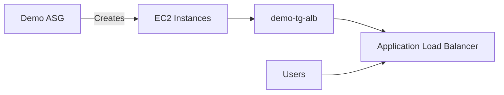
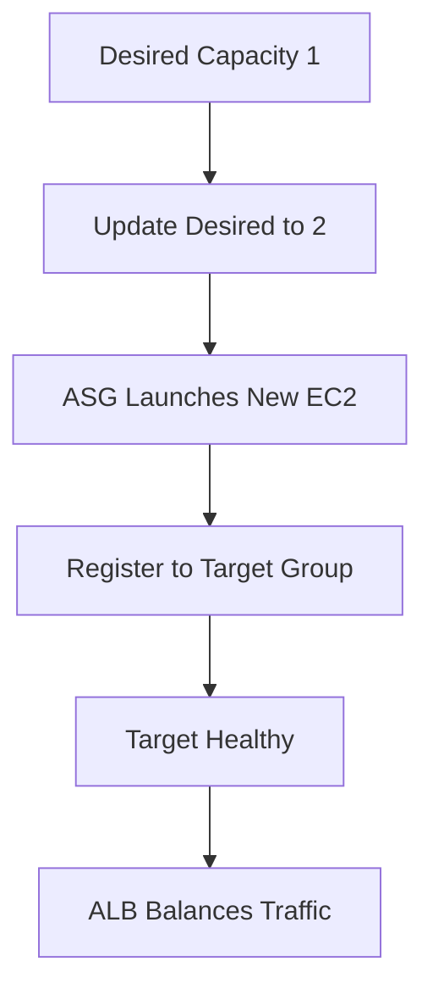

# 73. Auto Scaling Groups Hands On

## 🎯 Giới thiệu

Bài hands-on hướng dẫn tạo **Auto Scaling Group (ASG)**, sử dụng **launch template**, attach ASG với target group của **Application Load Balancer**, sau đó thử scale out và scale in thủ công bằng desired capacity.

## 1. 🧹 Chuẩn bị môi trường

Trước khi tạo ASG, transcript yêu cầu:

- Terminate toàn bộ EC2 instances hiện có.
- Đưa số lượng EC2 running về 0.

## 2. 🧱 Tạo Auto Scaling Group

Tạo ASG với name:

- `Demo ASG`

ASG cần tham chiếu đến một **launch template**, nên bài học tạo launch template mới.

## 3. 🚀 Tạo Launch Template

Launch template name:

- `my demo template`

Cấu hình chính:

- AMI: **Amazon Linux 2**.
- Architecture: x86.
- Instance type: `t2.micro`.
- Key pair: `EC2 tutorial`.
- Security group: chọn existing security group, ví dụ `launch-wizard-1`.
- Storage: 8 GB `gp2` volume.
- User data: script tạo web server như các bài trước.

📌 Launch template định nghĩa cách EC2 instances trong ASG được launch.

## 4. 🌐 Network và AZ Distribution

Trong ASG:

- Chọn VPC.
- Chọn multiple Availability Zones.
- AZ distribution: **balanced best effort**.

Mục tiêu:

- Instances được spread across 3 AZ.

## 5. ⚖️ Attach ASG với Load Balancer

Bài học attach ASG vào existing load balancer bằng target group:

- Chọn existing target group: `demo-tg-alb`.

Kết quả:

- EC2 instances được tạo bởi ASG sẽ tự động được attach vào target group.
- Target group này linked với ALB.

## 6. 🩺 Health Checks

Trong ASG, enable:

- EC2 health checks.
- Load balancer health checks.

Ý nghĩa:

- Load balancer kiểm tra health của EC2 instances.
- ASG có thể terminate unhealthy instances và tạo instance mới thay thế.

## 7. 🔢 Desired, Min và Max Capacity ban đầu

Ban đầu để:

- Desired capacity: 1.
- Minimum capacity: 1.
- Maximum capacity: 1.

Sau khi tạo ASG:

- ASG thấy capacity hiện tại là 0.
- Desired là 1.
- ASG launch một EC2 instance mới.

Có thể xem trong:

- Activity history.
- Instance management.
- EC2 Instances tab.

## 8. ✅ Instance được Register vào Target Group

Instance mới được ASG tạo ra sẽ được register vào target group của ALB.

Ban đầu target có thể unhealthy vì:

- EC2 instance đang bootstrapping.
- User data script chưa hoàn tất.

Sau một lúc:

- Target chuyển healthy.
- ALB trả về `Hello World`.

⚠️ Nếu instance không bao giờ healthy:

- ASG sẽ terminate instance và tạo instance mới.
- Nguyên nhân thường là security group issue hoặc EC2 user data script issue.

## 9. 📈 Scale Out thủ công

Thay đổi ASG size:

- Desired capacity: 2.
- Maximum capacity: tăng lên 2.

ASG sẽ:

- Launch thêm một EC2 instance.
- Register instance mới vào target group.
- Sau khi healthy, ALB phân phối traffic đến cả 2 instances.

Khi refresh ALB DNS:

- Response luân phiên giữa 2 IPs.

## 10. 📉 Scale In thủ công

Thay đổi ASG size:

- Desired capacity: 1.

ASG sẽ:

- Chọn một trong các instances để terminate.
- Deregister instance đó khỏi target group.
- Trở lại còn 1 EC2 instance trong ASG.

## 📊 Bảng tóm tắt

| Tiêu chí | Mô tả |
|----------|------|
| ASG name | Demo ASG |
| Launch template | my demo template |
| AMI | Amazon Linux 2 |
| Instance type | t2.micro |
| Storage | 8 GB gp2 |
| User data | Tạo web server |
| AZ distribution | Balanced best effort across multiple AZs |
| Target group | demo-tg-alb |
| Health checks | EC2 + Load Balancer health checks |
| Scale out demo | Desired 1 → 2 |
| Scale in demo | Desired 2 → 1 |

## 💡 Mẹo ghi nhớ cho kỳ thi AWS

- ASG có thể tự động register EC2 instances vào target group của ALB.
- Nếu instance unhealthy, ASG có thể terminate và recreate.
- Activity history là nơi quan sát các hoạt động launch/terminate.
- Desired capacity thay đổi sẽ khiến ASG scale out hoặc scale in.

## ✅ Kết luận

Bài hands-on minh họa toàn bộ luồng ASG cơ bản: tạo launch template, tạo ASG, attach với ALB target group, enable health checks, scale out bằng cách tăng desired capacity và scale in bằng cách giảm desired capacity.
