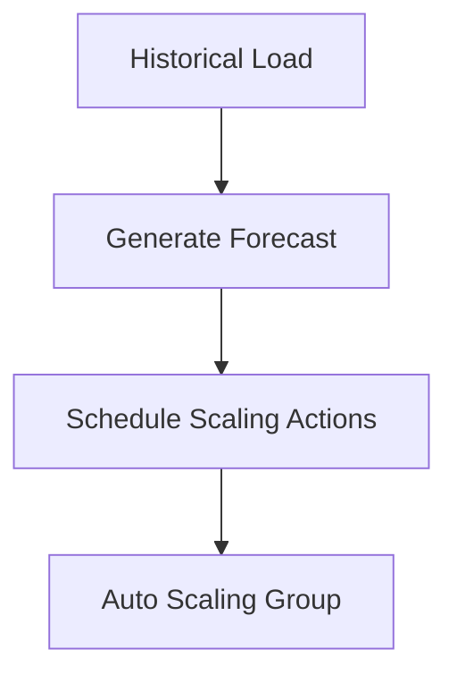
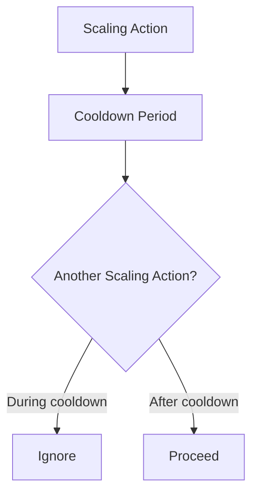

# 74. Auto Scaling Groups - Scaling Policies

## 🎯 Giới thiệu

Bài học giới thiệu các loại **Scaling Policies** cho **Auto Scaling Group (ASG)**, các metrics thường dùng để scale và khái niệm **Scaling Cooldown**.

## 1. 📈 Dynamic Scaling

**Dynamic scaling** gồm các dạng chính:

- **Target Tracking Scaling**.
- **Simple Scaling**.
- **Step Scaling**.

### Target Tracking Scaling

Đây là cách setup đơn giản.

Ý tưởng:

- Chọn một metric cho ASG.
- Đặt target value.
- ASG tự động scale out hoặc scale in để giữ metric quanh target.

Ví dụ trong bài:

- Metric: CPU utilization.
- Target value: 40%.

### Simple / Step Scaling

Dùng **CloudWatch alarms** để trigger scaling.

Khi alarm bị triggered:

- Add capacity units vào ASG.
- Hoặc remove capacity units khỏi ASG.

## 2. 🗓️ Scheduled Scaling

**Scheduled Scaling** dùng khi có thể dự đoán trước usage pattern.

Ví dụ trong bài:

- Biết rằng 5:00 PM vào Fridays sẽ có thêm users.
- Tăng minimum capacity lên 10 trước thời điểm đó.

## 3. 🔮 Predictive Scaling

**Predictive Scaling** dùng forecast load liên tục và schedule scaling trước thời điểm cần thiết.

Luồng hoạt động:

1. ASG analyze historical load.
2. Generate forecast.
3. Schedule scaling actions dựa trên forecast.

Use case:

- Patterns lặp lại theo chu kỳ.
- Cyclical data.

## 4. 📊 Metrics tốt để Scale

Việc chọn metric phụ thuộc vào application.

Transcript nêu một số metric thường dùng.

### CPU Utilization

- Request thường làm instance sử dụng CPU.
- Nếu average CPU utilization across instances tăng cao, có thể cần scale out.

### RequestCountPerTarget

Metric application-specific hơn.

Ví dụ:

- EC2 instances hoạt động tối ưu ở 1,000 requests per target.
- Có thể dùng con số đó làm target cho scaling.

Trong ví dụ:

- ASG có 3 EC2 instances.
- ALB spread requests across all instances.
- Request count per target metric là 3 vì mỗi instance trung bình có 3 outstanding requests.

### Network In / Network Out

Dùng khi application bị giới hạn bởi network.

Ví dụ:

- Nhiều uploads.
- Nhiều downloads.
- Network là bottleneck.

### Custom Metric

Có thể push custom metric vào **CloudWatch**.

Sau đó dùng custom metric đó cho scaling policies.

## 5. ⏳ Scaling Cooldown

Sau mỗi scaling activity:

- ASG bước vào cooldown period.
- Trong thời gian này ASG không launch hoặc terminate thêm instances.

Default cooldown:

- 5 minutes.
- 300 seconds.

Mục đích:

- Cho metrics ổn định.
- Cho instance mới có thời gian đi vào hiệu lực.
- Xem metric mới thay đổi như thế nào sau scaling.

## 6. 🚀 Best Practice trong bài

Transcript đưa ra lời khuyên:

- Dùng ready-to-use AMI để giảm thời gian cấu hình EC2 instances.
- Instance có thể serve request nhanh hơn.
- Cooldown period có thể giảm để ASG dynamic hơn.
- Enable **detailed monitoring** để có metrics mỗi 1 minute.

## 📊 Bảng tóm tắt

| Tiêu chí | Mô tả |
|----------|------|
| Target Tracking | Giữ metric quanh target value |
| Simple Scaling | Dựa trên CloudWatch alarm để add/remove capacity |
| Step Scaling | Scaling theo nhiều bước dựa trên alarm value |
| Scheduled Scaling | Scale theo lịch biết trước |
| Predictive Scaling | Forecast load và schedule scaling ahead of time |
| CPU Utilization | Metric thường dùng |
| RequestCountPerTarget | Metric theo số request mỗi target |
| Network In/Out | Dùng cho network-bound application |
| Custom Metric | Metric tự push vào CloudWatch |
| Cooldown | Default 300 seconds |

## 💡 Mẹo ghi nhớ cho kỳ thi AWS

- Muốn đơn giản → **Target Tracking Scaling**.
- Biết trước traffic pattern → **Scheduled Scaling**.
- Traffic có pattern lặp lại → **Predictive Scaling**.
- Sau scaling activity có **Cooldown** để metrics ổn định.
- Ready-to-use AMI giúp instance phục vụ traffic nhanh hơn.

## ✅ Kết luận

ASG hỗ trợ nhiều scaling policies: dynamic, scheduled và predictive. Việc chọn metric phù hợp và hiểu cooldown period là rất quan trọng để ASG scale hiệu quả.
